---
Learning Coding with LeapLearner
---

# 乐学编程

本书是立乐在线课堂系列第一部分课程内容。

[TOC]

## 什么是编程

### 什么是编码

人与人之间使用人类的语言进行交流。猫咪与猫咪之间使用猫类的语言进行交流。

**想一想**

- 你能用人类的语言跟猫咪说话吗？
- 猫咪能用猫类的语言跟你说话吗？
- 你能用人类的语言跟计算机说话吗？


### 重要性

我们通过编写代码与计算机交流。

如果我们现在不能说话，只能靠手势交流。我们规定竖起一根大拇指是`我们`的意思，竖起一根食指是`一起玩`的意思。那老师说：“我们一起吃饭”， 是不是要先竖起一根大拇指，然后放下这根大拇指，接着竖起一根食指，然后放下这根食指，你就能明白老师的意思啦。我们跟计算机说话，它并不能听懂，所以我们要有一种与计算机交流的方法，这就是编码。而程序就是由很多编码组成的。就像写作文需要写很多句子一样。

**想一想**

- 如何用不同的水果来表示`“我们一起玩”`


### 编程的应用

**想一想**

- 下列哪些东西用到了编程


**说一说**

- 你还知道哪些东西用到了编程


## 编程环境

### 立乐课堂地址

在浏览器中打开https://code.leaplearner.com，登录你的账号，用于保存学习进度，你的作品会被保存在网上哦。

### 如何登陆立乐课堂

1.如图所示，点击`学生登录`


2.如图所示，先输入账号，再输入密码，最后点击`登录`按钮

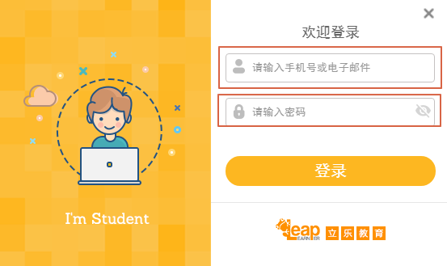

### 编程环境介绍

下面是立乐IDE的一个截图，可以看见分成了左右2个区域，左边是展示区域，右边是代码输入区域。我们在代码输入区域将代码输入完成后，如果一切正常，点击左上角`运行`按钮就可以看到你写的代码的结果了。


#### 功能说明

`分享`: 点击后生成链接和二维码，可以通过手机扫描获取到项目展示信息。

`运行`: 点击后执行JavaScript代码。每次点击`运行`都会重新开始执行。

`文件`: 用于操作文件，可以新建一个文件，或者打开、保存、重命名、另存为已有的文件。

**试一试**

- 点击`文件`→`新建`，并且用你的英文名字给新文件命名吧
- 点击左上角的`运行`
- 点击`文件`→`保存`

## 认识坐标

### 坐标系统

为了定义空间的位置，数学家们发明了坐标的概念，在此之上发展出了庞大的几何学科。在计算机图形中，坐标系统更是不可或缺。

在计算机坐标系统中，有一条横方向的轴名字叫`x轴`，有一条竖方向的轴名字叫`y轴`。它们相交的点，代表横方向位置为0，竖方向位置也为0，这个点名字叫`原点`。数学家们规定，表示一个物体的坐标位置，要先说横方向位置再说竖方向位置。因此，整个坐标系看起来像是这个样子的。


**说一说**

* 指出哪条是横方向的轴、哪条是竖方向的轴
* 说出横方向的轴和竖方向的轴它们的名字
* 指出原点的位置，并说出原点的横方向位置和竖方向位置

### 屏幕坐标

只要确定了坐标点的值，我们就能很容易的确定坐标的位置了。比如点（250，150）在坐标轴上的位置，我们就可以很容易找出来了。


> 小知识：笛卡尔坐标系和网页坐标系
>
> 和数学上常见的笛卡尔坐标系不同的是，网页坐标系的y轴正方向朝下。这是因为人类阅读习惯于从左到右，从上到下，在浏览器的定位系统中，根据这个习惯来定义坐标的位置，使得在网页设计时更为合理。

**说一说**

* 指出一个点，说出这个点的坐标
* 说出一个坐标，让其他人来指出这个坐标的位置
* 如果你在原点的位置，越往右边走横坐标的值越大还是越小？越往下走竖坐标的值越大还是越小？

#### 挑战：快乐的小红

http://ide.leaplearner.com/lregut/1/edit

有一位小朋友叫小红，今天她要出去玩。她每次都在原点出发。

**试一试**

* 让小红去甜品店
* 让小红去服装店
* 让小红回家

#### 挑战：移动瞄准镜

今天老师用代码画了一个坐标系和瞄准镜，通过改变`left`，`right`，`up`，`down`的值可以让瞄准镜向左、向右、向上、向下、移动，让我们来试一下吧。

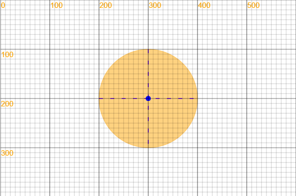

**试一试**

- 让瞄准镜横方向位置不变，只是往上移动
- 让瞄准镜横方向位置不变，只是往下移动
- 让瞄准镜竖方向位置不变，只是往左移动
- 让瞄准镜竖方向位置不变，只是往右移动
- 让瞄准镜先往左移动，再往上移动
- 让瞄准镜先往右移动，再往上移动
- 让瞄准镜先往左移动，再往下移动
- 让瞄准镜先往右移动，再往下移动

附录代码：

```javascript
var left; //向左
var right; //向右
var up; //向上
var down; //向下
moveCollimationMirror(left, right, up, down);
canvas.showAxis();

function moveCollimationMirror(left, right, up, down) {
    left = left || 0;
    right = right || 0;
    up = up || 0;
    down = down || 0;
    var circle1 = new Circle(300 + right - left, 200 - up + down, 100);
    circle1.strokeStyle = '#FFA50F';
    circle1.globalAlpha = 0.5;
    circle1.fillStyle = '#FFA500';

    circle1.draw();
    var line = new Line(200 + right - left, 200 - up + down, 400 + right - left, 200 - up + down); //横瞄准线
    line.strokeStyle = '#8A2BE2';
    line.lineWidth = 2;
    line.setLineDash([8, 15]);
    line.draw();
    var line2 = new Line(300 + right - left, 100 - up + down, 300 + right - left, 300 - up + down); //横瞄准线
    line2.lineWidth = 2;
    line2.strokeStyle = '#8A2BE2';
    line2.setLineDash([8, 15]);
    line2.draw();
    var point = new Point(300 + right - left, 200 - up + down);
    point.fillStyle = 'blue';
    point.r = 5;
    point.fill();
}
```


## 鼠标练习

### 鼠标移动-鼠标光标移动到指定位置

有一天立乐动物园里来了一位大坏蛋魔法师，他使用变矮魔法，把小动物们都变矮了。让我们使用编程的魔法，帮助他们复原吧。

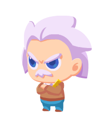

​											大坏蛋魔法师


​										动物们正常的身高

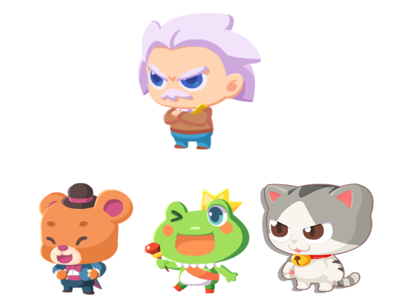

​						大坏蛋魔法师看到了可爱的小动物们准备使用变矮魔法


​						大坏蛋魔法师使用了变矮魔法后小动物们都变矮了！

让我们复制下面的代码，然后鼠标移到第一行的最后`数字1`的后面点击一下，是不是会看到一个一闪一闪的小竖线，这就是光标。光标是用来显示你将要输入文字的位置的。让我们把数字1改成数字2试试吧。

```javascript
var height = 100 * 1;
var link = ['http://rss.leaplearner.com/Image/Character/Einstein_angry.png', 'http://rss.leaplearner.com/Image/Character/Einstein_happy.png'];
var magicMan;
if (height == 100) {
    magicMan = link[1]
} else {
    magicMan = link[0]
};

var bear = new Sprite('http://rss.leaplearner.com/Image/Animals/Bear_happy.png', 20, 250, height, 200);
bear.draw();

var frog = new Sprite('http://rss.leaplearner.com/Image/Role/Frog1.png', 190, 250, 200, height);
frog.draw();

var cat = new Sprite('http://rss.leaplearner.com/Image/Animals/Cat.png', 360, 250, 200, height);
cat.draw();

var magicMan = new Sprite(magicMan, 150, 0, 250, 250);
magicMan.draw();
```


### 点击和双击

为了能区分鼠标的左键点击和右键点击，让我们复制下列代码并点击`运行`后，鼠标点击编程环境的左侧区域。

双击就是连续点击两下的意思。

```javascript
document.onmousedown = function(event) {
    var oEvent = event; //IE浏览器直接使用event或者window.event得到事件本身。IE下鼠标的 左键是1 ，  右键是2   ff和chrome下 鼠标左键是0  右键是2
    if (oEvent.button == 0) {
        alert('鼠标左键');
    }
    if (oEvent.button == 2) {
        alert('鼠标右键');
    }
};
```

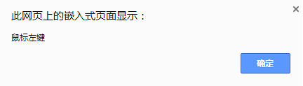


### 选中+右键菜单+复制粘贴

下面的代码是一个鼠标点击小游戏，让把鼠标移动到`var`的`v`前面点击一下，使鼠标变为一闪一闪的光标，选中下面的代码，并且点击鼠标右键复制及粘贴以下代码到编辑器中，运行后，在规定时间内达到20分即及格。

```javascript
var c = new Circle();

a = new Date();
score = 0;

!function () {
    canvas.clear();
    c.draw();
    score.toString().draw();
    var t = (new Date() - a)/1000;
    (""+t+'s').draw(1, 50);
    if(t < 30)
       nextFrame(arguments.callee)
}();

c.click = function(){
    c.x = 50 + 300 * Math.random();
    c.y = 50 + 500 * Math.random();
    score++;
};
```

| 分数    | 评价   |      |
| ----- | ---- | ---- |
| 20-29 | 及格   |      |
| 30-39 | 良好   |      |
| 40+   | 优秀   |      |

## 交互

### 鼠标点击事件

### 任务：热带雨林射击

**试一试**

- 把下面的代码复制并运行，瞄准红点靶心，试一试自己能拿几分

**想一想**

- 每个小动物代表的分数都是不同的，老虎、狐狸、老鹰、小蛇各自代表几分

```javascript
var frogBacGro = new Sprite('http://pic.qiantucdn.com/58pic/16/61/85/69858PICHs6_1024.jpg', 0, 0, 650, 332); //background
var tiger = new Sprite('http://ou1htxdl4.bkt.clouddn.com/image/L1U2_1_tiger.png', 145, 230, 95, 103);
var fox = new Sprite('http://ou1htxdl4.bkt.clouddn.com/image/L1U2_1_fox.png', 240, 230, 95, 103);
var eagle = new Sprite('http://ou1htxdl4.bkt.clouddn.com/image/L1U2_1_eagle.png', 335, 230, 95, 103);
var snake = new Sprite('http://ou1htxdl4.bkt.clouddn.com/image/L1U2_1_snake.png', 430, 230, 95, 103);
var score = 0;

function main() {
    canvas.clear();
    frogBacGro.draw();
    tiger.draw();
    fox.draw();
    eagle.draw();
    snake.draw();


    drawPoint();

}

Mouse.move = function () {
    loadRssAndRun(main);
    var point = new Point(Mouse.x, Mouse.y);
    point.r = 5;
    point.fillStyle = 'red';
    point.fill();
    drawPoint();
    var circle = new Circle(Mouse.x, Mouse.y, 100);
    var lineX = new Line(Mouse.x-100, Mouse.y, Mouse.x+100, Mouse.y);
    lineX.strokeStyle = "black";
    lineX.setLineDash([5,15]);
    lineX.draw();
    var lineY = new Line(Mouse.x, Mouse.y-100, Mouse.x, Mouse.y+100);
    lineY.strokeStyle = 'black';
    lineY.setLineDash([5,15]);
    lineY.draw();
    circle.strokeStyle = 'black';
    circle.stroke(); 
    var text = new Text();
}
Mouse.click = function () {
    score += 10;
}

function drawPoint() {
    var pointX = tiger.x + 47.5;
    var pointY = 281.5;
    var n = 95; //95+47.5;
    for (i = 0; i < 4; i++) {
        var point = new Point(pointX + i * n, pointY);
        point.r = 5;
        point.fillStyle = 'red';
        point.fill();
    }
}
loadRssAndRun(main);
```

### 鼠标按住事件

### 任务：小小画家

把下面的代码复制并运行，按住鼠标会出现颜色，画出你喜欢的东西吧。


```javascript
canvas.width = 600;
canvas.height = 400;

var panel = new Rectangle(10, 320, 580, 70);
var s_brush = new Circle(50, 355, 2);
var m_brush = new Circle(70, 355, 4);
var l_brush = new Circle(95, 355, 6);
var c_blue = new Rectangle(160, 335, 40, 40);
var c_red = new Rectangle(220, 335, 40, 40);
var c_green = new Rectangle(280, 335, 40, 40);
var c_yellow = new Rectangle(340, 335, 40, 40);
var c_black = new Rectangle(400, 335, 40, 40);
var c_white = new Rectangle(460, 335, 40, 40);
var selection = new Rectangle(40, 345, 20, 20);
var clearBtn = new Rectangle(515, 340, 60, 30);
var clearTxt = new Text("清理画布");

var my_brush = new Circle();
var isDrawing = false;
var x1,y1,x2,y2 = 0;
panel.fillStyle = "lightgrey";
panel.strokeStyle = "grey";
my_brush.r = 2;
my_brush.fillStyle = "black";
c_blue.fillStyle = "blue";
c_red.fillStyle = "red";
c_green.fillStyle = "green";
c_yellow.fillStyle = "yellow";
c_black.fillStyle = "black";
c_white.fillStyle = "white";
clearTxt.font = "12px Arial";
clearTxt.x = 522;
clearTxt.y = 359;
clearTxt.fillStyle = "black";
clearBtn.fillStyle = "white";
selection.strokeStyle = "black";

function Loop() {
    drawPanel();
    nextFrame(Loop);
}

function clear() {
    canvas.clear();
}
function drawline() {
    x1 = x2;
    y1 = y2;
    x2 = this.x;
    y2 = this.y;
    var draw_line = new Line(x1,y1,x2,y2);
    draw_line.lineWidth = this.r * 2;
    draw_line.strokeStyle = this.fillStyle;
    draw_line.stroke();
}
function drawPanel() {
    panel.draw();
    s_brush.fill();
    m_brush.fill();
    l_brush.fill();
    c_blue.draw();
    c_red.draw();
    c_green.draw();
    c_yellow.draw();
    c_black.draw();
    c_white.draw();
    clearBtn.draw();
    clearTxt.draw();
    selection.stroke();
}
function brush_click() {
    my_brush.r = this.r;
    selection.x = this.x - 10;
    selection.y = this.y - 10;
}
function color_click() {
    my_brush.fillStyle = this.fillStyle;
    s_brush.fillStyle = this.fillStyle;
    m_brush.fillStyle = this.fillStyle;
    l_brush.fillStyle = this.fillStyle;
}

Mouse.down = function() {
    x1 = Mouse.x;
    y1 = Mouse.y;
    x2 = Mouse.x;
    y2 = Mouse.y;
    isDrawing = true;
}
Mouse.up = function() {
    isDrawing = false;
}
Mouse.move = function() {
    my_brush.x = Mouse.x;
    my_brush.y = Mouse.y;
    if (isDrawing) my_brush.draw();
}

my_brush.draw = drawline;
c_blue.click = c_red.click = c_green.click = c_yellow.click = c_black.click = c_white.click = color_click;
s_brush.click = m_brush.click = l_brush.click = brush_click;
clearBtn.click = clear;
Loop();
```


## 键盘练习

目标：熟悉键盘操作

### 正确的打字姿势

打字时身子要坐正，双手轻松的放在键盘上。

左右手分别负责键盘的左右区域。用拇指按空格键。

### 大小写和数字键

输入10个数字

输入26个字母及大写字母

### 标点符号

输入标点符号

### 切换输入法

学会切换输入法：Shift键

输入回车和删除键


**试一试**

- 复制下面的代码并点击运行，找到键盘上的回车键，并按一下它。

```javascript
var rect = new Rectangle(100, 100, 100 * 2, 50 * 2);
rect.fillStyle = 'black';
rect.fill();
var line = new Line(240, 136, 240, 174);
line.strokeStyle = 'white';
line.draw();
var line1 = new Line(240, 174, 170, 174);
line1.strokeStyle = 'white';
line1.draw();
var triangle = new Triangle(170, 174 - 20, 170, 174 + 20, 150, 174);
triangle.fillStyle = 'white';
triangle.fill();
var text = new Text();
text.src = 'Enter';
text.fillStyle = 'white';
text.x = 176;
text.y = 133;
text.draw();
var text2 = new Text();
text2.src = '回车键';
text2.fillStyle = 'black';
text2.x = 102;
text2.y = 214;
text2.draw();

Key.Enter.press = function() {
    triangle.width = 80;
    triangle.fill();
    var music = new Audio();
    music.src = 'http://static.leaplearner.com/sounds/jump.mp3';
    music.play();
}
```

### 中英文字符

下面列出了一些常见的错误符号，一般来说，中文的标点符号要比英文标点符号占据的空间更大。

| 符号名称 | 英文标点 | 中文标点 |
| ---- | ---- | ---- |
| 句号   | .    | 。    |
| 逗号   | ,    | ，    |
| 分号   | ;    | ；    |
| 圆括号  | ()   | （）   |
| 单引号  | '    | ‘    |
| 双引号  | "    | “    |

不过，好在计算机可以帮助我们做这件事情，当你输入一个错误的符号时，计算机会在代码前面提示这个错误，如果发现有错误提示，赶紧看看是不是标点符号出错了呢。

### 挑战：纠正错误字符

在输入的时候要特别注意，在这里，计算机只能识别英文字符，如果输入中文的标点符号，计算机就无法正确识别出来你的命令。

改正下面代码中错误的标点符号，让程序跑起来。

1.

```javascript
var ball = new Circle（200，200, 50）;
ball。draw()；
```

2.

```javascript
var circle = new Circle(100, 100, 100);
circle.fillStyle = ‘red’;
circle.fill（）；
```

正确答案：

1.

```javascript
var ball = new Circle(200,200, 50);
ball.draw();
```

2.

```javascript
var circle = new Circle(100, 100, 100);
circle.fillStyle = 'red';
circle.fill();
```

## 颜色

在生活中，有许许多多的颜色，让世界变得丰富起来。比如彩虹，就有红橙黄绿青蓝紫等颜色。

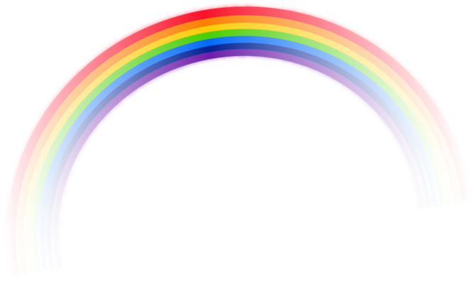


### 颜色代码

我们要让计算机知道颜色，那么我们就要告诉计算机这个颜色的名字。和坐标不一样的是，颜色的代码是一串字符，而不是数字，因此，我们需要将颜色名字用双引号或者单引号引起来。

```javascript
var circle = new Circle(100, 100, 50);
circle.fillStyle = 'red';
circle.draw();
```

试着将红色替换为绿色，重新点击运行，看看图形的颜色是不是发生了变化。

```javascript
circle.fillStyle = 'green';
```

**试一试**

- 列出所有你知道的颜色名称
- 试试你知道的颜色

### 常见颜色

让我们来认识这些颜色：红色、橙色、黄色、绿色、青色、蓝色、紫色。

#### 挑战: 填色游戏

通过设计七彩调色板，点击调色板来点亮彩色灯泡。

将七彩颜色写入colArr[]数组，点击`运行`后，点击调色板，灯泡会变成调色板的颜色。

```javascript
var colArr = [];//写入颜色前的colArr[]数组
var colArr = ["red","orange","yellow","green","cyan","blue","purple"];//写入颜色后的colArr[]数组
```


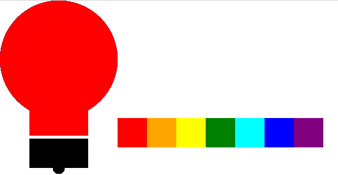

```javascript
附录全代码：
var colArr = ["red", "orange", "yellow", "green", "cyan", "blue", "purple"]; //调色板
var circle1 = new Circle(100, 100, 100);
var circle2 = new Circle(100, 285, 10);
var rect1 = new Rectangle(50, 130, 100, 100);
var rect2 = new Rectangle(50, 235, 100, 50);
var colButton = new Rectangle(200, 200, 50, 50);
var colButton1 = new Rectangle(250, 200, 50, 50);
var colButton2 = new Rectangle(300, 200, 50, 50);
var colButton3 = new Rectangle(350, 200, 50, 50);
var colButton4 = new Rectangle(400, 200, 50, 50);
var colButton5 = new Rectangle(450, 200, 50, 50);
var colButton6 = new Rectangle(500, 200, 50, 50);
circle1.fillStyle = "grey";
rect1.fillStyle = "grey";
rect2.fillStyle = "black";
circle2.fillStyle = "black";
colButton.fillStyle = colArr[0]; //调色板1
colButton1.fillStyle = colArr[1]; //调色板2
colButton2.fillStyle = colArr[2]; //调色板3
colButton3.fillStyle = colArr[3]; //调色板4
colButton4.fillStyle = colArr[4]; //调色板5
colButton5.fillStyle = colArr[5]; //调色板6
colButton6.fillStyle = colArr[6]; //调色板7
draw();

Rectangle.prototype.click = turnCol;
rect2.click = null;

function turnCol() {
    if (this.fillStyle != null) {
        console.log(this.fillStyle);
        circle1.fillStyle = this.fillStyle;
        rect1.fillStyle = this.fillStyle;
        draw();
    }
}

function draw() {
    rect2.fill();
    circle2.fill();
    rect1.fill();
    circle1.fill();
    colButton.fill();
    colButton1.fill();
    colButton2.fill();
    colButton3.fill();
    colButton4.fill();
    colButton5.fill();
    colButton6.fill();
}
```

### 挑战: 多彩的章鱼宝宝

曾经有一只可爱的章鱼宝宝，但是有一天它不小心喝了可恶的大坏蛋魔法师的变灰药水，所以它失去了自己的颜色，让我们用编程的魔法帮它找回自己的颜色吧。


​                                                                          **原本的章鱼宝宝是这样的**


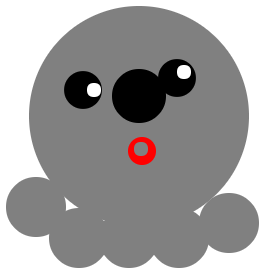

​                                                           **喝了变灰魔法药水的章鱼宝宝是这样的**

```javascript
//写下你的英文名吧
var yourName = '';
//写下你名字的颜色吧
var nameColor = '';

Colors = {
    head: '', //章鱼宝宝脑袋的颜色
    feet1: '', //章鱼宝宝第1只脚的颜色
    feet2: '', //章鱼宝宝第2只脚的颜色
    feet3: '', //章鱼宝宝第3只脚的颜色
    feet4: '', //章鱼宝宝第4只脚的颜色
    feet5: '', //章鱼宝宝第5只脚的颜色
    nipple: '', //章鱼宝宝嘴巴里奶嘴的颜色
    bubble: '' //章鱼宝宝吐的泡泡的颜色
};
Actions = {
    speed: 0, //章鱼游动的速度
    feet1: 0, //章鱼第1只脚的速度
    feet2: 0, //章鱼第2只脚的速度
    feet3: 0, //章鱼第3只脚的速度
    feet4: 0, //章鱼第4只脚的速度
    feet5: 0, //章鱼第5只脚的速度
    eyes: 0, //章鱼能睁眼的速度
    bubble: 0 //章鱼能吐泡泡的速度
};


//不能动的代码
var moveSpeed = 0; //控制章鱼整体移动的参数
var moveFeet1 = 0; //控制章鱼第1只脚的速度
var moveFeet2 = 0; //控制章鱼第2只脚的速度
var moveFeet3 = 0; //控制章鱼第3只脚的速度
var moveFeet4 = 0; //控制章鱼第4只脚的速度
var moveFeet5 = 0; //控制章鱼第5只脚的速度
var bigBubble = 0; //控制章鱼最大泡泡
var bigEyes = 0; //控制章鱼最大眼睛
canvas.width = 500;
canvas.height = 500;
drawGame(); //主函数

//动关节
function moveFeet(A, B) {
  //  A = demoNumber(A);
    if (A !== 0) {
        B += A;
        if (B > 150) {
            B = 0;
        }
    }
    return B;
}
//整体移动
function moveAllSpeed(A) {
    A = demoNumber(A);
    if (A !== 0) {
        moveSpeed += A;
        if (moveSpeed > 400) {
            moveSpeed = 0;
        }
    }
    return moveSpeed;
}
//变大
function moveBig(A, B) {
    A = demoNumber(A);
    if (A !== 0) {
        B += A;
        if (B > 10) {
            B = 0;
        }
    }
    return B;
}
//数字必须在0-10之间
function demoNumber(A) {
    if (A < 0 || A > 10) {
        A = 0;
    }
    return A;
}
//主函数
function drawGame() {
    moveSpeed = moveAllSpeed(Actions.speed);
    moveFeet1 = moveFeet(Actions.feet1, moveFeet1);
    moveFeet2 = moveFeet(Actions.feet2, moveFeet2);
    moveFeet3 = moveFeet(Actions.feet3, moveFeet3);
    moveFeet4 = moveFeet(Actions.feet4, moveFeet4);
    moveFeet5 = moveFeet(Actions.feet5, moveFeet5);
    bigEyes = moveBig(Actions.eyes, bigEyes);
    bigBubble = moveBig(Actions.bubble, bigBubble);
    drawOctopus(Actions, Colors);
    nextFrame(drawGame);
}
//绘制小章鱼的自画像
function drawOctopus(A, C) {
    C.paper = C.paper || 'white';
    C.head = C.head || 'grey';
    C.nipple = C.nipple || 'grey';
    C.feet1 = C.feet1 || '#grey';
    C.feet2 = C.feet2 || '#grey';
    C.feet3 = C.feet3 || '#grey';
    C.feet4 = C.feet4 || '#grey';
    C.feet5 = C.feet5 || '#grey';
    C.bubble = C.bubble || 'black';
    A.speed = A.speed || 0;
    A.eyes = A.eyes || 0;
    A.feet1 = A.feet1 || 0;
    A.feet2 = A.feet2 || 0;
    A.feet3 = A.feet3 || 0;
    A.feet4 = A.feet4 || 0;
    A.feet5 = A.feet5 || 0;
    A.bubble = A.bubble || 0;
    ctx.fillStyle = C.paper;
    ctx.fillRect(0, 0, canvas.width, canvas.height);
    // var sprite = new Sprite('http://osykyzwcn.bkt.clouddn.com/fishbg.png', 0, 0, 500, 500);
   // sprite.draw();
    circle(261 + moveSpeed, 246, 110, C.head); //head
    circle(205 + moveSpeed, 220, (27 + bigEyes) * 0.7, "black"); //eye1
    circle(216 + moveSpeed, 220, (10 + bigEyes) * 0.7, "white"); //eye2
    circle(299 + moveSpeed, 208, (27 + bigEyes) * 0.7, "black"); //eye1
    circle(306 + moveSpeed, 202, (10 + bigEyes) * 0.7, "white"); //eye2
    circle(264 + moveSpeed, 271 + 10, 20 * 0.7, "red");
    circle(263 + moveSpeed, 269 + 10, 10 * 0.7, C.nipple); //nipple
    circle(158 + moveSpeed, 271 + 66 + moveFeet1, 30, C.feet1); //feet1
    circle(201 + moveSpeed, 368 + moveFeet2, 30, C.feet2); //feet2
    circle(251 + moveSpeed, 368 + moveFeet3, 30, C.feet3); //feet3
    circle(301 + moveSpeed, 368 + moveFeet4, 30, C.feet4); //feet4
    circle(351 + moveSpeed, 368 - 15 + moveFeet5, 30, C.feet5); //feet5
    circle(261 + moveSpeed, 226 - 0.5 * moveSpeed, 27 + bigBubble, C.bubble); //bubble
    text(yourName, nameColor);
}

function text(str, color) {
    ctx.fillStyle = color;
    ctx.font = "25" + "px Arial";
    ctx.fillText(str, 0, 30);
}

function circle(circlex, circley, circleradius, co1) {
    ctx.beginPath();
    ctx.arc(circlex, circley, circleradius, 0, 2 * Math.PI);
    ctx.fillStyle = co1;
    ctx.fill();
    ctx.closePath();
}
```

**参考颜色列表**

- [颜色列表](http://www.w3school.com.cn/tags/html_ref_colornames.asp)

## 图形基础

### 使用代码来画图

在学会坐标后，我们就可以学着用代码来绘图了。第一步，来我们来在画布上画出一个圆来。

```javascript
var circle = new Circle(100, 100, 50);
circle.draw();
```

第一行，我们定义了一个圆，名字叫做`circle`。它是一个Circle的实例，括号里有3个参数，从左到右依次是圆的x、y值，还有半径r。

第二行，我们是有那个了`circle`的方法`draw`，将圆画在屏幕上。

**试一试**

* 修改圆的x坐标，y坐标，重新运行，看看会有什么变化。
* 修改圆的半径，重新运行，看看会有什么变化。
* 画一个圆，尽可能大的占满屏幕，但又不超出屏幕。做完后，你有什么发现呢。这个最大的圆和画布的关系是什么。

#### 挑战：雪人

从前有一只可爱的雪人叫西西，他没有镜子，一直都看不到自己可爱的样子。让我们用编程的魔法画出他的样子给他看吧。

第一步，让我们思考下雪人是什么样子的。是不是下面这个样子的，它的身体、它的头部，还有它的眼睛，都是圆圆的，所以我们就可以用圆来模拟雪人。


首先，让我们用圆来画出雪人的身体。我们需要把雪人的身体摆在合适的位置，对照坐标轴，为雪人的身体选择一个最合适的位置。

```javascript
var body = new Circle(200, 250, 100);
body.draw();
```

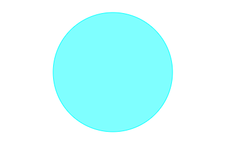

运行，看雪人的身体是不是出现在屏幕上了。但是呢，雪人的身体是白色的，我们要把它改成白色的。在第一行代码后面加入一行代码，将雪人的颜色修改成为白色。

```javascript
var body = new Circle(200, 250, 100);
body.fillStyle = "white";
body.draw();
```


快看，我们成功的用代码画出了一个白色的雪人身体。接下来，让我们把雪人的头画上去，雪人的头也是一个圆，同样，我们也要将雪人脑袋的颜色改成白色。

```javascript
var head = new Circle(200, 130, 60);
head.fillStyle = "white";
head.draw();
```

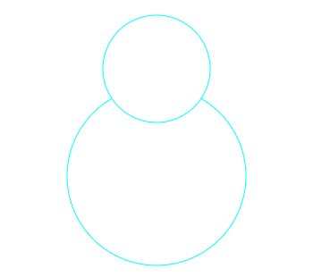

再次运行，看雪人的头是不是出现了。接下来，就是雪人的眼睛了，这里我们让雪人的眼睛变成黑色。你可以选择喜欢其他你喜欢的颜色，

```javascript
var body = new Circle(200, 250, 100);
body.fillStyle = "white";
body.draw();

var head = new Circle(200, 130, 60);
head.fillStyle = "white";
head.draw();

var eye = new Circle(180, 120, 10);
eye.fillStyle = "black";
eye.draw()

var eye = new Circle(220, 120, 10);
eye.fillStyle = "black";
eye.draw()
```

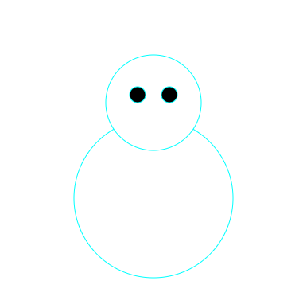

我的雪人完成了，接下来就到你了。

**试一试**

* 修改雪人的位置，让雪人出现在各个位置。
* 修改雪人的颜色，创造出一个‘美丽’的雪人。
* 在一张画布上再画出1个不一样的雪人来。

除了白色(white)，黑色(black)外，还有很多丰富多彩的颜色，比如红色(red)，橙色(orange)，黄色(yellow)，绿色(green)等等。大家可以尽情的发挥你们的想象力，创造出不一样的雪人出来。

#### 挑战：章鱼保罗

每画一个圆都要写好多代码，有没有简单的办法呢，当然了，我们可以定义一个方法`drawXY`来帮我们完成这些事情，我们将在后面的课程中学习函数的相关知识，在这里，我们只需要把`drawXY`赋值给`c.draw`就可以了。

```javascript
function drawXY(x, y){
    this.x = x;
    this.y = y;
    this.fill();
}

var c = new Circle();
c.draw = drawXY;
```

这样，我们只要用`c.draw(x, y, r)`就能够直接画出一个圆来了，下面我们就用这个函数来画出我们的保罗啦。

首先，让我们把保罗的身体画出来，我的保罗是一只粉红色的，那么我就将它的颜色设置为pink。很快，我们就可以看到一个粉红色的圆出现在画布上了。

```javascript
c.fillStyle = 'pink';
c.r = 100;
c.draw(200, 200); // body
```

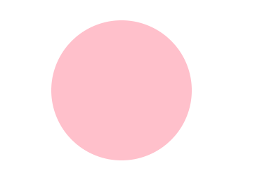

接下来，让我们把保罗的脚们画上去，脚比身体要小很多，所以我要把半径减小。我的保罗有5只脚，让我们依次画出它们来。

```javascript
c.r = 30;  // foot
c.draw(104, 289); // foot 1
c.draw(155, 320); // foot 2
c.draw(215, 329); // foot 3
c.draw(264, 309); // foot 4
c.draw(310, 276); // foot 5
```

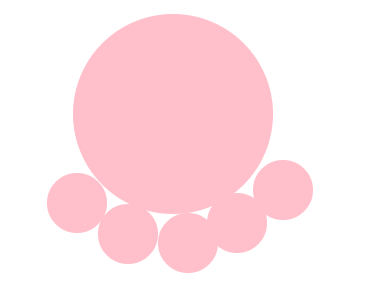

保罗出现了，不过好像它背对着我们，让我们来想个办法让它转过来。在上面加个眼睛和嘴巴。

```javascript
c.fillStyle = 'black';
c.r = 15;
c.draw(160, 200); // eye
c.draw(200, 200); // eye

c.fillStyle = 'red';
c.r = 5;
c.draw(200, 250);  // mouse
```

看，我们的小章鱼保罗出现了，快来分享你们的作品吧。


**试一试**

* 创作你的章鱼。
* 给你的小章鱼取个名字，说说为什么。

### 矩形

除了圆以外，我们还可以使用更多的图形，创造出来更多丰富的图形出来。

我们把类似下面的图形叫做矩形，它包括了正方形和长方形。在生活中有许许多多的图形都是矩形。


在画布上画出一个矩形，我们需要使用以下的代码。

```javascript
var rect = new Rectangle(100, 100, 200, 50);
rect.draw();
```

#### 挑战：车辆

`drawXY`函数可以让图形可以直接使用`draw(x, y)`，我们将在后面的单元中学习相关的知识。

```javascript
function drawXY(x, y){
    this.x = x;
    this.y = y;
    this.fill();
}

var bus = new Rectangle(50, 50, 300, 150);

var glass = new Rectangle(0, 0, 50, 50);
glass.draw = drawXY;

var wheel = new Circle(100, 100, 30);
wheel.draw = drawXY;

bus.fillStyle = "green";
bus.draw();

glass.fillStyle = "white";
glass.draw(80, 80);
glass.draw(140, 80);
glass.draw(200, 80);
glass.draw(260, 80);

wheel.fillStyle = "black";
wheel.draw(120, 200);
wheel.draw(280, 200);
```

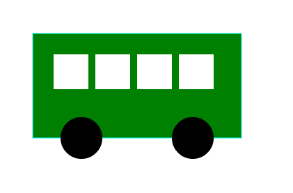

**说一说**

*　生活中有那些东西是矩形

*　使用矩形和圆形来创作你的作品

### 线条

线条，是由2个不同的点决定的。

```javascript
var line = new Line(100, 100, 200, 200);
line.draw();
```

#### 挑战：雪人的手臂

让我们回到雪人，让我们为雪人加上手臂。

```javascript
var leftHand = new Line(80, 150, 150, 220);
leftHand.draw();

var rightHand = new Line(320, 150, 250, 220);
rightHand.draw();
```


**试一试**

* 帮你的雪人加上手臂，还有手指
* 使用矩形、圆、线条来创作你的作品

综合课：

引导 让学生自己画出自己喜欢的图形use 圆。线。矩形（有缺口的圆 、用很多三角形画宝剑） 

## 变量

### 介绍变量

变量，就像是计算机里的一个盒子，可以存放着各种各样的东西，但是里面只能放一个东西。

我们现在就有一个变量盒子，它的名字叫box，因为它可以用来放东西，所以我们先往里面放一个苹果吧。


放了一个苹果后，叫box的这个变量盒子里面就有了一个苹果。

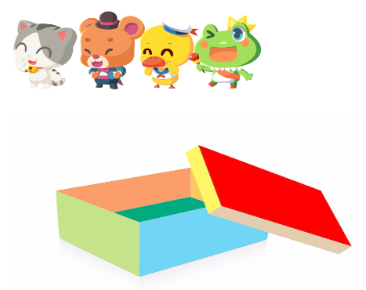

如果我们再往叫box的这个变量盒子里面放一根香蕉呢？猜一猜会发生什么。

当当当当！里面并不是有苹果也有香蕉，而是只有香蕉。

变量这个盒子的容量很小，里面只能放一个东西。之前我们放的苹果就被计算机扔出去啦。因为塞不下啦。


**试一试**

- 找一张你最喜欢的水果的图片，放在变量里吧

```javascript
附录代码：
var box = new Rectangle(45, 436, 500, 300);
box.fillStyle = 'orange';
box.fill();
var apple = 'https://ss1.bdstatic.com/70cFuXSh_Q1YnxGkpoWK1HF6hhy/it/u=261613111,2092797742&fm=27&gp=0.jpg'
var banana = 'https://ss3.bdstatic.com/70cFv8Sh_Q1YnxGkpoWK1HF6hhy/it/u=3134587658,578833225&fm=27&gp=0.jpg'
var text = new Text();
text.x = 45;
text.y = 436 + 250;
text.src = '变量box';
text.fillStyle = 'white';
var sprite = new Sprite(apple, 272.5 - 100 - 22.5, 436, 250, 250);
sprite.onload = function() {
    box.click = function() {
        sprite.draw();
        text.fill();

    }
}
```

### 变量的重要性

### 小测验：变量

通过之前的课程，我们学会了画圆的方法，那让我们把圆心的横方向位置（X坐标）用计算机里的盒子——变量来表示吧。

画出了圆后，改变一下变量circleX的数字大小让你的圆形左右移动吧。

```javascript
var circleX = 80;
var circle = new Circle(circleX, 80, 70);
circle.draw();
```

### 更多的变量

既然圆的左右位置我们可以通过变量进行改变，那圆的上下位置是不是也可以呢？

让我们定义一个变量circleY来试一试你的圆形有没有上下移动吧。

```javascript
var circleX = 80;
var circleY = 80;
var circle = new Circle(circleX, circleY, 70);
circle.draw();
```

### 挑战：用变量来绘制雪人

让学生找出之前的雪人项目，将xy坐标用变量来表示。通过修改变量，让雪人整体移动。

```javascript
var snowX = 220;
var snowY = 250;

var body = new Circle(snowX, snowY, 100);
body.fillStyle = "white";
body.draw();

var head = new Circle(snowX, snowY-120, 60);
head.fillStyle = "white";
head.draw();

var eye = new Circle(snowX-20, snowY-130, 10);
eye.fillStyle = "black";
eye.draw()

var eye = new Circle(snowX+20, snowY-130, 10);
eye.fillStyle = "black";
eye.draw()
```


## 图片

### 什么是链接

链接是资源在网络上的地址，那小朋友们是不是都有家庭住址，你的好朋友知道你家的地址就能来找你玩了呀，所以我们知道了图片的地址，就能够找到这张图片了。

### 使用图片

首先点击`内置函数`里的`image方法`，然后修改图片的链接和横纵方向的位置和图片的宽度高度。我们就能在画布上绘制出一张自己喜欢的图片啦。

注意：图片链接一定要写在英文的引号里

```javascript
var sprite = new Sprite('http://static.leaplearner.com/image/image.png', 53, 363, 40, 40);
sprite.draw();
```


### 图片的顺序

插入图片时，后插入的图片会盖住先插入的图片。就像我们在一张白纸上画画，后画的东西是不是会盖住先画的东西呀。

试一下将frogBacGro.draw();这一行代码加在snake.draw();后面图片会发生什么吧。

```javascript
// Let us code the future
var frogBacGro = new Sprite('http://pic.qiantucdn.com/58pic/16/61/85/69858PICHs6_1024.jpg',0,0,650,332);//background
var tiger = new Sprite('http://ou1htxdl4.bkt.clouddn.com/image/L1U2_1_tiger.png',145,230,95,103);
var fox = new Sprite('http://ou1htxdl4.bkt.clouddn.com/image/L1U2_1_fox.png',240,230,95,103);
var eagle = new Sprite('http://ou1htxdl4.bkt.clouddn.com/image/L1U2_1_eagle.png',335,230,95,103);
var snake = new Sprite('http://ou1htxdl4.bkt.clouddn.com/image/L1U2_1_snake.png',430,230,95,103);

frogBacGro.onload = function() {
   frogBacGro.draw();
   tiger.draw();
   fox.draw();
   eagle.draw();
   snake.draw();
};
```

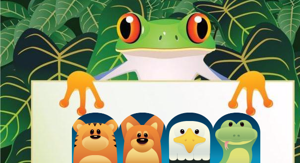

### 挑战：动物园I

使用图片来创建一个动物园

### 放大和缩小

通过修改图片的宽度和高度来完成放大和缩小。

动物可不是一样大小，我们要让动物变的和他们实际体型一样。（也就说小猫是不可能比大象的图片大的哟）


让我们找两张动物的图片来试一试吧。

### 挑战：小剧场

让我们挑选出故事的主人公，并且带上他们各自的宠物出现吧。

### 立乐图片素材库

### 挑战：动物快乐节

今天是动物界里的快乐节，所有的小动物都要笑，请你从素材库里找出所有笑着的小动物，把它们用插图片的方法画出来吧。找出五个。

## 动画基础

### 什么是动画

每一个画面称为一帧，下一帧的内容总比前一帧有稍微的变化。这样，就产生了运动的错觉：每一帧都很短并且很快被另一个帧所代替，这样就产生了运动。比如我们拍下举起手的照片和放下手的照片，快速的看一眼举起手的照片，然后再快速的看一眼放下手的照片，就会有一种运动的错觉。

### 制作动画：让小猫动起来

找出图片素材库里所有小猫的图片，把图片链接放在`var catLink = [ ];`这句代码的`[ ]`里，每一个图片的链接之间要用逗号隔开，像这样`['http://rss.leaplearner.com/Image/Animals/Cat_happy.png' , 'http://rss.leaplearner.com/Image/Animals/Cat_angry.png'];`

```javascript
附录完整代码：
var catLink = ['http://rss.leaplearner.com/Image/Animals/Cat_happy.png', 'http://rss.leaplearner.com/Image/Animals/Cat_angry.png', 'http://rss.leaplearner.com/Image/Animals/Cat_stand.png', 'http://rss.leaplearner.com/Image/Animals/Cat_think.png', 'http://rss.leaplearner.com/Image/Animals/Cat_walk.png'];
var cat = new Sprite(catLink[0], 150, 200, 200, 200);
var i = 0;

function main() {
    canvas.clear();

    if (i > catLink.length) {
        i = 0;
    }
    cat.src = catLink[i];
    i++;

    cat.draw();
}
setInterval(main, 500);
```


#### 挑战：日出

我们知道，每天早上太阳都会从东边升起来。让我们来做一个日出的动画。

第一步：让我们先画一片海。

第二步：让我们再画出一片天空。

第三步：画出我们的太阳。

第四步：让太阳动起来。

想一想：怎么让太阳升到高空停下来？

```javascript
var sky = new Rectangle(0, 0, 350, 300);
sky.fillStyle = "white";
var sea = new Rectangle(0, 300, 350, 150);
sea.fillStyle = "blue";
var sun = new Circle(200, 430, 20);
sun.fillStyle = "red";

var draw = function() {

    sky.fill();
    sun.y = sun.y - 1;
    if (sun.y <= 34) {
        clearInterval(n);
    }
    sun.fill();
    sea.fill();

};

draw();

var n = setInterval(draw, 100);
```

#### 挑战：云朵

在天空中添加一片云朵，并让云朵动起来。

```javascript
var sky = new Rectangle(0, 0, 350, 300);
sky.fillStyle = "white";
var sea = new Rectangle(0, 300, 350, 150);
sea.fillStyle = "blue";
var sun = new Circle(200, 430, 20);
sun.fillStyle = "red";
var cloud = new Ellipse(50, 50, 30, 20);
cloud.fillStyle = "white";
cloud.strokeStyle = 'cyan';

var draw = function() {
    sky.fill();
    cloud.x = cloud.x +1;
    if (cloud.x  >= 150) {
        cloud.x =50 ;
    }
    cloud.draw();
    
    sun.y = sun.y - 1;
    if (sun.y <= 34) {
        sun.y = 34;
    }
    sun.fill();
    sea.fill();

};

draw();

var n = setInterval(draw, 100);
```


## 音效

### 加入背景音乐

```javascript
var music = new Audio();
music.src = "ddd.mp3";
music.play();
```

### 立乐音乐素材库

如何使用音乐素材库: 点击左侧`多媒体`，点击`音乐`，选择你最喜欢的音乐吧!	


**试一试**

- 通过改变`var catLink = [ ]`里的链接，制作属于你自己的钢琴键吧

附录代码：

```javascript
var urlArr = ['http://static.leaplearner.com/sounds/jump.mp3', 'http://static.leaplearner.com/sounds/coin.mp3'];
Rectangle.prototype.click = function() {
    this.audio.play();
};
for (i = 0; i < urlArr.length; i++) {
    var rect = new Rectangle(100, 100, 50, 100);
    var rect2 = new Rectangle(100 + 25 - 25.5 / 2, 100, 50 / 2, 100 / 2);
    rect.audio = new Audio();
    rect.fillStyle = 'white';
    rect.strokeStyle = 'black';
    rect.audio.src = urlArr[0];
    rect.draw();
    rect2.audio = new Audio();
    rect2.fillStyle = 'black';
    rect2.strokeStyle = 'black';
    rect2.audio.src = urlArr[1];
    rect2.draw();
}
```

