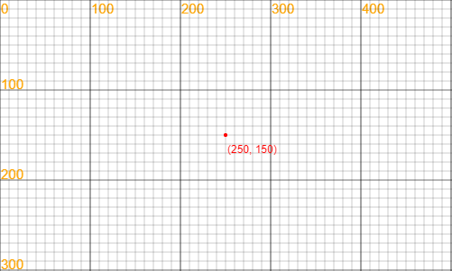

---
Learning Coding with LeapLearner
---

# 乐学编程

本书是立乐在线课堂系列第一部分课程内容。

[TOC]

## 开发环境

### 立乐课堂

在浏览器中打开https://code.leaplearner.com，注册一个账号，用于保存学习进度。

### IDE介绍

下面是立乐IDE的一个截图，可以看见分成了2个区域，左边是展示区域，右边是代码输入区域。我们在代码输入区域将代码输入完成后，如果一切正常，点击运行按钮就可以看到运行结果了。


#### 功能说明

`分享`: 点击后生成链接和二维码，可以通过手机扫描获取到项目展示信息。

`运行`: 点击后执行JavaScript代码。每次点击`运行`都会重新开始执行。

`文件`: 用于操作文件，可以新建一个文件，或者打开、保存已有的文件。

## 什么是编程

### 重要性

网络的普及，使得人们被一分为二：告诉电脑该怎么做的人，以及被电脑告知该怎么做的人。 

### 编程的应用

#### 说一说

* 说出你知道的编程能够应用的地方

## 认识坐标

### 坐标系统

为了定义空间的位置，数学家们发明了坐标的概念，在此至上发展出了庞大的几何学科。在计算机图形中，坐标系统更是不可或缺。

我们将左上角的坐标定义为`(0,0)`，把水平轴为`x轴`，把垂直坐标定义为`y轴`。平面上的任意一个点，在`x轴`上的投影称之为该点的`x坐标`，同样，在`y轴`上的投影即`y坐标`。因此，整个坐标系看起来像是这个样子的。


#### 说一说

* 指出原点的位置
* 指出x轴和y轴
* 指出x轴的方向和y轴的方向

### 屏幕坐标

只要确定了坐标点的值，我们就能很容易的确定坐标的位置了。比如点（250，150）在坐标轴上的位置，我们就可以很容易找出来了。



> 小知识：笛卡尔坐标系和网页坐标系
>
> 和数学上常见的笛卡尔坐标系不同的是，网页坐标系的y轴正方向朝下。这是因为人类阅读习惯于从左到右，从上到下，在浏览器的定位系统中，根据这个习惯来定义坐标的位置，使得在网页设计时更为合理。

#### 说一说

* 指出一个点，说出这个点的坐标
* 说出一个坐标，让其他人来指出这个坐标的位置

### 挑战：跑酷游戏

立乐项目组开发了一个跑酷游戏，明天就要上线了，但是还剩最后一点工作没有完成，就是摆放障碍物的位置。我们需要你来帮忙摆放障碍物的位置，来完成这个项目。在这里，障碍物的位置，就是由坐标来决定的，修改代码中各个障碍物的位置，完成这个项目吧。


#### 试一试

* 创作你的跑酷游戏。
* 挑战别人的作品，看能不能打破他的最高分。
* 让别人来尝试你的作品，看看谁的作品最好玩。

## 图形基础

### 使用代码来画图

在学会坐标后，我们就可以学着用代码来绘图了。第一步，来我们来在画布上画出一个圆来。

```javascript
var circle = new Circle(100, 100, 50);
circle.draw();
```

第一行，我们定义了一个圆，名字叫做circle。它是一个Circle的实例，括号里有3个参数，从左到右依次是圆的x、y值，还有半径r。

第二行，我们是有那个了circle的方法draw，将圆画在屏幕上。

#### 试一试

* 修改圆的x坐标，y坐标，重新运行，看看会有什么变化。
* 修改圆的半径，重新运行，看看会有什么变化。
* 画一个圆，尽可能大的占满屏幕，但又不超出屏幕。做完后，你有什么发现呢。这个最大的圆和画布的关系是什么。

### 挑战：完成一个雪人

第一步，让我们思考下雪人是什么样子的。是不是下面这个样子的，它的身体、它的头部，还有它的眼睛，都是圆圆的，所以我们就可以用圆来模拟雪人。


首先，让我们用圆来画出雪人的身体。我们需要把雪人的身体摆在合适的位置，对照坐标轴，为雪人的身体选择一个最合适的位置。

```javascript
var body = new Circle(200, 400, 100);
body.draw();
```

运行，看雪人的身体是不是出现在屏幕上了。但是呢，雪人的身体是白色的，我们要把它改成白色的。在第一行代码后面加入一行代码，将雪人的颜色修改成为白色。

```javascript
var body = new Circle(200, 400, 100);
body.fillStyle = "white";
body.draw();
```

快看，我们成功的用代码画出了一个白色的雪人身体。接下来，让我们把雪人的头画上去，雪人的头也是一个圆，同样，我们也要将雪人脑袋的颜色改成白色。

```javascript
var head = new Circle(200, 280, 60);
head.fillStyle = "white";
head.draw();
```

再次运行，看雪人的头是不是出现了。接下来，就是雪人的眼睛了，这里我们让雪人的眼睛变成黑色。你可以选择喜欢其他你喜欢的颜色，

```javascript
var body = new Circle(200, 400, 100);
body.fillStyle = "white";
body.draw();

var head = new Circle(200, 280, 60);
head.fillStyle = "white";
head.draw();

var eye = new Circle(180, 270, 10);
eye.fillStyle = "black";
eye.draw()

var eye = new Circle(220, 270, 10);
eye.fillStyle = "black";
eye.draw()
```

我的雪人完成了，接下来就到你了。

#### 试一试

* 修改雪人的位置，让雪人出现在各个位置。
* 修改雪人的颜色，创造出一个‘美丽’的雪人。
* 在一张画布上再画出1个不一样的雪人来。

除了白色（white），黑色（black）外，还有很多丰富多彩的颜色，比如红色（red），橙色（orange），黄色（yellow），绿色（green）等等。大家可以尽情的发挥你们的想象力，创造出不一样的雪人出来。

### 挑战：章鱼保罗

每画一个圆都要写好多代码，有没有简单的办法呢，当然了，我们可以定义一个函数来帮我们完成这些事情。

```javascript
function drawCircle(x, y, r, color){
    var c = new Circle(x, y, r);
  	c.fillStyle = color;
  	c.fill();
}
```

这样，我们只要用drawCircle就能够直接画出一个圆来了，下面我们就用这个函数来画出我们的保罗啦。

```javascript
drawCircle(300, 200, 100, 'pink'); // body
drawCircle(330, 200, 15, 'black'); // eye
drawCircle(270, 200, 15, 'black'); // eye

drawCircle(300, 250, 5, 'red');  // mouse

drawCircle(204, 289, 30, 'pink'); // foot
drawCircle(255, 320, 30, 'pink'); // foot
drawCircle(315, 329, 30, 'pink'); // foot
drawCircle(364, 309, 30, 'pink'); // foot
drawCircle(410, 276, 30, 'pink'); // foot
```

看，我们的小章鱼保罗出现了，快来分享你们的作品吧。


#### 试一试

* 创作你的章鱼。
* 给你的小章鱼取个名字，说说为什么。

### 画更多的图形

除了圆以外，我们还可以使用更多的图形，创造出来更多丰富的图形出来。

#### 矩形

矩形，包括正方形和长方形

```javascript
var rect = new Rectangle(100, 100, 200, 50);
rect.draw();
```

#### 线条

线条，是由2个不同的点决定的。

```javascript
var line = new Line(100, 100, 200, 200);
line.draw();
```

#### 试一试

* 帮你的雪人加上手臂
* 使用矩形来创作

## 颜色

在生活中，有许许多多的颜色，让世界变得丰富起来。比如彩虹，就有红橙黄绿青蓝紫等颜色。


### 颜色代码

我们要让计算机知道颜色，那么我们就要告诉计算机这个颜色的名字。和坐标不一样的是，颜色的代码是一串字符，而不是数字，因此，我们需要将颜色名字用双引号或者单引号引起来。

```javascript
var circle = new Circle(100, 100, 50);
circle.fillStyle = 'red';
circle.draw();
```

试着将红色替换为绿色，重新点击运行，看看图形的颜色是不是发生了变化。

```javascript
circle.fillStyle = 'green';
```

#### 试一试

* 列出所有你知道的颜色名称
* 试试你知道的颜色

### 常见颜色

让我们来认识这些颜色，

TODO: 这里需要一个项目

**参考颜色列表**

* [颜色列表](http://www.w3school.com.cn/tags/html_ref_colornames.asp)

## 变量

### 介绍变量


### 小测验：变量

### 更多的变量

### 挑战：用变量来绘制雪人

TODO：使用变量来绘制雪人

通过修改变量，让雪人整体移动。

## 图片

### 什么是链接

链接是资源在网络上的地址，只要获得了图片的链接，我们就能够使用这张图片了。

### 使用图片

如何在画布上绘制出一张图片。

### 图片的顺序

使用图片时，后面的图片会盖住前面的图片

### 挑战：动物园I

使用图片来创建一个动物园

### 放大和缩小

动物可不是一样大小，我们要让动物变的和他们

### 挑战：动物园II

### 立乐图片素材库

### 挑战：小小艺术家

## 动画基础

### 什么是动画

动画原理

### 制作动画

### 挑战：日出

我们知道，每天早上太阳都会从东边升起来。让我们来做一个日出的动画。

第一步，让我们先画一片海。

```javascript
var sky = new Rectangle(0, 0, 350, 400);

var sea = new Rectangle(0, 400, 350, 150);
sea.fillStyle = "blue";

var sun = new Circle(200, 500, 20);
sun.fillStyle = "red";

var draw = function(){
    sky.draw();
    sun.y = sun.y - 1;
    
  	sun.draw();
  	sea.draw();
};

setInterval(draw, 100);
```

### 挑战：云朵

在上面添加一个云朵，并让云朵动起来。

## 音效

### 加入背景音乐


### 立乐音乐素材库

如何使用音乐素材库

## 输入

### 键盘输入

### 挑战：打字游戏

### 中英文字符

在输入的时候要特别注意，在这里，计算机只能识别英文字符，如果输入中文的标点符号，计算机就无法正确识别出来你的命令。

改正下面代码中错误的标点符号，让程序跑起来。

```javascript
var ball = new Circle（200，200, 50）;
ball。draw()；
```

下面列出了一些常见的错误符号，一般来说，中文的标点符号要比英文标点符号占据的空间更大。

| 英文标点 | 中文标点 |      |
| ---- | ---- | ---- |
| .    | 。    |      |
| ,    | ，    |      |
| ;    | ；    |      |
| ()   | （）   |      |

不过，好在计算机可以帮助我们做这件事情，当你输入一个错误的符号时，计算机会在代码前面提示这个错误，如果发现有错误提示，赶紧看看是不是标点符号出错了呢。

### 复制和粘贴

在学习过程中，我们经常会用到一些命令

选中：

复制：

粘贴：

快捷键

Ctrl + C / V;

## 交互

### 鼠标点击事件

### 任务：打地鼠

## 键盘练习

目标：熟悉键盘操作

### 大小写

输入10个数字

输入26个字母及大写字幕

### 标点符号

输入标点符号

### 切换输入法

学会切换输入法

输入回车和删除键

### 复制和粘贴

使用复制和粘贴快捷键

## 鼠标练习

### 鼠标移动

将鼠标光标移动到指定位置

### 点击和双击

区分左键点击和右键点击

### 选中

使用鼠标选中物体

### 右键菜单

使用鼠标完成复制、剪切和粘贴操作

目标：熟悉鼠标操作

下面的代码是一个鼠标点击小游戏，复制以下代码到编辑器中，运行后，在规定时间内达到20分即及格。

```javascript
var c = new Circle();

a = new Date();
score = 0;

!function () {
    canvas.clear();
    c.draw();
    score.toString().draw();
    var t = (new Date() - a)/1000;
    (""+t+'s').draw(1, 50);
    if(t < 30)
       nextFrame(arguments.callee)
}();

c.click = function(){
    c.x = 50 + 300 * Math.random();
    c.y = 50 + 500 * Math.random();
    score++;
};
```

| 分数    | 评价   |      |
| ----- | ---- | ---- |
| 20-29 | 及格   |      |
| 30-39 | 良好   |      |
| 40+   | 优秀   |      |

### 


