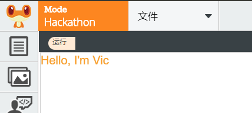

---
Learning Coding with LeapLearner
---

# 乐学编程

本书是立乐在线课堂系列第二部分课程内容，建议在完成立乐在线课堂系列第一部分内容的学习之后再开始学习。


[TOC]


## 图形

在学习了矩形和圆形后，相信大家对图形都有了一些基本的认识。

### 点

```javascript
var p = new Point(100, 100);
p.draw();
```

#### 实例：点点点

画一个点，我们只需要定义出一个点，然后将这个点绘制在画布上即可。点的初始化需要2个数值，x坐标和y坐标，有了这两个值，就可以确定一个点的位置了。

```javascript
var p = new Point(100, 100);
p.draw();
```

很快，我们就可以在画布的100，100上看到这个点了。接下来，我们想要在每次点击画布的时候，留下一个点。我们就使用鼠标的事件函数Mouse.click，然后将点的位置移到鼠标位置，再画出来。

```javascript
Mouse.click = function () {
    p.x = Mouse.x;
  	p.y = Mouse.y;
  	p.draw();
};
```


当鼠标点击时，点的位置都会被设置为鼠标所在的位置，并且将点绘制出来。

```javascript
var p = new Point(100, 100);

Mouse.click = function(){
    p.x = Mouse.x;
    p.y = Mouse.y;
    p.draw();
};
```


#### 实例：用点来模拟图形


### 线段

两点确定一条线段，通过设置线条两点的位置，我们可以确定线条的起始位置和终止位置。在画布中，我们用下面的方式来定义一个线段。

```javascript
var line = new Line(x1, y1, x2, y2)
```

定义后，我们就获得了line这个对象，通过修改line的属性，我们就可以改变线条的位置、样式以及它的宽度。

线条有比较多的属性值，修改线条的位置是一件非常容易出错的事情，要特别的小心。

#### 实例：线条

首先，定义一个线条，从点`(100, 100)`连接到点`(250, 100)`，并在画布中绘制出来。

```javascript
var line = new Line(100, 100, 250, 100);
line.draw();
```

第二步，将线条往下平移到200，即将线条两个点的坐标设置为200，再将线条的颜色改成红色，粗细设置为5个像素，再次在画布上绘制。

```javascript
line.y1 = 200;
line.y2 = 200;
line.strokeStyle = "red";
line.lineWidth = 3;
line.draw();
```

最终效果图如下，仔细观察`output`中线条的粗细程度。


注意的是，和其他图形不一样的是，线条是没有面积的，因此是没有`fill`方法的。

### 多边形

```javascript
var polygon = new Polygon(100, 200, 100, 300, 200, 200, 200, 400);
polygon.draw();
```

多边形的绘制是依据点的顺序来的，不同的顺序绘制的多边形是不一样的。同时，绘制出来的多边形可能不是简单的凸多边形，有兴趣的同学可以去了解下多边形的分类，以及多边形的外部和内部的区分。

### 三角形

```javascript
var triangle = new Triangle(x1, y1, x2, y2, x3, y3);
```

三角形是多边形的一种特殊情况，即只有3条边的多边形。因此除了定义上，三角形和多边形具有一样的属性和方法。


## 代码结构

### 代码执行顺序


## 变量

### 数值

### 字符串

首先，我们先学会将字符串输出在画布上，只要在字符串后使用draw方法，就可以在画布上显示出来。

```javascript
var s = "Hello, I'm Vic";
s.draw();
```

输入结果



字符串连接运算符

如果我们要将字符串拼接在一起，我们使用+号来

```javascript
var s = "Hello" + "World";
s.draw();
```

我们可以在屏幕上显示出来"HelloWorld"，我们成功的将字符串拼接在一起了。

#### 空格

在字符串中，用`" "`来表示空格

```javascript
var s = "Hello " + "World";
s.draw();
```


### 布尔值

### 变量的命名规则


#### 驼峰法

当变量或者函数的名称是由多个单词连接在一起的时候，第一个单词以小写字母开始，后面每个单词的首字母大写。

因为大小写的区分使得复合词呈现出块状，看上去就想骆驼的驼峰。

```javascript
var myName = 'Vic';
var myAge = 18;
var myFavouriteBook = 'Javascript';
```

#### 全局变量

一般的，全局变量所有字母都写成大写

```javascript
PI, COUNT
```

#### 变量的名称

我们在给变量取名的时候，一定要取一个有意义的变量名字，这样我们在看到这个变量名字的时候，能够很快的了解这个变量是做什么的，下面两段代码用的不用的变量名称，阅读下面的代码，预测下运行的结果。在编辑器中运行，看看结果和你设想的是否一致。

在这个例子中，由于变量没有一个很好的名字，我们阅读起来就非常费劲。

## 二维码

TODO：这里需要一个将字符串转为二维码的项目。在这之前，使用以https://cli.im/text为例进行说明。

在生活中，我们经常看到很多的二维码。有各种各样不同的功能，只要用手机扫一扫，就用很简便的使用它们。

其实，每个二维码对应的都是一组字符串，如果这个字符串是一个网址，那么手机会自动打开这个网址，进入到这个应用。下面，我们就来看看怎么制作自己的二维码，利用二维码来传递我们的信息。

### 制作二维码

实例：二维码的Hello World程序

打开项目，在文本框中输入一个字符串，点击运行后，就可以在画布上成功显示出制作完成的二维码。


这就是我们成功制作的第一个二维码啦，但是从这张图上我们无法直接读取出来里面的信息。这时，就需要我们学会去读取二维码。

说一说：

* 观察二维码，它们有什么相同点
* 二维码的方向是什么样的

### 识别二维码

我们有很多的软件可以来识别二维码，最简单的，现代的手机上有很多可以扫描二维码的软件，使用扫一扫功能，就可以看到这个二维码上带的内容。

```html
Hello, World!
```

动手试一试

* 写下一段话，将这段话转为二维码
* 将二维码发送给其他人，告诉他们怎么识别二维码

如果我们输入了很多的文字，那么这个二维码就会变得越来越复杂，越来越大。

### 二维码分享

将二维码发送给其他人，只要其他人获取到这个二维码，就能够获取到二维码携带的信息。

二维码有一定的容错性，因为二维码的这个特性，那怕二维码上面

二维码是没有加密的，只要拿到了二维码，就能用软件读取出其中的内容，所以如果你想要用二维码来传达秘密，你可要小心不要被其他人看到这个二维码。

#### 实例：分享自己的项目

同样，我们可以通过二维码分享自己的项目，在屏幕右上角，我们有一个分享按钮。点击后可以看到有2个内容，一个是二维码，一个是网址。在这里，这个二维码内容就是我们的网址。如果你要把自己的作品分享给其他人，那么只要将这个二维码发送给他，对方使用手机软件进行扫描后就可以看到了。

**动手试一试：**

* 把自己最喜欢的一个项目的二维码保存下来
* 发送给爸妈还有同学们，让他们观看你的项目

## 文本

在上一节中，我们知道如何将字符串显示出来。也知道了如何

### 颜色

fillStyle

### 大小

### 字体

自己观察下面的2行字，发现他们有什么不一样的地方。

A字体，B字体

同样的字，在计算机中可以用不一样的字体来显示出来。

几种常见的字体


## 图形的属性

图形一般包含边和填充，图形的样式也是由这两块共同组成。

### 填充样式

```javascript
rect.fillStyle = "red";
rect.draw();
```

填充样式

### 线条样式

```javascript
rect.strokeStyle = "green";
rect.stroke(); 
```

实例：

stoke和

###

## 代码规范

### 缩进

每新增一个模块内容，整个代码区域往右缩进4个空格

看看下面的代码，哪个是符合要求的。

```javascript
var rect = new Rectangle(100, 100, 100, 50);

function draw (x, y) {
  	rect.x = x;
  	rect.y = y;
    rect.draw(); 
}

rect.draw(200, 200);
```

```javascript
var rect = new Rectangle(100, 100, 100, 50);

function draw (x, y) {
rect.x = x;
rect.y = y;
rect.draw();
}

rect.draw(200, 200);
```

这两段代码实现的效果完全一致，但是第二段代码没有按照要求进行缩进。在阅读上就没有第一个直观。

使用4个空格符号缩进

### 空格

运算符前后需要添加空格

函数名称后无空格

函数参数与括号间无空格

对象的冒号后加空格，冒号前不加

条件语句关键字后加空格

### 分号

一条语句通常以分号作为结束符。

```javascript
var a = 1;
var funk = {
    name: 'funk',
  	age: 18
};
```

### 换行

每行代码的字符数要少于80个。如果一个JavaScrip的语句超过了80个字符，建议在运算符或者逗号后换行。


在实际编程中，会有很多各种各样的编程规范，有了良好的编程规范，我们在编写代码时可以减少很多错误。

当然，良好的编程规范并不是一蹴而就的，需要我们在平时编程过程中，要注意多多积累，养成良好的习惯。

## 事件

计算机在运行的时候，能够同时。当鼠标被点击的时候，当键盘上的按键被按下的时候，会产生一个事件，通知计算机

### 事件原理

### 鼠标事件

### 键盘事件

当键盘上的一个按键被按下的时候，就会触发一个按键事件。如果我们为按键事件绑定了函数，那么这个函数就会被执行。

先让我们试一个简单的例子，用WASD来移动方块。

#### 实例：移动方块

首先，我们在画布上画出一个方块。为了能够实时显示方块的位置，我们使用了动画，但是方块并没有在运动，所以我们无法看到任何动作。

```javascript
var rect = new Rectangle(100, 100, 100, 100);

function main(){
  	canvas.clear();
    rect.draw();
}

setInterval(main, 100);
```

接下来，我们在按键D上面绑定一个事件，只要按下D，就会触发这个函数。

```javascript
Key.d.press = function(){ rect.x += 10;}
```

再次运行，点击D，方块就随之往右移动了！

我们再把ASW的按键事件加上去，这样我们就可以用WASD来控制方块的位置了。

```javascript
Key.a.press = function(){ rect.x -= 10; }
Key.w.press = function(){ rect.y -= 10; }
Key.s.press = function(){ rect.y += 10; }
```

有了键盘事件，我们就可以用键盘来操作画布里的角色了。

#### 实例：把键盘变为钢琴

我们还可以利用事件来控制声音的播放，当一个键被按下来的时候播放一个音符，如果每个按键绑定一个音符，那么键盘是不是就可以变成一台钢琴的琴键了？让我们来试一试吧。

我们决定，用1到7来分别代表钢琴的哆雷咪发梭拉西七个音阶。先从1开始：

```javascript
var do1 = new Audio();
do1.src = 
// re,mi,fa,sol,la,si
Key[1].press = function(){ duo.play(); }
```

完成的代码

```javascript
var url = "http://llcs-1252287760.cossh.myqcloud.com/Piano/";

var do1 = new Audio();
var re = new Audio();
var mi = new Audio();
var fa = new Audio();
var sol = new Audio();
var la = new Audio();
var xi = new Audio();

do1.src = url + "40-C.mp3";
re.src = url + "42-D.mp3";
mi.src = url + "44-E.mp3";
fa.src = url + "45-F.mp3";
sol.src = url + "47-G.mp3";
la.src = url + "49-A.mp3";
xi.src = url + "51-B.mp3";

Key[1].press = function(){ do1.play(); }
Key[2].press = function(){ re.play(); }
Key[3].press = function(){ mi.play(); }
Key[4].press = function(){ fa.play(); }
Key[5].press = function(){ sol.play(); }
Key[6].press = function(){ la.play(); }
Key[7].press = function(){ xi.play(); }

```

来一首《小星星》吧

1155665，4433221，5544332，5544332，1155665，4433221


再试试这个

333，333，35123，444，433，322125，333，333，35123，444，433，55421

看能不能听出来是什么音乐呢。

## 音效

### 循环播放

```javascript
var music = new Audio();
music.loop = true;
music.play();
```


### 音效的加载

音效资源是需要从资源库中下载，需要的时间依据资源的大小而定，随着资源的增大，下载的时间也会增长。如果我们可以在音效资源加载完成后进行播放，那就可以解决这个问题。

我们只要为音效对象onload事件定义一个函数，当音效加载完成后，这个事件所对应的函数就会执行，也就起到了加载结束后播放的效果。

```javascript
var music = new Audio();
music.loop = true;

music.onload = function(){
    music.play();
}
```

#### 缓存

如果你多次点击运行，会发现后面几次的运行时，音效并没有延迟播放，这是因为浏览器将音效缓存起来了。我们下次再需要这个资源的时候，浏览器会直接使用已经下载好的资源，而不会重新去下载。

如果我们在一个新的环境下打开，比如在手机中打开，那么第一次甚至每次打开的时候就要重新下载，因此，为了保证体验的一致性，我们需要使用onload事件来保证一切都正常进行。


