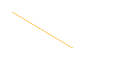
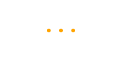
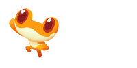

## Drawing & Animation

### Shapes

| Code                                   | Shape                             |
| -------------------------------------- | --------------------------------- |
| `rectangle(x, y, w, h)`                |  |
| `circle(x, y, r)`                      |     |
| `line(x1, y1, x2, y2)`                 |       |
| `point(x, y)`                          |      |
| `triangle(x1, y1, x2, y2, x3, y3)`     |   |
| `polygon(x1, y1, x2, y2, x3, y3, ...)` |    |
| `ellipse(x, y, rX, rY)`                |    |


### Image

| Code                                     | Result                        |
| ---------------------------------------- | ----------------------------- |
| `image(src, x, y)` || <br />`image(src, x, y, w, h)` |  |


### Colors

`fill(r, g, b)` || `fill(color)` : 修改画笔填充的颜色

`stroke(r, g, b)` || `stroke(color)` : 修改画笔描边的颜色

`noFill()` : 使用该方法后，绘制的图形不再填充，使用`fill`方法后恢复填充

`noStroke()` : 使用该方法后，图形的边不再绘制，使用`stroke`方法恢复绘制

`lineWidth(thickness)` : 设置线条的粗细

`background(color)` : 使用颜色直接绘制背景

`background(r, g, b)` : 使用RGB值来绘制背景


### Text

`font(size, font*)` : 设置文本大小和字体，文本颜色仍然通过`fill`来设置

`text(src, x, y)` : 绘制文本


### Environment

`canvas.resize(w, h)` : 设置画布的宽度和高度

`canvas.clear()` : 清理画布上的内容


```javascript
var draw = function(){
    // code here
};
setInterval(draw, 1000/50);
```

重复执行函数


`playSound(src)`: 播放音乐。注意：需要在加载完成后才能看到，需要点击运行2次，作品也要刷新一次才可以看到。


### Mouse

`Mouse.x`, `Mouse.y` :当前鼠标的x、y值


```javascript
Mouse.click = function () {
  // Called when mouse is clicked
}
```

当鼠标点击后触发的事件


```javascript
Mouse.down = function () {
  // Called when mouse is down
}
```

当鼠标按下后触发的事件


```javascript
Mouse.up = function () {
  // Called when mouse is up
}
```

当鼠标松开后触发的事件


```javascript
Mouse.move = function () {
  // Called when mouse is moving
}
```

当鼠标移动时触发的事件


### Keyboard

```javascript
Key.a.press  = function () {
  // Called when key 'a' is fired
}
```

敲击a键后触发的事件，这里的a可以是其他的按键


```javascript
Key.a.up  = function () {
  // Called when key 'a' is released
}
```

当a键被松开时触发的事件，这里的a可以是其他的按键


```javascript
Key.a.down  = function () {
  // Called when key 'a' is pressed
}
```

当a键被按下时触发的事件，这里的a可以是其他的按键


**各个键的名称**

| 键名                                     | 名称                                       |
| -------------------------------------- | ---------------------------------------- |
| `a`-`z`                                | `a`-`z`                                  |
| 方向键向左<br />方向键向右<br />方向键向上<br />方向键向下 | `ArrowLeft`<br />`ArrowRight`<br />`ArrowUp`<br />`ArrowDown` |
| Escape键                                | `Escape`                                 |
| 回车键                                    | `Enter`                                  |
| Tab键                                   | `Tab`                                    |


### Math

`Math.random()` : 产生一个0到1之间的随机数

`Math.floor(x)` : 返回x值的整数部分

`Math.max(a, b)` : 返回a、b两个值的较大的那个值

`Math.min(a, b)` : 返回a、b两个值中较小的那个值

