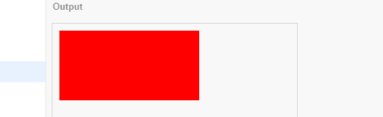
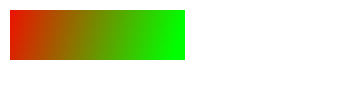

# 乐学编程

## 本书介绍

**学习，永不止步**

当今世界是科技快速发展的世界，成功将会越来越难。立乐教育认为，未来势必会属于自我学习能力强、不断适应新环境的精英。因此，我们设计了一系列编程课程，培养自我学习能力，当面对挑战时，教会您能够学会自己解决问题。

**迎接未来**

立乐教育始终关注下面的问题——如何为孩子的未来做好准备？特别是，在科技日益发展、全球化加速改变生活的情况下，我们该如何做好准备？我们坚信问题的答案就在于自我学习能力。孩子能够源源不断地创新，不断学习新技能，适应新的环境一定会成为孩子未来成功的基石！

**本书的用户**

本书针对没有编程知识的用户，采用项目制的方式来引导他们去一步步走进编程的大门。

除了JavaScript基本语法外，本书更多的设计到了项目开发中的方方面面，从最基础的计算机图形，到贴图与动画，到项目开发流程，涉及到了编程领域的多个纬度。

**学习环境**

在学习过程中，添加了大量的实例。本书的所有例子都在`LeapLearner IDE`环境下测试通过，浏览器为`Chrome 61.0.3163.100 (64 位)`。


## 目录

[TOC]

## 一、开发环境

本课程可以在任意浏览器环境下进行，这里以[立乐IDE(http://ide.leaplearner.com)](http://ide.leaplearner.com)为例进行配置。

### IDE介绍

下面是立乐IDE的一个截图，可以看见分成了3个区域，从左到右分别是：

* html区域，描述网页内容的
* JavaScript区域，这里是代码区域，也是我们输入代码的地方，是最重要的地方
* Output区域，这里是展示区域，用于展示输出效果


#### 功能说明

`Share`: 点击后生成链接和二维码，可以通过手机扫描获取到项目展示信息。

`Run`: 点击后执行JavaScript代码。每次点击`Run`都会重新开始执行。

`Auto-run`: 勾选后，只要修改代码便会自动执行代码。

`↗`：点击后在打开一个新页签，展示项目。

`console`：控制台，在激活状态下，会将日志信息和报错信息输出到这里。

`css`: 用于配置网页的样式，在本书中暂不涉及。

### 配置说明

点击`Projects`->`New`新建一个项目，并将`html`页签替换为以下内容

```html
<!DOCTYPE html>
<html>
<head>
    <meta charset="utf-8">
    <meta name="viewport" content="width=device-width,minimum-scale=1.0,maximum-scale=1.0,user-scalable=no"/>
    <title>立乐教育</title>
</head>
<body>
  <script src="http://cs.leaplearner.com/lleg/LLEG.min.js"></script>
</body>
</html>
```

点击运行，如果能够在`output`窗口看到如下画面，方框处即为我们的画布。当鼠标在画布范围内移动时，即可看到画布左下角实时显示当前坐标值。


在`<body>`中我们插入了以下内容，即引用我们的画布基本功能，在其他开发环境下，添加以下代码也可以实现同意的效果。

```html
<script src="http://cs.leaplearner.com/lleg/LLEG.min.js"></script>
```

如果在其他环境下开发，需要为开发的JavaScript代码提供一个容器，最简单的方式就是在`<body>`元素下再添加一个`<script>`选项，你可以将你的代码写在`<script>`内。

```html
<body>
  <script src="http://cs.leaplearner.com/lleg/LLEG.min.js"></script>
  <script>
    // write your code here.
  </script>
</body>
```

以下这一行是为了项目能够兼容手机屏幕而设置的。当项目在手机上打开时，界面会根据手机屏幕进行调整。

```html
<meta name="viewport" content="width=device-width,minimum-scale=1.0,maximum-scale=1.0,user-scalable=no"/>
```

## 二、基本图形

基本图形是所有画面展示的基本单位，通过基本图形的组合，我们可以创造出许许多多丰富的图案，做出漂亮的动画。

### 坐标简介

为了定义空间的位置，数学家们发明了坐标的概念，在此至上发展出了庞大的几何学科。在计算机图形中，坐标系统更是不可或缺。

我们将左上角的坐标定义为`(0,0)`，把水平轴为`x轴`，把垂直坐标定义为`y轴`。平面上的任意一个点，在`x轴`上的投影称之为该点的`x坐标`，同样，在`y轴`上的投影即`y坐标`。因此，整个坐标系看起来像是这个样子的。


只要确定了坐标点的值，我们就能很容易的确定坐标的位置了。


> 小知识：笛卡尔坐标系和网页坐标系
>
> 和数学上常见的笛卡尔坐标系不同的是，网页坐标系的y轴正方向朝下。这是因为人类阅读习惯于从左到右，从上到下，在浏览器的定位系统中，根据这个习惯来定义坐标的位置，使得在网页设计时更为合理。


没有什么比实际应用更容易掌握知识了，让我们用一个有趣的项目来熟悉下坐标的概念。

##### 实例：设计一个跑酷游戏

在这个项目中，我们可以摆放障碍物的位置，来调整游戏的难度。而障碍物的位置，就是由坐标来决定的。


### 矩形

长方形和正方形，统称为矩形，在数学描述中，矩形是如下的图形：相邻的两边相互垂直，而不相邻的两边平行且长度相等。


要在画布上准确的描述一个矩形的位置和大小，我们需要以下属性

- 矩形左上角的位置`(x, y)`
- 矩形的宽度`width`和高度`height`

那么，矩形就可以用以下表达式来定义。

```javascript
Rectangle(x, y, width, height);
```

只要我们指定矩形所有的属性值，就可以定义出矩形的位置和大小。在Canvas中，我们使用以下代码来创建一个矩形。

```javascript
var rect = new Rectangle(10, 10, 100, 50);
rect.draw();
```

第一行，我们定义了一个变量`rect`，代表了一个矩形，它的左上角顶点坐标是`(10, 10)`，宽度是100，高度是50。

第二行，我们执行了`rect`的一个方法`draw()`，将这个矩形画在了画布上，点击`Run`就可以看到一下效果：


图中这个浅蓝色的方块就是我们的`rect`矩形。

如果我们修改`rect`的属性值，再点击运行，就可以看到不同效果的矩形，快动手试一下吧。

#### 改变矩形的属性

在定义`rect`后，我们可以通过`rect.x`来修改`rect`左上角顶点的x坐标

```javascript
var rect = new Rectangle(10, 10, 100, 50);
rect.x = 200;
rect.draw();
```

同样，修改`rect.y`，`rect.width`，`rect.height`也将会相应调整矩形的位置和形状。

> 小知识：像素
>
> 在计算机中，距离的单位往往是以像素作为单位的。1个像素即是显示器上的最基础一个发光原件，我们常说的分辨率就是指屏幕上发光原件的数量。

**取值和赋值**

属性值可以直接读取，使用点操作符(`.`)即可读取矩形的属性值。如果要修改矩形的属性值，则要使用赋值操作符(`=`)。我们来看下面这个例子。

```javascript
var rect = new Rectangle(10, 10, 100, 50);
rect.height = rect.height + 50;
rect.draw();
```

注意第二行，我们先读取了矩形的高度(第二个`rect.height`)，然后将这个高度增加50，最后将新的值赋给了矩形(第一个`rect.height`)。最终，矩形的高度变为100，在我们的画布中显示出来的便是一个高度为100的矩形。

#### 画线和填充

对矩形来说，拥有四周的边和占据的面积这两个属性。我们在绘制的时候，可以选择只绘制四条边，或者只填充矩形的面积，分别使用`stroke`和`fill`方法来区分。如果需要同时绘制，可以直接使用`draw`方法。

##### 实例：画线和填充

在这个例子中，我们将使用不同的方式来绘制矩形，

```javascript
var rect = new Rectangle(10, 10, 100, 50);
rect.styleStyle = "red";
rect.stroke();

rect.y = 110;
rect.fill();

rect.y = 210;
rect.draw();
```


矩形除了以上属性外，还有一些属性值和方法，所有矩形相关的属性和方法都列在下方。

#### 属性值

| 属性值           | 说明            |
| ------------- | ------------- |
| `x`           | 获取或设置左上角顶点的x值 |
| `y`           | 获取或设置左上角顶点的y值 |
| `width`       | 获取或者设置矩形的宽度   |
| `height`      | 获取或者设置矩形的高度   |
| `strokeStyle` | 获取或者设置矩形边的样式  |
| `fillStyle`   | 获取或者设置矩形填充的样式 |
| `lineWidth`   | 获取或者设置线条的宽度   |

##### 实例：绘制绿色矩形

我们希望绘制一个绿色矩形，它的左上角顶点是（100，100），它的颜色是绿色，不需要画出矩形的边。

```javascript
var rect = new Rectangle(100, 100, 200, 50);
rect.fillStyle = "green";
rect.fill();
```

#### 方法

我们注意到，在使用方法时，我们需要在方法的后面增加括号（）。这是告诉计算机，我们要执行这个动作了。矩形拥有了以下一些基本方法，有了这些方法，我们就可以按照我们的想法来使用矩形了。

| 方法         | 用法                               |
| ---------- | -------------------------------- |
| `draw()`   | 将矩形画在画布上                         |
| `fill()`   | 填充矩形，默认样式为rgba(255, 255, 0, 0.5) |
| `stroke()` | 绘制矩形的四条边，默认样式为`#FFFF00`          |


### 圆

类似于矩形，创建一个圆也是非常简单的一件事情。

```javascript
var circle = new Circle(x, y, r);
circle.draw();
```

和矩形一样，圆是一个封闭的图形。对圆而言，确定圆心和圆的半径，即可确定圆的位置和大小。


#### 属性值

| 属性值           | 说明           |
| ------------- | ------------ |
| `x`           | 获取或设置圆心的x值   |
| `y`           | 获取或设置圆心的y值   |
| `r`           | 获取或者设置圆的半径   |
| `strokeStyle` | 获取或者设置圆周的样式  |
| `fillStyle`   | 获取或者设置圆填充的样式 |
| `lineWidth`   | 获取或者设置线条的宽度  |

半径是圆特有的属性，是直径的一半。圆并没有宽度和高度，如果你想从圆的属性中找出高度和宽度，那你会非常失望的。

#### 方法

圆的方法和矩形类似，按照绘制的内容进行区分。

| 属性值      | 用法                                       |
| -------- | ---------------------------------------- |
| draw()   | 将圆画在画布上，包含圆周和内部                          |
| fill()   | 仅填充圆，不绘制圆周，默认样式为"rgba(255, 255, 0, 0.5)" |
| stroke() | 绘制圆周，不填充圆，默认样式为"#FFFF00"                 |

##### 实例：绘制雪人I

我们先定义了一个函数`drawCircle`，它能直接修改圆的位置、半径、颜色，并将圆画出来。利用这个函数，我们可以快速的将雪人绘制出来。

```javascript
var circle = new Circle();

function drawCircle(x, y, r, c){
    circle.x = x;
    circle.y = y;
    circle.r = r;
    circle.fillStyle = c;
    circle.draw();
}


drawCircle(200, 400, 100, "white");
drawCircle(200, 280, 60, "white");
drawCircle(180, 270, 10, "black");
drawCircle(220, 270, 10, "black");
```

##### 实例：绘制雪人II

我们还可以使用另外一种方式，将雪人不同部位都定义好。我们定义了雪人的头，雪人的身体，雪人的眼睛。掌握坐标后，我们很容易就可以将这个雪人画出来了。

```javascript
var bg = new Rectangle(0, 0, 350, 550);

var head = new Circle(200, 280, 60);
head.fillStyle = "white";

var body = new Circle(200, 400, 100);
body.fillStyle = "white";

var eye = new Circle(180, 270, 10);
eye.fillStyle = "black";

bg.draw();

body.fill();
head.draw();
eye.fill();

eye.x = 220;
eye.fill();
```

### 点

数学上的点是一个没有面积的的图形，但是为了能在画布上显示出来，我们将点看作一个半径非常小的圆，因此在这里，点几乎可以使用所有圆的属性和方法。不同的是，在使用点的时候，你无需指定点的半径。

```javascript
var p = new Point(x, y);
```

因为点是继承与于圆，你可以使用所有圆的属性和方法。

**继承**

因为点是从圆继承的，所以圆的所有属性点都有，圆的所有方法点也都有。我们只要照着圆的方式使用点就可以啦。

##### 实例：点点点

当鼠标在屏幕上移动时，点的位置都会被设置为鼠标所在的位置，并且将点绘制出来。

```javascript
var p = new Point();

Mouse.move = function(){
    p.x = Mouse.x;
    p.y = Mouse.y;
    p.draw();
};
```

#### 属性值

| 属性值         | 说明           |
| ----------- | ------------ |
| `x`         | 获取或设置点的x值    |
| `y`         | 获取或设置点的y值    |
| `r`         | 获取或者设置点的大小   |
| `fillStyle` | 获取或者设置点填充的样式 |

注意：点没有`strokeStyle`属性，设置了也不会生效

#### 方法

| 属性值      | 用法              |
| -------- | --------------- |
| `draw()` | 将点画在画布上，默认样式为红色 |
| `fill()` | 同`draw`         |

注意的是，和圆不一样的是，点是没有stroke方法的。

### 线条

两点确定一条线段，通过设置线条两点的位置，我们可以确定线条的起始位置和终止位置。在画布中，我们用下面的方式来定义一个线段。

```javascript
var line = new Line(x1, y1, x2, y2)
```

定义后，我们就获得了line这个对象，通过修改line的属性，我们就可以改变线条的位置、样式以及它的宽度。

线条有比较多的属性值，修改线条的位置是一件非常容易出错的事情，要特别的小心。

#### 属性值

| 属性值           | 说明           |
| ------------- | ------------ |
| `x1`          | 获取或设置第一个点的x值 |
| `y1`          | 获取或设置第一个点的y值 |
| `x2`          | 获取或设置第二个点的x值 |
| `y2`          | 获取或设置第二个点的y值 |
| `strokeStyle` | 获取或者设置线条的样式  |
| `lineWidth`   | 获取或者设置线条的宽度  |

#### 方法

| 属性值        | 用法       |
| ---------- | -------- |
| `draw()`   | 将线条画在画布上 |
| `stroke()` | 同`draw`  |

因为线条是没有面积的，所有并没有fill方法的。

##### 实例：线条

首先，定义一个线条，从点`(100, 100)`连接到点`(250, 100)`，并在画布中绘制出来。

```javascript
var line = new Line(100, 100, 250, 100);
line.draw();
```

第二步，将线条往下平移到200，即将线条两个点的坐标设置为200，再将线条的颜色改成红色，粗细设置为5个像素，再次在画布上绘制。

```javascript
line.y1 = 200;
line.y2 = 200;
line.strokeStyle = "red";
line.lineWidth = 3;
line.draw();
```

最终效果图如下，仔细观察`output`中线条的粗细程度。


注意的是，和其他图形不一样的是，线条是没有面积的，因此是没有`fill`方法的。

### 多边形

除了以上简单图形外，还有许许多多的图形，如多边形就是其中的一类。

```javascript
var polygon = new Polygon(x1, y1, x2, y2, x3, y3, ...);
```

#### 属性值

| 属性值           | 说明           |
| ------------- | ------------ |
| `fillStyle`   | 获取或者设置点填充的样式 |
| `strokeStyle` | 获取或者设置线条的样式  |
| `lineWidth`   | 获取或者设置线条的宽度  |

多边形的点是一个数组，通过`polygon.points`获取，每个元素都是一个点。因为多边形往往点数较多，这里不展开了。

#### 方法

| 属性值        | 用法                |
| ---------- | ----------------- |
| `draw()`   | 将多边形画在画布上，默认样式为红色 |
| `fill()`   | 将多边形画在画布上，仅填充内容   |
| `stroke()` | 将圆画在画布上，包含圆周和内部   |

多边形的绘制是依据点的顺序来的，不同的顺序绘制的多边形是不一样的。同时，绘制出来的多边形可能不是简单的凸多边形，这已经不再本书的讨论范围内了。有兴趣的同学可以去了解下多边形的分类，以及多边形的外边和内部的区分。

### 三角形

```javascript
var triangle = new Triangle(x1, y1, x2, y2, x3, y3);
```

三角形是多边形的一种特殊情况，即只有3条边的多边形。因此除了定义上，三角形和多边形具有一样的属性和方法。

## 三、图形样式

图形一般包含边和填充，图形的样式也是由这两块共同组成。

### 线条和填充

图形的线条和填充分别由`strokeStyle`和`fillStyle`这两个属性来决定

### 颜色常量

`fillStyle`与`stokeStyle`可以设置为表示颜色的字符串常量，从而可以直接设置图形的颜色。

一些常见的颜色的常量有aqua、black、blue、fuchsia、gray、green、lime、maroon、navy、olive、purple、red、silver、teal、white、yellow。

##### 实例：设置矩形的颜色

```javascript
var rect = new Rectangle(10, 10, 200, 100);
rect.fillStyle = "red";
rect.fill()
```



##### 实例：颜色指示板

在使用颜色时，有时候我们需要把它们都列出来，这样才能更准确的选择需要的颜色。那我们就来做一个颜色的指示板吧。

```javascript
var colors = ["aqua", "black", "blue", "fuchsia", "gray", "green", "lime", "maroon", "navy", "olive", "purple", "red", "silver", "teal", "white", "yellow"];

var crect = new Rectangle(10, 10, 200, 25);
var cname = new Text("color", 20, 28);

for(var i=0; i<colors.length; i++){
  crect.fillStyle = colors[i];
  cname.src = colors[i];
  crect.fill();
  cname.fill();
  crect.y += 30;
  cname.y += 30;
}
```

展示效果


### RGB值

如果用放大镜看显示器的屏幕，会发现屏幕的每个点都是由3个颜色组成，分别是

* Red, 红色
* Green，绿色
* Blue，蓝色

而这3个颜色的首字母组合，即RGB，这也是RGB值的由来。在RGB值的组成中，每一个数字分布代表了每个颜色的强弱，0代表关闭，255代表最高。

有了这3个基本的颜色，按照亮度的不同，就以组成各种个样的颜色。

##### 实例：设置矩形边的颜色

```javascript
var rect = new Rectangle(10, 10, 200, 100);
rect.strokeStyle = RGB(150, 100, 0);
rect.stroke();
```


RGB的另外一种写法是“#FFFFFF"，在这里，FFFFFF是一个16进制的数字，每两位代表了一种颜色的高低。`FF`代表了255，在16进制中，F代表了15，因此FF的计算方式是

```latex
15(F的十进制数值) * 16(16进制) + 15(F的十进制数值) = 255
```

同样，如果将一个十进制的数字转为16进制，计算方式反过来即可，如`169`在16进制中表示为`A9`

```latex
169 ÷ 16 = 10 ... 9 (余数) = A9(16进制)
```


> 补充知识：16进制
>
> 在2进制中，我们用0, 1来代表不同的数值
>
> 在10进制中，我们用0, 1, 2, 3, 4, 5, 6, 7, 8, 9来代表不同的数值
>
> 在16进制中，我们用0, 1, 2, 3, 4, 5, 6, 7, 8, 9, A, B, C, D, E, F来代表从小到大的数值

#### 进制转换

不同的进制可以通过计算来转换，比如

在JavaScript中，可以用`parseInt`这个函数可以将不同进制的字符串转为数字，默认情况下，`parseInt`将一个字符串转为10进制的数字。

```javascript
parseInt('1111', 2) //=> 15
parseInt('15') 		// => 15
parseInt('15', 10) 	//=> 15
parseInt('15', 16)	//=> 22
```

#### **常见的RGB值**

下面列举了一些比较受欢迎的RGB值


### 透明度

在生活中，关于透明度最常见的例子就是玻璃了，我们可以透过不一样颜色玻璃看到一个不一样颜色的世界。汽车玻璃拥有不同的透明度，在减弱光线的同时，仍能够看到玻璃后面的物体。如果我们将一个图形设置为一定的透明度，那么我们就可以看到图形后面的其他图形。

透明度的数值从0到1，0代表完全透明，即什么都看不见，1代表全不透，是图像透明度的默认值。

在Canvas中，图像的透明度用globalApha来表示，设置图形的globalAlpha值即可获得不同的透明度。

```javascript
var rect = new Rectangle(10, 10, 200, 100);
rect.globalAlpha = 0.1;
rect.draw();
```

##### 实例：做一个调色板

```javascript
var circle = new Circle(200, 150, 100);

circle.globalAlpha = 0.6;

circle.fillStyle = "#0000FF";
circle.fill();

circle.x = 150;
circle.y = 250;
circle.fillStyle = "#00FF00";
circle.fill();

circle.x = 250;
circle.y = 250;
circle.fillStyle = "#FF0000";
circle.fill();
```

显示效果


思考：绘制图形时，顺序不一样，产生的图形是否会不一致，为什么？

### RGBA值

RGBA值是RGB的扩充，在使用颜色时可以直接制定该颜色的Alpha值。

```javascript
var rect.fillStyle = "rgba(255, 255, 0, 0,5)";
```

前三位对应的是RGB值，第四位即透明度值

**透明度还是RGBA值**

设置透明度可以通过globalAlpha或者rgba值来设置，这两者都可以达到一样的效果，同时两者可以相互叠加。使用globalAlpha值能够快速获取以及修改到透明度值，所以一般情况下，我们建议使用globalAlpha这个属性。

##### 实例：妙笔生花

```javascript
var circle = new Circle();

function randomInt(n){
  return Math.floor(Math.random() * n);
}

function randomRGBA(){
  var rgba = RGBA(rand) randomInt(255) + "," + randomInt(255)+ "," + randomInt(255) + "," + Math.random() + ")";
  return rgba;
}

Mouse.move = function(){
  circle.x = Mouse.x;
  circle.y = Mouse.y;
  circle.r = 10 + 20 * Math.random();
  circle.fillStyle = randomRGBA();
  circle.fill();
};
```

展示效果，但鼠标在画布上移动时，便会随机的绘制出各种图案来，步步生花。


### 渐变色

在上面的例子中，我们图形的颜色是单一的。而在实际生活中，颜色往往都不是均匀的。我们可以创建一个变化的颜色来实现这个效果。

##### 实例：渐变色

```javascript
var grd = ctx.createLinearGradient(0,0,175,50);
grd.addColorStop(0,"#FF0000");
grd.addColorStop(1,"#00FF00");

var rect = new Rectangle(10, 10, 175, 50);
rect.fillStyle = grd;
rect.draw();
```

渐变色效果



addColorStop是在图像的特定位置创建出制定的颜色，中间的变化则由计算机自动完成。

通过添加更多的颜色，我们可以创建出更多特殊的渐变色。

彩虹是难得一见的奇观，一般只有雨过天晴的时候才会出现，现在，我们就来创建一个彩虹出来。

##### 实例：彩虹

```javascript
canvas.width = 600;
canvas.height = 400;
var grd = ctx.createLinearGradient(0,0,100,10);
grd.addColorStop(0,"lightblue");
grd.addColorStop(1/8,"red");
grd.addColorStop(2/8,"orange");
grd.addColorStop(3/8,"yellow");
grd.addColorStop(4/8,"green");
grd.addColorStop(5/8,"cyan");
grd.addColorStop(6/8,"blue");
grd.addColorStop(7/8,"purple");
grd.addColorStop(1,"lightblue");

var sky = new Rectangle(0, 0, 600, 400);
sky.fillStyle = "lightblue";
sky.fill();

var rect = new Rectangle(0, 0, 100, 10);
rect.fillStyle = grd;
rect.translate(0, 400);
rect.setAnchor(300, 400);
for(var i=0; i<180; i+=1){
  rect.rotate(i);
  rect.fill();
}
```

一条漂亮的彩虹出来啦


## 四、语法基础I

本章节全面介绍 JavaScript 核心语法，从最简单的开始讲起，循序渐进、由浅入深，力求清晰易懂。

小知识：Atwood定律

> 程序员Jeff Atwood提出这么一条定律
>
> 所有可以用 JavaScript 编写的程序，最终都会出现 JavaScript 的版本。
>
> (Any application that can be written in JavaScript will eventually be written in JavaScript.)

### 开发环境

JavaScript 的开发环境非常方便配置，只要电脑安装了浏览器，就相当于搭建了一个开发环境。从菜单中选择`更多选项`→`开发者工具`，就可以在它的控制台运行 JavaScript 代码。

进入控制台以后，就可以在提示符后输入代码，然后按`Enter`键，代码就会执行。如果按`Shift + Enter`键，则是换行，不会触发执行。建议阅读本章节时，使用控制台来进行说明。

将下面的程序复制到“控制台”，按下回车后，就可以看到运行结果。

```javascript
function welcome(name) {
  console.log('Hello ' + name);
}

welcome('Vic')
// => Hello Vic
```

### 数据类型

JavaScript 语言的每一个值，都属于某一种数据类型。JavaScript 的数据类型，共有六种。

* Number:  数值
* String: 字符串
* Boolean：布尔值
* undefined：表示未定义或者不存在
* null：表示空值
* Object：对象

通常，我们将数值、字符串、布尔值成为原始类型，它们无法再进行分割了。而对象往往是由多个原始类型的值组成的，可以看作是一个存放各种值的容器。至于undefined和null，一般将它们当作是两个特殊的值。

对象又可以分成三个子类型

* Object：狭义的对象
* Array：数组
* Function：函数

这里需要明确的是，JavaScript的所有数据，都可以视为广义的对象。不仅数组和函数属于对象，就连原始类型的数据（数值、字符串、布尔值）也可以用对象方式调用。为了避免混淆，此后除非特别声明，本教程的”对象“都特指狭义的对象。

狭义的对象和数组是两种不同的数据组合方式，而函数其实是处理数据的方法。JavaScript把函数当成一种数据类型，可以像其他类型的数据一样，进行赋值和传递，这为编程带来了很大的灵活性，体现了JavaScript作为“函数式语言”的本质。

#### 数值

和很多编程语言不同的是，JavaScript的数值只有一种类型，没有区分整数、浮点数等类型。

以下值都是数值

* 0, 1, 2, 3, ...
* 100, 230, 8888, ...
* 3.14, 0.01, 3.33333, ...
* -1, -3.14, ...

数值可以在JavaScript中直接进行运算，在计算机中，没有乘号和除号，一般用`*`来代表`x`号，用`/`来代表`÷` 。

```javascript
1 + 2 
// => 3

6 * 4 + 2 
// => 26

20 / 10 
// => 2
```

在Console中执行运算时，直接输入`Enter`键就可以得到结果了，而不需要输入`=`号，如果不小心输入了`=`号，反而是得不到结果的。

##### 数值的进制

使用字面量（literal）时，JavaScript 对整数提供四种进制的表示方法：十进制、十六进制、八进制、2进制。

* 十进制
* 八进制：有前缀`0o`或`0O`的数值，或者有前导0、且只用到0-7的八个阿拉伯数字的数值。
* 十六进制：有前缀`0x`或`0X`的数值。
* 二进制：有前缀`0b`或`0B`的数值。

##### 小数

在JavaScript内部，所有数字都是以64位浮点数的形式储存，即时是整数也是如此。所有1和1.0是相同的。

在进行小数的运算和比较时要十分小心。这是因为计算机为了同有限的位数表示更多的数字，从而将小数转成非常接近的浮点数，浮点数并不是一个非常精确的值。

```javascript
0.1 + 0.2
// => 0.30000000000000004
```

#### 字符串

字符串是由0个或者多个排在一起的字符，放在单引号或双引号之中。

```javascript
'hi'
"Hello"
```

字符串默认只能写在同一行，如果必须分成多行，可以在每一行的末尾使用反斜杠\

```javascript
'a very \
very \
long strory'
```

单引号字符串的内部，可以使用双引号。双引号字符串的内部，可以使用单引号。利用这个规则，我们可以合理的在字符串中使用双引号或者单引号。

```javascript
'This is "A"'
"I'm vic"
```

当然，如果非要在字符串里同时使用单引号和双引号，可以用\来转义

```javascript
'She said \"Hello\, I\'m Monica\"'
```

##### 转义

反斜杠（\）在字符串内有特殊含义，用来表示一些特殊字符，所以又称为转义符。

需要用反斜杠转义的特殊字符，主要有下面这些：

- `\0` null（\u0000）
- `\b` 后退键（\u0008）
- `\f` 换页符（\u000C）
- `\n` 换行符（\u000A）
- `\r` 回车键（\u000D）
- `\t` 制表符（\u0009）
- `\v` 垂直制表符（\u000B）
- `\'` 单引号（\u0027）
- `\"` 双引号（\u0022）
- \ 反斜杠（\u005C）

##### 字符串与数组

字符串可以被视为字符数组，因此可以使用数组的方括号运算符，用来返回某个位置的字符（位置编号从0开始）。

```javascript
var s = 'hello';
s[0] // => "h"
s[1] // => "e"
s[4] // => "o"

'hello'[1] // => "e"
```

但是，字符串与数组的相似性仅此而已。实际上，无法改变字符串之中的单个字符。

```javascript
var s = 'hello';

delete s[0];
s // "hello"

s[1] = 'a';
s // "hello"

s[5] = '!';
s // "hello"
```

##### length属性

`length`属性返回字符串的长度，该属性也是无法改变的。

```javascript
var s = 'hello';
s.length // 5

s.length = 3;
s.length // 5

s.length = 7;
s.length // 5
```

#### 布尔值

布尔值只有2个值，`true`和`false`，分别代表真和假。在程序中一般和`if`一起使用，用于控制程序的走向。

```javascript
if(true){
    console.log("Hello!");
}
// => Hello!
```

```javascript
if(false){
    console.log("World");
}
// 没有任何结果
```

当然，以上2个程序没有任何实际用处，甚至你都会觉得多此一举。事实上，布尔值一般由运算产生，如下面这个例子，我们定义了一个函数`rank`来判断学生的成绩是不是合格。

##### 实例：输出分数的结果

```javascript
function rank(score){
    if(score > 60)
      console.log('Pass');
 	else
      console.log('Fail!');
}

rank(70); // => Pass
rank(40); // => Fail!
```

在这里，通过一个`>`的运算，产生了一个布尔值。从而控制程序输出不一样的内容。

其他返回布尔值的运算符

* &&, ||
* !
* ===, !==, ==, !=
* <, >, <=, >=

所有JavaScript的对象都可以转换为布尔值，除了false以外，还有一些值会被当作是布尔值false。

* 0
* null
* false
* undefined
* NaN
* "" 以及 ''（空字符串）

除了以上几类值外，其他的值都会被看作是true。我们可以利用这个特性简化代码。


#### null和undefined

对于`null`和`undefined`，可以大致可以像下面这样理解。

`null`表示空值，即该处的值现在为空。调用函数时，某个参数未设置任何值，这时就可以传入`null`。比如，某个函数接受引擎抛出的错误作为参数，如果运行过程中未出错，那么这个参数就会传入`null`，表示未发生错误。

`undefined`表示“未定义”，如果声明了一个变量而未进行赋值，那么这个值就是`undefined`

注意，JavaScript的标识名区分大小写，所以`undefined`和`null`不同于`Undefined`和`Null`

### 注释

在JavaScript中，有两个常见的注释方式有两种，单行注释和多行注释。

#### 单行注释

使用//来注释

```javascript
// this is the fist style, only this line is affected by the comment
var rect = new Rectangle();

/* here is the second 
   and you can write as much lines as you want 
   */
rect.draw();
```

良好的注释可以帮助理解代码，同时不会影响到代码的执行。

### 函数

函数是一段可以重复调用的代码块。函数还能接受输入的参数，不同的参数会返回不同的之。

#### 声明

函数使用function来声明，function后面接的是函数名，函数名的命名规则和变量完全一致。函数名后面是一对圆括号，里面是传入的参数。在后面是函数体，用大括号包含起来。

```javascript
function drawRect(x, y, w, h){
    var rect = new Rectangle(x, y, w, h);
  	rect.draw();
}
```

上面的代码声明了一个`drawRect`函数，它含有4个参数。

另外一种声明方式是将一个匿名函数赋值给变量。

```javascript
var drawRect = function(){x, y, w, h}{
    var rect = new Rectangle(x, y, w, h);
  	rect.draw();
}
```

和变量一样，如果同一个函数名重复声明，后面的函数声明会覆盖前面的函数。

#### 调用

使用函数时，只要按照定义的参数，按顺序输入正确的变量。

```javascript
drawRect(100, 100, 200, 500);
```

#### 函数的作用域

作用域是指变量存在的范围。在函数内部声明的变量只能在函数中使用。在函数外生命的变量叫做全局变量，可以在函数内部读取。

## 五、字符串

字符串是将字符串在一起，用单引号或者双引号包围的一串字符。

```javascript
var a = "abc";
var b = 'Hello, world!';
```

注意，即时是空的`""`或者`''`也是一个字符串。

#### 连接

使用加号(`+`)可以将多个字符串拼接在一起。

```javascript
var msg = "Hello" + "World";
```

#### 转义

但遇到一些特殊字符时，我们需要用反斜杠`\`来输入他们。

#### 属性和方法

`length`属性返回字符串的长度。

```javascript
'abc'.length; // => 3
```

## 六、动画基础

### 画布的清理

canvas有许多的方法，我们可以利用clear方法来清理画布上的图形，好让我们重新开始绘制图形。

##### 实例：画布清理

第一步，让我们在画布上画上任意你想要花的图形。

```javascript
var rect = new Rectangle(100, 100, 200, 100);
rect.draw();
```

第二步，使用clear方法

```javascript
canvas.clear();
```

发生了什么，一切都消失了，我们将画布上的图形全部清理了。

看起来clear这个方法好像很奇怪，我们如果需要一个空白的画布，一开始我们不往上画不就可以了？但是，利用这个方法以及下面的间隔执行，是创建一切动画的基础。

### 间隔执行

`setInterval`是浏览器窗口自带的一个函数，接受1个函数名参数以及一个时间间隔参数。它可以在规定的时间间隔后执行函数，利用这一特性，我们可以定时绘制图形，从而达到让图形动起来的效果。

##### 实例：间隔执行

```javascript
var rect = new Rectangle(10, 10, 200, 100);
function loop(){
    rect.x += 10;
    rect.y += 10;
    rect.draw();
}

setInterval(loop, 1000);
```

在这里，时间间隔的单位为毫秒`ms`，1s=1000ms。在上面的例子中，浏览器每过一秒就会调用`loop`一次。从而实现固定时间间隔执行代码。

>  **小知识: window对象**
>
>  `setInterval`是浏览器`window`对象的一个方法，完整的写法是`window.setInterval`。在使用时，可以省去前面的`window`对象而直接使用。

执行代码，我们可以看到每隔一秒，就会输出一个新的矩形，不停的重叠起来。如果，我们将原来的图形清除，是不是就会有一种图形动起来的感觉了！


##### 实例：动画

在每次执行绘制前，清理掉屏幕。

```javascript
var rect = new Rectangle(10, 10, 200, 100);
function loop(){
    rect.x += 10;
    rect.y += 10;
    canvas.clear();
    rect.draw();
}

setInterval(loop, 1000);
```

快看，矩形动起来了！利用`setInterval`这个强大的功能，我们就可以让画面动起来了。

> **小知识：时间的单位**
>
> 我们知道1天=24个小时，1个小时=60分钟，1分钟=60秒。而在秒下面，还有更小的单位，毫秒和纳秒，1秒=1000毫秒，1毫秒=1000纳秒。
> 对计算机来说，1秒是非常长的时间，可以做多达十亿亿次以上的计算，因此在计算机的世界里，往往以毫秒(ms)作为时间的计量单位。


### 帧执行

`requestAnimationFrame`是浏览器用于刷新页面的一个接口，类似于setTimeout，主要用途是按帧对页面进行重绘。

设置这个API的目的是为了让各种网页动画效果（DOM动画、Canvas动画、SVG动画、WebGL动画）能够有一个统一的刷新机制，从而节省系统资源，提高系统性能，改善视觉效果。代码中使用这个API，就是告诉浏览器希望执行一个动画，让浏览器在下一个动画帧安排一次网页重绘。

requestAnimationFrame的优势，在于充分利用显示器的刷新机制，比较节省系统资源。显示器有固定的刷新频率（60Hz或75Hz），也就是说，每秒最多只能重绘60次或75次，requestAnimationFrame的基本思想就是与这个刷新频率保持同步，利用这个刷新频率进行页面重绘。此外，使用这个API，一旦页面不处于浏览器的当前标签，就会自动停止刷新。这就节省了CPU、GPU和电力。

requestAnimationFrame使用一个回调函数作为参数。这个回调函数会在浏览器重绘之前调用。

```javascript
requestAnimationFrame(callback);
```

**避免重复绘制**

在实际使用中，往往有多种情况需要使用`requestAnimationFrame`，如果在同一帧中多次调用了`requestAnimationFrame`，有可能导致多次执行。表现出动画加速，达不到预期的要求。

实例：错误使用`requestAnimationFrame`导致动画加速。


在LLEG中，可以使用nextFrame函数，这个函数保证了在下一帧中仅有函数被调用

## 七、贴图与动画

在创作过程中，我们更多的会运用到很多色彩丰富的图片，而不仅仅是几何图形。在这一章节里，我们将学习怎么使用图片来创作。

### 图片

在网页上，图片一般被保存在服务器上，在需要的时候他们会被加载并显示在网页上。每个网络上的图片，都有一个url地址，这个地址告诉了浏览器该到哪里去获取这个地址。

如下面就是一个图片的链接，如果你直接打开它，那么你就可以直接看到这张图片了。

```html
http://
```

在Canvas中，我们定义了一个图片类Sprite，它需要5个参数来确定这个张图片。第一个是图片的url地址，后面4个参数和矩形一样，用来确定图片的位置和大小。

```javascript
var sprite = new Sprite(src, x, y, width, height)
```

例子：图片的绘制

#### 加载

因为贴图需要一定的时间加载，所以需要重新执行运行才能成功看到图片显示出来。

贴图资源的加载是有一定延迟的，而代码的执行非常的快，因此在代码执行前图片可能还未加载成功。我们增加了一个资源加载的函数`loadRssAndRun`，它能知道我们用了那些图片并且在项目代码执行前加载好资源。

```javascript
var sprite = new Sprite("", 0, 0, 100, 100);

function main(){
    sprite.draw();
}

loadRssAndRun(main);
```

### 序列帧动画

我们知道，动画是因为计算机快速绘制不同的图形而形成的。如果计算机快速更改的是同一个东西的不同时刻的图像，那么，就会让这个东西动起来了。

下面是一张食人花的图，它一共有7个动作，从第一张图到最后一张图，我们发现食人花做了一个张开又合上的动作。下面我们就来看怎么让食人花动起来。


#### 定义

第一步，我们使用Animation这个类，和Sprite类似，Animation需要图片的地址和其他4个参数来确定图片以及位置。

```javascript
var animation = new Animation(src, x, y, width, height);
animation.setFrame(sx, sy, swidth, sheight, culumn, row)
```

第二步，我们需要设置这个动画的各个参数，否则计算机将不知道怎么去播放这个动画。

* sx，sy: 动画左上角的偏移量
* swidth，sheight：每一个动画的宽度和高度
* culumn，row：动画的帧数在图片上的列数和行数

##### 实例：动画介绍

下面是一个动画的介绍课件，使用动画原理制作，展示了动画是如何制作出来的。

```javascript
var url = "http://llcs-1252287760.cossh.myqcloud.com/";

var width = 60;
var height = 60;
var frameCount = 5;
var row = 1;
var speed = 2;
var image = new Sprite(url+"animations/fire.png", 0, 50, width*5, height);

var fire = new Animation(url+"animations/fire.png", 0, 150, width, height);

fire.setFrame(0, 0, 77, 84, frameCount, row); 
// shiftX, shiftY, frameX, frameY, columns, rows	
fire.setSpeed(speed);		// Animation frame speed

var rect = new Rectangle(0, 50, width, height);
var n=0;

rect.update = function(){
    rect.x = width * (Math.floor(n++*speed/60) % 5);
};

function main(){
    canvas.clear();
    rect.update();
    
    image.draw();
    rect.stroke();
    fire.draw();
    nextFrame(main);
}

loadRssAndRun(main);
```


## 八、音乐与音效

好的项目离不开音效，合适的音效可以让一个项目发挥出200%的效果。

```javascript
var music = new Audio();
music.src = "ddd.mp3"
music.play();
```

### 音乐

背景音乐一般是长度较长的音乐，且需要循环播放。我们可以将音效的`loop`属性设置为`true`，这样只要播放一次就可以了。

```javascript
var music = new Audio();
music.src = "ddd.mp3"
music.loop = true;
music.play();
```

### 音效

无论是音乐还是音效，浏览器在加载时都需要耗费一定的时间，因此一般都是通过异步加载的。因此只有在加载结束后才能进行播放。一般通过`onload`函数来调用播放音效。

如果是音效，我们可以在项目执行之前进行加载。本书不涉及到资源的管理和加载，如果有兴趣，可以去网上了解更多预加载的知识。

##### 实例：色阶钢琴

```javascript
var url = "http://llcs-1252287760.cossh.myqcloud.com/Piano/";

var urls = [ "40-C.mp3", "42-D.mp3", "44-E.mp3", "45-F.mp3", "47-G.mp3", "49-A.mp3", "51-B.mp3"];

var Key = Rectangle;
Key.prototype.click = function(){
    //this.audio.currentTime = 0;
    this.audio.play();
};

for(var i=0; i<urls.length; i++){
    var key = new Key(0, 550/7*i, 350, 550/7);
    key.fillStyle = RGB(0, 200-20*i, 200-20*i);
    key.audio = new Audio();
    key.audio.src = url + urls[i];
    key.fill();
}
```


## 九、事件

### 鼠标事件

事件驱动在JavaScript中是非常常见的一种程序设计模式，通过监测事件的发生，调用预定的函数，从而实现异步执行的效果。

比如说，当鼠标在画布上移动时，鼠标的坐标值会随之而变，这就是一个简单的事件在驱动着坐标值不断的发生变化。

`Mouse`的属性

| 属性   | 描述                 |
| ---- | ------------------ |
| x    | 鼠标当前的x值，可以在画布左下角看到 |
| y    | 鼠标当前的y值，可以在画布左下角看到 |

**点击事件**

当鼠标在画布上点击时，就会触发`click`事件，如果配置了`Mouse.click`函数，那么该函数就会执行。

##### 实例：点击成图

这个项目的目标是创建一个空白的画布，当鼠标在画布上面点击时，就会在鼠标的位置绘制一个圆圈。

第一步，我们需要创建一个圆，这里我们可以创建一个默认的圆图形。

```javascript
var circle = new Circle();
```

第二步，定义一个绘制圆的函数`drawEvent`，因为我们要将圆绘制在鼠标的位置，因此我们要将圆中心设置为鼠标的位置。

`Mouse`对象，即鼠标，有两个属性`x`和`y`，他们会随着鼠标的移动而发生变化，因此我们只要直接使用这两个属性就可以了。

```javascript
function drawEvent(){
    circle.x = Mouse.x;
    circle.y = Mouse.y;
    circle.draw();
}
```

第三步，将函数绑定给click事件

```javascript
Mouse.click = drawEvent;
```

完整代码如下，我们用简单的9行代码，就完成了这个例子。

```javascript
var circle = new Circle();

function drawEvent(){
    circle.x = Mouse.x;
  	circle.y = Mouse.y;
  	circle.draw();
}

Mouse.click = drawEvent;
```

一般情况下，我们可以省略函数名，直接定义一个匿名函数，可以简单写成。

```javascript
var circle = new Circle();

Mouse.click = function(){
    circle.x = Mouse.x;
  	circle.y = Mouse.y;
  	circle.draw();
}
```

点击画布，就会在画布上留下一个圆圈。


#### 移动事件

当鼠标移动时，就会触发`move`事件。只要我们定义了`move`函数，那么该函数就会执行。

##### 实例：写字板

`Mouse`的事件

手机上的事件

如果应用需要在手机上运行，需要特别注意事件的区别。在手机上，没有鼠标的存在，只有点击屏幕后才有移动事件的触发。

电脑：`Move` -> `Down` -> `Move` -> `Up/Click` -> `Down`

手机：`Down` -> `Move` -> `Up/Click`

所以为手机开发应用时，我们应该小心的使用这些事件的顺序

##### 实例：点击英雄

**插入图片**

第一步，我们定义两个图片，使用图片对象的`draw`方法将图片绘制在画布上。

```javascript
var bg = new Sprite("http://orjajlo36.bkt.clouddn.com/backgroundimage2.jpg", 0, 0, 350, 550);
var item = new Sprite("http://ou1htxdl4.bkt.clouddn.com/coin.png", 150, 100, 50, 50);
bg.draw();
item.draw();
```

点击执行，就可以将这两张图片绘制在画布上了。

**行动起来**

接下来，就是让物体开始运动起来了。画布上，我们每隔一段时间`(16.7ms)`将图形重新绘制一次，因为频率非常块，看起来就像是动起来一样。

这里我们需要先定义一个`GameLoop`函数，它的作用是在每一帧里绘制图形，同时在下一帧中调用自己。

```javascript
function GameLoop(){
    item.y += 1;
  
    bg.draw();
    item.draw();
    nextFrame(GameLoop);
}

loadRssAndRun(GameLoop);
```

在`GameLoop`中，我们让物体的y值每次都增加一，以达到每次往下移动的效果。最后，我们用一个函数`loadRssAndRun(GameLoop);`来加载图片并且开始执行这个循环。

完整代码如下：

```javascript
var bg = new Sprite("http://orjajlo36.bkt.clouddn.com/backgroundimage2.jpg", 0, 0, 350, 550);
var item = new Sprite("http://ou1htxdl4.bkt.clouddn.com/coin.png", 150, 100, 50, 50);

function GameLoop(){
    item.y += 1;
  
    bg.draw();
    item.draw();
    nextFrame(GameLoop);
}

loadRssAndRun(GameLoop);
```

**点击事件**

在点中物体时，我们需要让物体消失，然后刷新出一个新的物体。事实上，我们不用这么麻烦，把物体的坐标修改为0就可以了。

```javascript
item.click = function(){
    item.y = 0;
};
```

**随机位置**

每次都是固定的位置显然不好玩，让我们同时修改下物体的水平位置，使用一个随机的概念。`Math.random()`会产生一个0到1的随机数，乘以300，即随机生成一个0到300的随机数。

```javascript
item.click = function(){
    item.y = 0;
    item.x = Math.random() * 300;
};
```

**显示分数**

接下来就是记录游戏的分数了。让我们新增一个变量`score`，初始值为0。

```javascript
var score = 0;
```

数字是没法直接显示出来的，我们需要将数字转为字符串，利用JavaScript中字符串＋数字，自动将数字转为字符串的特性，我们可以实现数字的转换。

```javascript
var scoreMsg;

function GameLoop(){
    item.y += 1;
    scoreMsg = "score:" + score;
  
    bg.draw();
    item.draw();
    scoreMsg.draw();
    nextFrame(GameLoop);
}
```

当然，别忘了在成功点击物体时增加分数，否则分数就不会增加啦。

```javascript
item.click = function(){
    item.y = 0;
    item.x = Math.random() * 300;
    score++;
};
```

完整代码如下

```javascript
var bg = new Sprite("http://orjajlo36.bkt.clouddn.com/backgroundimage2.jpg", 0, 0, 350, 550);
var item = new Sprite("http://ou1htxdl4.bkt.clouddn.com/coin.png", 150, 100, 50, 50);

var score = 0;
var scoreMsg;

function GameLoop(){
    item.y += 1;
    scoreMsg = "score:" + score;
  
    bg.draw();
    item.draw();
    scoreMsg.draw();
    nextFrame(GameLoop);
}

loadRssAndRun(GameLoop);

item.click = function(){
    item.y = 0;
    item.x = Math.random() * 300;
	score++;
};
```

**播放声音**

没有声音，再好的戏也出不来。让我们来增加两个声音，背景音乐和点击音效，这里增加了两个新的声音对象

```javascript
var bgm = new Audio();
bgm.src = "http://oq2qlcey8.bkt.clouddn.com/bgm.mp3";

var clickSound = new Audio();
clickSound.src = "http://llcs-1252287760.cossh.myqcloud.com/audio/gold.mp3";
```

背景音乐我们需要让它循环播放，因此设置`loop`属性为`true`

```javascript
var bgm = new Audio();
bgm.src = "http://oq2qlcey8.bkt.clouddn.com/bgm.mp3";
bgm.loop = true;
bgm.play();
```

而物体点击音效则是在点击的时候播放，因此我们把它加在点击时

```javascript
item.click = function(){
    item.y = 0;
    item.x = Math.random() * 300;
	score++;
    clickSound.play();
};
```

最终代码

```javascript
var bg = new Sprite("http://orjajlo36.bkt.clouddn.com/backgroundimage2.jpg", 0, 0, 350, 550);
var item = new Sprite("http://ou1htxdl4.bkt.clouddn.com/coin.png", 150, 100, 50, 50);

var bgm = new Audio();
bgm.src = "http://oq2qlcey8.bkt.clouddn.com/bgm.mp3";
bgm.loop = true;
bgm.play();

var clickSound = new Audio();
clickSound.src = "http://llcs-1252287760.cossh.myqcloud.com/audio/gold.mp3";

var score = 0;
var scoreMsg;

function GameLoop(){
    item.y += 1;
    scoreMsg = "score:" + score;
  
    bg.draw();
    item.draw();
    scoreMsg.draw();
    nextFrame(GameLoop);
}

loadRssAndRun(GameLoop);

item.click = function(){
    item.y = 0;
    item.x = Math.random() * 300;
	score++;
    clickSound.play();
};
```

**代码重构**

在进入下一章节前，我们先对我们的程序进行一个小小的重构。在改变速度这里，我们使用了这么一行代码

```javascript
item.y += 1;
```

 这里1代表的是速度，但是并不直观。所以我们定义一个变量`speed`来表达它。

```javascript
var scoreMsg;
var speed = 1;
...
    item.y += speed;
```

**难度提升**

接下来，就是我们对游戏的难度进行修改。我们在每一次分数增加的时候去提高物体掉落的速度，这样就能提高游戏难度了！

```javascript
item.click = function(){
    item.y = 0;
    item.x = Math.random() * 300;
	score++;
    speed += 1;
    clickSound.play();
};
```

如果你觉得难度变化太大，你可以降低这个数值，让速度的增长变的慢一点。

**游戏结束**

游戏结束时，我们在屏幕上写上Game Over。

```javascript
function GameOver(){
    'Game Over'.draw(120, 300, "white");
}
```

怎么判断游戏结束呢，先用一段伪代码来表示

```javascript
如果物体超出了画布:
    游戏结束
其他情况下：
	继续游戏循环
```

在JavaScript中，就可以写成

```javascript
function GameLoop(){
    ...
    if(item.y > canvas.height)
    	GameOver();
	else
    	nextFrame(GameLoop);
}
```

**重新开始**

重新开始游戏循环前，我们要做这几件事情

- 把分数清零
- 把物体放回到最上方
- 把速度变为最初的速度

最后执行游戏循环。

```javascript
function GameStart(){
    score = 0;
    item.y = 0;
    speed = 1;
    GameLoop();
}
```

那什么时候触发游戏重新开始呢，当然是游戏结束的时候了。我们需要在游戏结束时添加一个按钮来激活它。

```javascript
var retry = new Sprite( "http://osykyzwcn.bkt.clouddn.com/SHAYUx0001.png", 120, 300, 100, 50);
retry.click = GameStart;

function GameOver(){
    "Game Over".draw(120, 160, "white");
	retry.draw();    
}
```

当游戏结束的时候，这个按钮就会被绘制到画布上，点击就可以重新开始游戏啦。

**最终代码**

```javascript
var bg = new Sprite("http://orjajlo36.bkt.clouddn.com/backgroundimage2.jpg", 0, 0, 350, 550);
var item = new Sprite("http://ou1htxdl4.bkt.clouddn.com/coin.png", 100, 0, 60, 60);

var bgm = new Audio();
bgm.src = "http://oq2qlcey8.bkt.clouddn.com/bgm.mp3";
bgm.loop = true;
bgm.play();

var sound = new Audio();
sound.src = "http://llcs-1252287760.cossh.myqcloud.com/audio/gold.mp3";

var speed = 1;
var score = 0;
var hiscore = 0;

item.click = function(){
    score += 1;
    speed += 1;

    sound.currentTime = 0;
    sound.play();

    item.y = 0;
    item.x = Math.random() * 300;
};

function GameStart(){
	item.y = 0;
    score = 0;
    speed = 1;
    GameLoop();
}

function GameLoop(){
    item.y += speed;
    
	bg.draw();
    item.draw();
    
    var scoreMsg = "Score: " + score;
    scoreMsg.draw();

  	if(item.y > canvas.height)
      GameOver();
  	else
      nextFrame(GameLoop);
}

var retry = new Sprite( "http://osykyzwcn.bkt.clouddn.com/SHAYUx0001.png", 120, 300, 100, 50);
retry.click = GameStart;

function GameOver(){
    "Game Over".draw(120, 160, "white");
	retry.draw();    
}

loadRssAndRun(GameStart);
```

### 键盘事件

和鼠标类似，键盘也会触发事件。

* `down`：当按键被按下时触发
* `up`：当按键松开时触发
* `press：当按键被按下并且松开时触发`

方法一：

```javascript
Key.a.press = function(console.log('a'));
```

```javascript
Key['a']press = function(console.log('a'));
```

Key是一个对象，因此以上两种方式都可以实现对按键a的监听。

一些特别的键名称

| 按键    | 名称         | 备注       |
| ----- | ---------- | -------- |
| `↑`   | ArrowUp    | 无press事件 |
| `↓`   | ArrowDown  | 无press事件 |
| `←`   | ArrowLeft  | 无press事件 |
| `→`   | ArrowRight | 无press事件 |
| `Esc` | Escape     |          |
| `空格`  | Space      |          |
| `回车键` | Enter      |          |

#### **数字键**

因为数字无法作为属性的名称，所有数字键只能使用以下方式进行调用。

```javascript
Key['1'].press = function(){};
```


### 手势事件

另外，手机上的键盘需要触发输入才能够显示，因此我们也要避免使用键盘输入。

`LLEG`包含了对手势的基本支持功能，在手机上，支持4个简单的滑动手势，上下左右，分别对应键盘的上下左右键。使用了这些按键的程序，在手机上可以使用滑动手势来控制。

```javascript
var rect = new Rectangle(30, 30, 100, 100);

Key.ArrowLeft.down = function(){  rect.x -= 10;};
Key.ArrowRight.down = function(){  rect.x += 10;};
Key.ArrowUp.down = function(){  rect.y -= 10;};
Key.ArrowDown.down = function(){  rect.y += 10;};

function main(){
  canvas.clear();
  rect.draw();
  requestAnimationFrame(main);
}

main();
```

在这个例子中，我们可以使用键盘的方向键来移动矩形的位置，也可以在手机上用移动手势来控制。

## 十、语法基础II

### 对象

对象是JavaScript的核心概念，也是最重要的数据类型。简单说，对象是一种无序的数据集合，由若干的键值对构成。

```javascript
var vic = {
    name: "Vic",
  	age: 18
}
```

上面的代码中，大括号就定义了一个对象`vic`，他有2个键值对，`name`和`age`是键名，`"Vic"`和`28`是对应键的值。

#### 属性

对象的每一个键名又称之为属性，我们可以用以下方法来获取该属性对应的属性值。

```javascript
vic.name // => "Vic"
```

还有一种是使用方括号运算符来读取属性值，使用方括号时，键名必须用字符串的形式。另外，数字键只能用方括号来读取，并且可以直接使用。

```javascript
vic['name'] // => "Vic"
```

如果我们需要修改属性值，那么我们只要将重新给它赋值就可以了。

```javascript
vic.name = "Tom";
```

#### 方法

如果一个属性的值为函数，通常把这个属性称之为方法，它可以像函数那样调用。

### 数组

数组是按次序排列的一组值。每个值都有编号，而且是从0还是的。

```javascript
var array = ['a', 'b', 'cc'];
```

上面的代码中，'a'是数组的0号位置。

本质上，数组是一种特殊的对象。

#### length属性

数组的length属性，返回数组的成员数量。

```javascript
array.length // => 3
```

## 十一、图形变换

所有的图形都可以在画布上按照一定的规律进行变换

### 平移

```javascript
var circle = new Circle(0, 0, 100);
circle.translate(100, 100);
circle.draw();
```

图形调用translate即可在画布上进行偏移。

如果需要对线条、多变形进行移动时，就可以使用该方式，而不用

```javascript
var polygon = new Polygon(0, 100, 0, 150, 50, 100, 100, 100, 200, 50);
polygon.translate(100, 100);
polygon.draw();
```

组合图形的统一偏移

用位移做一个窗口震动效果

```

```

### 中心点与旋转

图形在平面上进行旋转后可以得到不一样的效果。

要明确旋转的位置，我们需要明确旋转的中心点和方向。默认情况下，我们将原点`(0, 0)`设置为旋转的中心点。将顺时针方向的角度规定为正方向。


##### 实例：旋转的矩形

```javascript
var rect = new Rectangle(100, 100, 200, 100);
rect.draw();

rect.rotate(10);
rect.draw();
```

可以看到，矩形以原点为中心旋转了10°。


那么，我们能不能让矩形以矩形的中心点进行旋转呢，当然可以啦，我们只要把矩形的旋转点设置在矩形的中心就可以了。

##### 实例：旋转的矩形II

为了更明显的看出区别，这次我们把旋转的角度加大到30°，来看看会有怎么样的效果。

```javascript
var rect = new Rectangle(100, 100, 200, 100);
rect.draw();

rect.setAnchor(200, 150);
rect.rotate(30);
rect.draw();
```

Bingo! 矩形按照我们的想法旋转起来了。


大家可以想一想，如果旋转度数为负数会是怎么样的呢，旋转读数超过360度呢，又会是怎么样的，快来试一试吧。

##### 实例：时钟

```javascript
var dashboard = new Sprite("http://ou1htxdl4.bkt.clouddn.com/clk/biaopan-01.png", 100, 100);
var h_line = new Line(200, 160, 200, 200);
var m_line = new Line(200, 140, 200, 200);
var s_line = new Line(200, 120, 200, 200);

s_line.lineWidth = 2;
m_line.lineWidth = 3;
h_line.lineWidth = 5;

s_line.strokeStyle = "red";
m_line.strokeStyle = 'green';
h_line.strokeStyle = 'blue';

// 设定锚点（旋转中心点）
s_line.setAnchor(200, 200);
m_line.setAnchor(200, 200);
h_line.setAnchor(200, 200);

var h, m, s;
var h_degree, m_degree, s_degree;
var t;

function updateTime(){
  t = new Date();
  h = t.getHours();
  m = t.getMinutes();
  s = t.getSeconds();
    
  h_degree = h * 360 / 12;
  m_degree = m * 360 / 60;
  s_degree = s * 360 / 60;
}
function main(){
  updateTime();
  canvas.clear();
  dashboard.draw();
  
  h_line.rotate(h_degree);
  m_line.rotate(m_degree);
  s_line.rotate(s_degree);
    
  h_line.draw();
  m_line.draw();
  s_line.draw();
}

setInterval(main, 1000);
```


### 放大与缩小

我们可以改变矩形的宽高来改变矩形的大小，改变圆的半径来改变圆的大小。但是如果我们要改变其他图形的大小，就有点麻烦了。

不过，我们可以通过修改图像的比例来达到这个效果。

```javascript
rect.scale(2, 2);
```

同样的，放大缩小时是以坐标原点作为参考系的，我们可以通过设定锚点来修改。

### 斜切

图像的变换都是通过矩形计算进行的，如果读者想要了解更多图形的变换的知识，欢迎点击一下链接学习更多知识。

**平行多边形**

利用斜切来定义一个平行多边形

##### 实例：阴影的实现

如何让物体看起来更立体

```javascript
var item = new Rectangle(100, 50, 200, 100);
var shadow = new Rectangle(100, 100, 200, 50);

shadow.setAnchor(100, 150);
shadow.skew(0, 0.6);

shadow.fillStyle = "#cccccc";

shadow.fill();
item.draw();
```

效果如下：


实例

翻页效果的实现

**菱形**

如何定义一个菱形

## 十二、物理效果

### 移动

类似与坐标，我们可以将移动速度分解为2个方向，x和y轴上的速度。在每帧动画中，我们将图像的位置根据速度进行修正，就可以得到移动的效果。

速度的分解示意图


定义物体的速度

```javascript
item.xspeed = 1;
item.yspeed = 2;
```

通过运动公式

```latex
距离 = 速度 x 时间
```

我们可以知道，下一次物体位置变化为

```javascript
item.x = item.x + item.xspeed * t
item.y = item.y + item.yspeed * t
```

在实际应用时，因为每帧动画的时间间隔一致，所以我们可以将t直接计算进speed中，从而简化为

```javascript
item.x = item.x + item.xspeed;
item.y = item.y + item.yspeed;
```

可以简写为

```javascript
item.x += item.xspeed;
item.y += item.yspeed;
```


##### 实例：移动的小球

```javascript
var ball = new Circle(100, 100, 20);

ball.xspeed = 1;
ball.yspeed = 2;

ball.update = function(){
    ball.x += ball.xspeed;
  	ball.y += ball.yspeed;
}

function main(){
  canvas.clear();
  ball.update();
  ball.draw();
  nextFrame(main);
}

main();
```

##### 实例：移动的小球II

根据上面的例子，我们很快就可以写出让两个小球分布动起来的效果。

```javascript
var ball1 = new Circle(100, 100, 20);
var ball2 = new Circle(100, 100, 20);

ball1.xspeed = 1;
ball1.yspeed = 2;

ball1.xspeed = 2;
ball1.yspeed = 1;

ball1.update = function(){
    ball1.x += ball1.xspeed;
  	ball1.y += ball1.yspeed;
}

ball2.update = function(){
    ball2.x += ball2.xspeed;
  	ball2.y += ball2.yspeed;
}

function main(){
  canvas.clear();
  ball1.update();
  ball1.draw();
  ball2.update();
  ball2.draw();
  nextFrame(main);
}

main();
```

但是，上面的代码有些地方重复了，因为我们写了两次的移动函数

```javascript
ball1.update = function(){
    ball1.x += ball1.xspeed;
  	ball1.y += ball1.yspeed;
}

ball2.update = function(){
    ball2.x += ball2.xspeed;
  	ball2.y += ball2.yspeed;
}
```

而运动规则对这两个小球来说，应该是完全一致的，如果我们有3个、4个小球，那么他们的运行规则应该是一样的，那么我们能不能把这个规律总结出来呢。这时，就要引进一个非常重要的概念this。

this在JavaScript中代表了引用这个方法的主体，我们将上面的运动部分代码可以修改为：

```javascript
ball1.update = function(){
    this.x += this.xspeed;
  	this.y += this.yspeed;
}

ball2.update = function(){
    this.x += this.xspeed;
  	this.y += this.yspeed;
}
```

可以发现，现在这两个方法是完全一模一样了。我们再将这个方法独立出来，命名为move，那么就可以写成下面的代码了。

```javascript
var ball1 = new Circle(100, 100, 20);
var ball2 = new Circle(100, 100, 20);

ball1.xspeed = 1;
ball1.yspeed = 2;

ball1.xspeed = 2;
ball1.yspeed = 1;

function move(){
    this.x += this.xspeed;
  	this.y += this.yspeed;
}

ball1.update = move;
ball2.update = move;

function main(){
  canvas.clear();
  ball1.update();
  ball1.draw();
  ball2.update();
  ball2.draw();
  nextFrame(main);
}

main();
```

经过抽象后，如果我们需要添加更多的小球，那么显然也是轻而易举的事情了。

### 反弹

在很多PC上都有经典的弹球游戏，小球在碰到边界后自动弹回。

##### 实例：反弹的小球

首先，让我们用伪代码来实现这个过程

伪代码

```markdown
如果（小球碰到了右边），让小球的x速度等于负数
如果（小球碰到了左边），让小球的x速度等于正数
如果（小球碰到了上边），让小球的y速度等于正数
如果（小球碰到了下边），让小球的y速度等于负数
```

在代码实现上，就很容易将以上伪代码转为Javascript代码

```javascript
var item = new Circle(100, 100, 20);

item.xspeed = 1;
item.yspeed = 2;

item.update = function(){
  this.x += this.xspeed;
  this.y += this.yspeed;
  if(this.x > canvas.width) this.xspeed = -1;
  if(this.x < 0) this.xspeed = 1;
  if(this.y > canvas.height) this.yspeed = -2;
  if(this.y < 0) this.yspeed = 2;
};

function main(){
  canvas.clear();
  item.update();
  item.draw();
  requestAnimationFrame(main);
}

main();
```

### 碰撞

在这里，我们提供了一个方法collide，可以支持图形对象的检测判断。

##### 实例：圆和矩形

```javascript
var rect = new Rectangle(100, 100, 100, 100);
var circle = new Circle(100, 100, 30);

Mouse.move = function(){
    circle.x = Mouse.x;
    circle.y = Mouse.y;
};

(function main(){
    canvas.clear();
    rect.draw();
    circle.draw();
	var p = circle.collide(rect);
    if(p){
        new Point(p.x, p.y).draw();
    }
    nextFrame(main);
}());
```

##### 实例：一群碰撞的圆

```javascript
var r = 20;
var cs = [];
var count = 60;

function update(){
    for(var i=0; i<count; i++){
        c = cs[i];
        if(c == this) continue;
        var p = this.collide(c);

        if(p){
            if(p.x != this.x) this.x -= 5*Math.random()*(p.x - this.x)/Math.abs(p.x - this.x);
            if(p.y != this.y) this.y -= 5*Math.random()*(p.y - this.y)/Math.abs(p.y - this.y);
        }

        if(this.x < r) this.x = r;
        if(this.y < r) this.y = r;
        if(this.x + r > canvas.width) this.x = canvas.width - r;
        if(this.y + r > canvas.height) this.y = canvas.height - r;
    }
}

for(var i=0; i<count; i++){
    c = new Circle(200, 200+i, r);
    c.update = update;
    cs.push(c);
}

(function main(){
    canvas.clear();
    for(var i=0; i<cs.length; i++)
        cs[i].update();
    cs.draw();
    nextFrame(main);
})();
```


### 重力效果

##### 实例：重力小球

在地球上，重力无所不再，牛顿发现了其中的规律并总结为定律，后人称之为牛顿第二定律。
$$
s = s + v · dt \\v = v + a · dt
$$
如果我们固定每次变化的间隔，那么公式可以简化为

```latex
yspeed = yspeed + g;
y = y + yspeed;
```

这就是重力公式在画布上的表示，我们可以写出以下代码来实现重力效果。


##### 实例：一个颠球小游戏的实现

```javascript
var ball = new Circle(200, 0, 20);
var g = 0.5;

ball.yspeed = 0;

ball.click = function(){
    this.yspeed = -10;
};

ball.update = function(){
  this.yspeed += g;
  this.y += this.yspeed;
  if(this.y > 500) this.y = 500;
};

function loop(){
  canvas.clear();
  ball.update();
  ball.draw();
  requestAnimationFrame(loop);
}

loop();
```

##### 实例：Flappy Bird

```javascript
var url = "http://llcs-1252287760.cossh.myqcloud.com/";
var sky = new Sprite(url+"bgs/bg.png", 0, 0, 800, 450);
var ground = new Sprite(url+"bgs/ground.png", 0, 430, 600, 150);

var bird = new Animation(url+"animations/bird.png", 80, 20, 56, 42);
bird.setFrame(0, 0, 112, 84, 8, 1); // shiftX, shiftY, frameX, frameY, columns, rows
bird.setAnchor(100, 0);			
bird.scale(-1, 1);		// These two lines are used to flip bird
bird.setCollisionScale(0.4, 0.4);	// the actual collision scale

var spike1 = new Sprite(url+"images/spike3.png", 500, 300, 80, 170);
var spike2 = new Sprite(url+"images/spike3.png", 500, 0, 80, 170);

var bgm = new Audio();
bgm.src = url+"audio/bgm.mp3";
bgm.loop = true;
bgm.play();

var sound = new Audio(); 
sound.src = url+"audio/jump.mp3";

var collideSound = new Audio();
collideSound.src = url+"audio/collision.mp3";

var score = 0;
var hiscore = 0;

spike1.update = function(){
  this.x += -6;  						// Moving speed
  if(this.x + this.width < 0){			// If spike move out canvas
    this.x = canvas.width;
    this.y = 200 + 200 * Math.random(); // Spike in the buttom
    score++; 
  }
};

spike2.update = function(){
  this.x = spike1.x;
  this.y = spike1.y - 360 + score*5; // Gap between spikes
};

bird.update = function(){
  this.yspeed += 0.5; 				// Gravity
  this.y += this.yspeed;
};

function moveAndDraw(speed){	// scene comes with same scene
  this.translate(0, 0);
  this.x -= speed;
  if(this.x<-this.width) this.x = 0; // move out from canvas
  this.draw();
  this.translate(this.width, 0);
  this.draw();
}

sky.moveAndDraw = moveAndDraw;
ground.moveAndDraw = moveAndDraw;
  
Mouse.down = function(){
  if(isGameOver()){
    GameStart();
  }
  else {
    bird.yspeed = -10;			// Bird jump speed
    sound.currentTime = 0;
    sound.play();
  }
};

function GameStart(){
  score = 0;
  bird.y = 100;
  bird.yspeed = -5;
  spike1.x = 600;
  spike2.x = 600;
  bgm.play();
  GameLoop();
}

function GameLoop(){  
  if(isGameOver()){
    "Game Over TT".draw(110, 200);
    "Try Again".draw(130, 240);
    collideSound.play();
  } else {
    canvas.clear();

    sky.moveAndDraw(2);  

    spike1.update();
    spike2.update();
    bird.update();
      
    spike1.draw();
    spike2.draw();

    ground.moveAndDraw(6);		// On top of spikes, keep same speed with spikes
    bird.draw();

    ("score:" + score).draw(10, 30, "white");
    if(hiscore < score) hiscore = score;
    ("HI:" + hiscore).draw(300, 30, "white");

  	nextFrame(GameLoop);
  }
}

function isGameOver(){
  if(bird.y + bird.height > ground.y) return true;
  if(bird.y + bird.height < 0) return true;  
  if(bird.collide(spike1) || bird.collide(spike2))
    return true;
  return false;
}

loadRssAndRun(GameStart);
```


## 十三、语法进阶

面向对象编程是目前主流的编程范式。它将真实世界各种复杂的关系，抽象为一个个对象，然后由对象之间的分工与合作，完成对真实世界的模拟。

### 构造函数

构造函数和函数类型，使用`function`来定义。不一样的是，构造函数里使用了`this`来指代创建的实例。

```javascript
function Human(name, age){
    this.name = name;
  	this.age = age;
}
```

### 对象原型

每个构造函数都有一个prototype属性，这个属性就是实例对象的原型对象。

```javascript
Human.prototype.sayHello = function(){
    console.log("hello");
}
```

所有`Human`的实例便可以使用`Human`的原型函数了

### 创建实例

在使用实例前，我们需要创建一个实例。实例的创建

```javascript
var vic = new Human("vic", 18);
```

使用new时，它做了以下事情

* 创建一个空对象，作为将要返回的对象实例
* 将这个空对象的模型，指向构造函数的prototype属性
* 将这个空对象复制给函数内部的this关键字
* 开始执行构造函数内部的代码

## 参考：库函数

### Math

#### 随机数

Math.random()

返回一个0到1的随机数，利用这个特性我们可以

注意：随机数的加法和乘法

Math.random() + Math.random() 能够生成 0-2的随机数字，但是结果并非均匀分布的，如果使用这种方式生成随机数，产生的结果会和你的预期可能会有较大出入。

同样，Math.random() * Math.random()的结果也非均匀分布的，在使用随机数的时候一定要注意这两点。

Math.floor()

##### 实例：三角形

在画布上绘制出一个直角三角形，斜边长度是200，其中一个角是30°。

依据直角三角形的定理，我们可以知道

```latex
a = c * sin(30°)
b = c * cos(30°)
```

因此，我们假定直角定点是100, 100，那么其他两个顶点可以由此计算出来

```javascript
var x1 = 100, y1 = 100, c = 200;

var x2 = x1 + c*Math.sin(30 * Math.PI / 180);
var y2 = y1;

var x3 = x1;
var y3 = y1 + c*Math.cos(30 * Math.PI / 180);

var tri = new Triangle(x1, y1, x2, y2, x3, y3);
tri.draw();
```

就得到我们想要的三角形了。


#### 方法

| 方法         | 描述                                       |
| ---------- | ---------------------------------------- |
| abs(x)     | 返回数的绝对值。                                 |
| acos(x)    | 返回数的反余弦值。                                |
| asin(x)    | 返回数的反正弦值。                                |
| atan(x)    | 以介于 -PI/2 与 PI/2 弧度之间的数值来返回 x 的反正切值。     |
| atan2(y,x) | 返回从 x 轴到点 (x,y) 的角度（介于 -PI/2 与 PI/2 弧度之间）。 |
| ceil(x)    | 对数进行上舍入。                                 |
| cos(x)     | 返回数的余弦。                                  |
| exp(x)     | 返回 e 的指数。                                |
| floor(x)   | 对数进行下舍入。                                 |
| log(x)     | 返回数的自然对数（底为e）。                           |
| max(x,y)   | 返回 x 和 y 中的最高值。                          |
| min(x,y)   | 返回 x 和 y 中的最低值。                          |
| pow(x,y)   | 返回 x 的 y 次幂。                             |
| random()   | 返回 0 ~ 1 之间的随机数。                         |
| round(x)   | 把数四舍五入为最接近的整数。                           |
| sin(x)     | 返回数的正弦。                                  |
| sqrt(x)    | 返回数的平方根。                                 |
| tan(x)     | 返回角的正切。                                  |
| toSource() | 返回该对象的源代码。                               |
| valueOf()  | 返回 Math 对象的原始值。                          |

### Date

Date 对象用于处理日期和时间。

可以通过 `new` 关键词来定义 `Date` 对象。以下代码定义了名为 `date`的 `Date` 对象：

```javascript
var date =new Date() 
```

注释：Date 对象自动使用当前的日期和时间作为其初始值。

| 方法             | 说明                      |
| -------------- | ----------------------- |
| `getHours()`   | 返回 Date 对象的小时 (0 ~ 23)。 |
| `getMinutes()` | 返回 Date 对象的分钟 (0 ~ 59)。 |
| `getSeconds()` | 返回 Date 对象的秒数 (0 ~ 59)。 |

##### 实例：显示时间

```javascript
var now = new Date();

var h = now.getHours();
var m = now.getMinutes();
var s = now.getSeconds();

var time = h + ":" + m + ":" + s;
time.draw();
```

每次运行时，都会依据你当前的时间来显示


## 