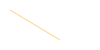
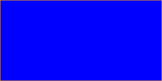

# LeapLearner Canvas Documentation (PART I)

### Shapes

| Code                                   | Shape                              |
| -------------------------------------- | ---------------------------------- |
| `rectangle(x, y, w, h)`                |   |
| `circle(x, y, r)`                      |      |
| `line(x1, y1, x2, y2)`                 |        |
| `point(x, y)`                          |       |
| `triangle(x1, y1, x2, y2, x3, y3)`     |    |
| `polygon(x1, y1, x2, y2, x3, y3, ...)` |     |
| `ellipse(x, y, rX, rY)`                |     |
| `image(src, x, y)`                     |       |
| `background(r, g, b)`                  |  |

### Colors

`fill(r, g, b)` || `fill(color)` : 修改画笔填充的颜色

`stroke(r, g, b)` || `stroke(color)` : 修改画笔描边的颜色

`noFill()` : 使用该方法后，绘制的图形不再填充，使用`fill`方法后恢复填充

`noStroke()` : 使用该方法后，图形的边不再绘制，使用`stroke`方法恢复绘制

`lineWidth(thickness)` : 设置线条的粗细

`background(color)` : 使用颜色直接绘制背景

`background(r, g, b)` : 使用rbg值来绘制背景

### Text

`text(src, x, y)` : 文本

`font(size, font*)`: 设置文本大小和字体

### Environment

`canvas.resize(w, h)` : 设置画布的宽度和高度

```javascript
var draw = function(){
    // code here
};
setInterval(draw, 1000/50);
```

Called repeatedly during program execution.


`playSound(src)`: 播放音乐。注意：需要在加载完成后才能看到，需要点击运行2次，作品也要刷新一次才可以看到。

### Mouse

`Mouse.x`, `Mouse.y` :当前鼠标的x、y值

```javascript
Mouse.click = function () {
  // Called when mouse is clicked
}
```

当鼠标点击后触发的事件


```javascript
Mouse.down = function () {
  // Called when mouse is down
}
```

当鼠标按下后触发的事件


```javascript
Mouse.up = function () {
  // Called when mouse is up
}
```

当鼠标松开后触发的事件


### Keyboard

```javascript
Key.a.press  = function () {
  // Called when key 'a' is fired
}
```

敲击a键后触发的事件


```javascript
Key.a.up  = function () {
  // Called when key 'a' is released
}
```

当a键被松开时触发的事件


```javascript
Key.a.down  = function () {
  // Called when key 'a' is pressed
}
```

当a键被按下时触发的事件


#### 各个键的名称

`a-z`, `ArrowLeft`, `ArrowRight`, `ArrowUp`, `ArrowDown`, `Escape`, `Tab`

### Math

`Math.random()` :Generate a random number between 0 and 1

`Math.floor()` :Return nearest interger of lesser/equal value

`Math.max()` :Return the maximum of two numbers

