---
Learning Coding with LeapLearner
---

# 乐学编程

本书是立乐在线课堂系列第三部分课程内容，建议在完成立乐在线课堂系列第二部分内容的学习之后再开始学习。


[TOC]

## 计算机图形的应用

随着计算机图形学不断发展，它的应用范围也日趋广泛。目前计算机图形学的主要应用领域如下。

### 计算机动画

最早的动画片都是手工绘制的。由于动画放映一秒钟需要24幅画面，故手工绘制的工作量相当大。而通过计算机制作动画，只需生成几幅被称作“关键帧”的画面，然后由计算机对两幅关键帧进行插值生成若干“中间帧”，连续播放时两个关键帧被有机地结合起来。这样可以大大节省时间，提高动画制作的效率。

### 计算机游戏

计算机游戏目前已成为促进计算机图形学研究特别是图形硬件发展的一大动力源泉。计算机图形学为计算机游戏开发提供了技术支持，如三维引擎的创建。建模和渲染这两大图形学主要问题在游戏开发中的地位十分重要。

### 虚拟现实（VR）

虚拟现实技术的应用非常广泛，可以应用于军事、医学、教育和娱乐等领域。虚拟现实是要使人们通过带上具有立体感觉的眼睛、头盔或数据手套，通过视觉、听觉、嗅觉、触觉以及形体或手势，整个融进计算机所创造的虚拟氛围中，从而取得身临其境的体验。例如走进分子结构的微观世界里猎奇，在新设计的建筑大厦图形里漫游等。这也成为近年计算机图形学的研究热点之一。

在其他领域，计算机图形的应用也非常的广泛，如辅助设计与制作、辅助教学、科学计算可视化等，目前都已经非常的成熟了。

## 计算机图形

在学习了矩形和圆形后，相信大家对图形都有了一些基本的认识。计算机中，图形的最基础的对象是点，点组成了矩形、圆等一系列我们所熟悉的图形，下面就让我们来认识下点这个最基础的图形。

### 点

和其他图形类似，点的位置可以在坐标轴上，用x坐标和y坐标确定出来。

```javascript
canvas.showAxis(); // 显示坐标轴
var p = new Point(150, 50);
p.draw();
```

在点的参数中，第一个坐标`150`是x坐标，也就是横坐标，在水平方向上，找到150的位置，它位于100和200的中间。第二个坐标50是y坐标，也就是纵坐标，在垂直方向上，找到50的位置，它位于0和100的中间。这两个坐标确定了点的位置，最后我们用`draw`方法把点绘制在画布上，就得到了下面的结果。

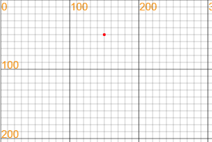

点的颜色可以通过点的`fillStyle`属性来设置，通过设置不同的样式，画出来的点可以有不一样的颜色。

```javascript
canvas.showAxis(); // 显示坐标轴
var p = new Point(150, 50);
p.fillStyle = "green";
p.draw();
```

通过修改点的颜色，我们就在同样的位置画出了一个绿色的的点。


**练习**

* 在坐标轴上画出以下点的位置：（100，100）
* 在坐标轴上读取点的位置
* 如果点从100，100均匀移动到了200，200，它是怎么移动的呢

**实例：点点点**

画一个点，我们只需要定义出一个点，然后将这个点绘制在画布上即可。点的初始化需要2个数值，x坐标和y坐标，有了这两个值，就可以确定一个点的位置了。

```javascript
var p = new Point(100, 100);
p.draw();
```

很快，我们就可以在画布的100，100上看到这个点了。接下来，我们想要在每次点击画布的时候，留下一个点。我们就使用鼠标的事件函数Mouse.click，然后将点的位置移到鼠标位置，再画出来。

```javascript
Mouse.click = function () {
    p.x = Mouse.x;
  	p.y = Mouse.y;
  	p.draw();
};
```

当鼠标点击时，点的位置都会被设置为鼠标所在的位置，并且将点绘制出来。

```javascript
var p = new Point(100, 100);

Mouse.click = function(){
    p.x = Mouse.x;
    p.y = Mouse.y;
    p.draw();
};
```

运行项目，在画布上点击鼠标，看看会不会留下痕迹。

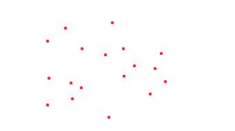

**实例：点点点II**

在上面的例子中，我们希望能够简单的按下鼠标就可以画出来，而不是一直要点击鼠标。我们可以把click事件修改为move事件，来试一试。

```javascript
var p = new Point(100, 100);

Mouse.move = function(){
    p.x = Mouse.x;
    p.y = Mouse.y;
    p.draw();
};
```

点击运行，然后将鼠标在画布上移动，就会留下各种个样的轨迹。如果不满意当前的图像，重新运行就可以清空屏幕上的图像了。


看起来好像达到我们的要求了，美中不足的时只要鼠标移动，就会自动在画布上留下很多我们不希望看到的点。

**想一想：**

* 画画、写字和点点点有什么不一样的地方呢
* 如何避免一直留下痕迹

为了模拟画笔的动作，我们可以这么设计，如果我按住鼠标，就留下痕迹，如果我松开鼠标，就不留下痕迹。

为了达到这个要求，我们先定义一个变量`clicked`，如果这个变量的值为`true`，那么移动鼠标时就留下痕迹，反之，则不留下痕迹。

```javascript
var clicked = false;

Mouse.move = function(){
    if(clicked){
      p.x = Mouse.x;
      p.y = Mouse.y;
      p.draw();
    }
}
```

接下来，但我们按下鼠标的时候，让这个值变为`true`，当松开鼠标的时候，让这个值变回为`false`。

```javascript
Mouse.down = function(){ clicked = true; };
Mouse.up = function(){ clicked = false; };
```

如果`clicked`是`true`，才开始画画。

```javascript
Mouse.move = function(){
    if(clicked){
      p.x = Mouse.x;
      p.y = Mouse.y;
      p.draw();
    }
}
```

我们把代码合在一起了，快看看你的的代码是不是和下面的代码一样。

```javascript
var p = new Point();

var clicked = false;

Mouse.down = function(){ clicked = true; };
Mouse.up = function(){ clicked = false; };

Mouse.move = function(){
    if(clicked){
      p.x = Mouse.x;
      p.y = Mouse.y;
      p.draw();
    }
}
```

画笔已经就位，我们来用它写首诗试一试，写的慢，可以写出连续的笔划，写的快，笔划就会变成一个个点，也是别有一番意境呢。

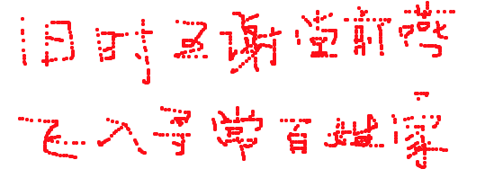

**比一比**

* 看看谁写的字更好看

**实例：点点点III**

我想换个颜色怎么办呢，我们把点的fillStyle改掉就行了

```javascript
p.fillStyle = "green";
```

成功，但是我们更希望在运行的时候来修改颜色。我们可以增加一个事件，当这个事件触发的时候就让颜色修改为绿色。

鼠标的事件已经被我们用了，那么我们可以在画布上添加一个按钮来增加点击事件。

```javascript
var rect = new Rectangle(10, 10, 50, 50);
rect.draw();
rect.click = function(){ p.fillStyle = "green"; };
```

这样，只要我们点击了这个按钮，就会让点的颜色变为绿色了。为了让其他人知道这个，我们可以把矩形的颜色改为绿色。

```javascript
var p = new Point();

var clicked = false;

Mouse.down = function(){ clicked = true; };
Mouse.up = function(){ clicked = false; };

Mouse.move = function(){
    if(clicked){
      p.x = Mouse.x;
      p.y = Mouse.y;
      p.draw();
    }
}

var rect = new Rectangle(10, 10, 50, 50);
rect.fillStyle = "green";
rect.fill();
rect.click = function(){
    p.fillStyle = "green";
}
```

运行项目，先用鼠标画出一条红色的线条，再点击绿色矩形，就可以用鼠标画出一条绿色的线条了。

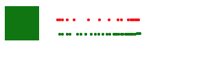

好了，接下来，我们可以添加更多的颜色上去了，快动手试一试吧。

**试一试**

* 完成点点点项目
* 为点点点项目添加更多的颜色

**实例：连点成线**

在下面的例子中，我们用点来模拟一条线段。在这里，我们定义了一个main函数，main函数每一次都会在点的右下方画出一个新的点出来。

```javascript
var p = new Point(50, 50);

function main(){
    p.x += 2;
    p.y += 1;
    p.draw();
    nextFrame(main);
}

main();
```

我们就可以利用点在画布上画出一条不断延长的线了。

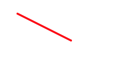

当然了，我们有更好的办法可以画出线条来。下面我们就来学学怎么用Line来定义线条。

### 线段

两点确定一条线段，通过设置线条两点的位置，我们可以确定线条的起始位置和终止位置。在画布中，我们用下面的方式来定义一个线段。

```javascript
var line = new Line(x1, y1, x2, y2)
```

定义后，我们就获得了`line`这个对象，通过修改line的属性，我们就可以改变线条的位置、样式以及它的宽度。

线条有比较多的属性值，修改线条的位置是一件非常容易出错的事情，要特别的小心。

**实例：线条**

首先，定义一个线条，从点`(100, 100)`连接到点`(250, 100)`，并在画布中绘制出来。

```javascript
var line = new Line(100, 100, 250, 100);
line.draw();
```

第二步，将线条往下平移到200，即将线条两个点的坐标设置为200，再将线条的颜色改成红色，粗细设置为5个像素，再次在画布上绘制。

```javascript
line.y1 = 200;
line.y2 = 200;
line.strokeStyle = "red";
line.lineWidth = 3;
line.draw();
```

最终效果图如下，仔细观察`output`中线条的粗细程度。


注意的是，和其他图形不一样的是，线条是没有面积的，因此是没有`fill`方法的。

**例子：用线条来绘制五角星**


### 多边形

```javascript
var polygon = new Polygon(100, 200, 100, 300, 200, 200, 200, 400);
polygon.draw();
```

多边形的绘制是依据点的顺序来的，不同的顺序绘制的多边形是不一样的。同时，绘制出来的多边形可能不是简单的凸多边形，有兴趣的同学可以去了解下多边形的分类，以及多边形的外部和内部的区分。

**实例：画个五边形**

我们先在纸上画出一个凸五边形，找出五边形5个点的坐标，依次将他们赋值给我们的多边形，在画布上画出来后，就可以看到一个五边形了。注意，我们找的点一点要按照按照顺时针或者逆时针的顺序输入。

```javascript
var polygon = new Polygon(200, 100,  // 1
                          105, 169,  // 2
                          141, 281,	 // 3
                          259, 281,	 // 4
                          295, 169   // 5
                         );
polygon.strokeStyle = "red";
polygon.stroke();
```

为了让点坐标看起来更明显，我们将每个点的坐标都单独放置一行。注意，最后一个坐标后面不能加上逗号。

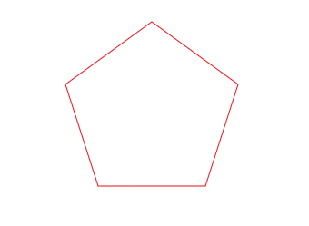

**实例：画个五角星**

同样的五个点，如果按照不同的顺序来，会画出不一样的图形来。接下来我们试着将点的顺序改变一下，按照1、3、5、2、4的顺序来画出这个五边形，观察下结果。

```javascript
var polygon = new Polygon(200, 100,  // 1
                          141, 281,	 // 3
                          295, 169,  // 5
                          105, 169,  // 2	
                          259, 281	 // 4
                         );

polygon.fillStyle = 'yellow';
polygon.fill();
```

五边形变成了一个五角星了！

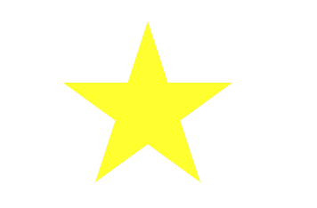

比一比：

* 看谁的五边形更正一点
* 试试看能不能画出更多不一样的图形出来
* 五个点可以画出多少种不一样的图形呢

### 三角形

```javascript
var triangle = new Triangle(x1, y1, x2, y2, x3, y3);
```

三角形是由三条线段围起来的、具有一定面积的图形。三角形有3个顶点，这3个顶点不在同一条直线上。

三角形的特性

三角形有许许多多的特性，比如三角形的内角和是180度，三角形任意两条边的长度只和都大于第三条边，三角形任意两条边的长度只差小于第三条边等等。

其中，最为人所知的是三角形的稳固性，三角形的三条边决定了三个唯一的角度，因此三角形不会发生角度的形变，被广泛运用到各种建筑上。

一些特殊的三角形

* 等边三角形
* 直角三角形
* 等腰三角形


**说一说**

* 生活中有哪些图形是三角形呢
* ​

**实例：山峰**

```javascript
var sky = new Rectangle(50, 100, 400, 300);
var sun = new Circle(290, 300, 30);
sun.fillStyle = "orange";

var moutain1 = new Triangle(200, 200, 50, 400, 300, 400); 
moutain1.fillStyle = "#666655";

var moutain2 = new Triangle(350, 250, 250, 400, 450, 400); 
moutain2.fillStyle = "#667755";

sky.fill();
sun.fill();
moutain1.fill();
moutain2.fill();
```

最后我们的作品就出来了，可以打印出来挂在墙上哦


## 变量

### 数值

#### 数值常量

所有的整数、小数都是数值，在过去的项目中我们用到了很多的数值，比如坐标值就是一个典型的数值。

数值包括以下

* 整数，如0，1，2，3...
* 小数，如0.1，0.2，0.3...

**试一试：**

* 写出几个不同类型的数值

#### 数值变量

当一个变量的值是数值常量时，这个变量就是一个数值变量。在下面的例子中，a和b都是一个数值变量。

```javascript
var a = 1;
var b = 0.1;
```

数值常量之间可以进行运算，数值变量同样也可以，通过运算和赋值，可以让变量的值发生改变。

```javascript
var a = 10;
a = a - 10;
```

#### 运算

#### 自增自减

变量可以通过`++`或者`--`运算符进行自增或者自减运算。自增是将变量的值增加1，比如：

```javascript
var a = 1;
a++;
```

经过运算后，`a`的值变为2。同样的`--`操作会将变量的值减去1。

在动画中，我们需要让图形进行移动，就可以通过自增或者自减的方式来改变图形的位置。下面的代码描述了四个图形运动的轨迹，预测各个图形运动的方向。

```javascript
var c1 = new Circle(200, 300, 20);
var c2 = new Circle(200, 300, 40);
var c3 = new Circle(200, 300, 60);
var c4 = new Circle(200, 300, 80);

function loop(){
  	canvas.clear();
  
    c1.x++;
  	c2.x--;
  	c3.y++;
  	c4.y--;
  
  	c1.draw();
  	c2.draw();
  	c3.draw();
  	c4.draw();
  	
  	nextFrame(loop);
}

loop();
```

**试一试：**

* 如果我们想让一个物体往右下移动，应该怎么做呢。
* 右上，左下，左上呢。

### 字符串

首先，我们先学会将字符串输出在画布上，只要在字符串后使用draw方法，就可以在画布上显示出来。

```javascript
var s = new Text("Hello, I'm Vic");
s.draw();
```

输入结果

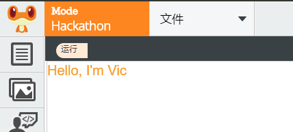


如果我们需要指定字符串的位置，我们只要在定义的时候加上坐标轴就可以了。

```javascript
var s = new Text("Hello, World!", 100, 100);
s.draw();
```

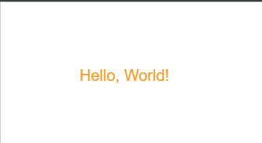

同样，如果在运行的时候，修改字符串的位置，也可以更改字符串的位置。

**实例：广告牌**

在生活中，我们经常看到各种各样的广告牌，其中一种是这样的：

TODO: 这里需要一张图片


它的文字一直向前滚动，下面我们就来试着做一个这样的广告牌。

:zero:

它的文字一直向前滚动，下面我们就来试着做一个这样的广告牌。

```javascript
var s = new Text("Hello, World!", 300, 100);

function main(){
    canvas.clear();
    s.x -= 1;
    s.draw();
    nextFrame(main);
}

main();
```

当字符串跑出屏幕后，我们要让他们重新从右边进来

```javascript
var s = new Text("Hello, World!", 300, 100);

function main(){
    canvas.clear();
    s.x -= 1;
  	if(s.x + 100 < 0) s.x = 300;
    s.draw();
    nextFrame(main);
}

main();
```

如果要修改字符串的值，那么要用到src属性。

```javascript
s.src = "New Year";
```


#### 字符串连接运算符

如果我们要将字符串拼接在一起，我们使用+号来

```javascript
var s = "Hello" + "World";
s.draw();
```

我们可以在屏幕上显示出来"HelloWorld"，我们成功的将字符串拼接在一起了。

**例子：记录坐标**

我们在绘制图形的时候，总是要设定很多的坐标值，坐标多了就容易混淆，我们就来做一个项目，可以记录画布上的坐标值。

第一步，创建一个Point对象和Text对象

```javascript
var p = new Point();
var text = new Text();
```

增加一个鼠标点击事件，当鼠标点击的时候，显示点的位置和文字。

```javascript
Mouse.click = function(){
	// draw point
  	// write text
}
```

接下来，在点击的时候，在鼠标的位置把点还有字符串显示出来。字符串是有x坐标和y坐标构成的，为了区分他们，我们在他们中间加上个逗号

```javascript
text.src = Mouse.x + ", " + Mouse.y;
```

除了让点的位置等于鼠标的位置外，记的让文字的位置也和鼠标的位置一样。

```javascript
p.x = Mouse.x;
p.y = Mouse.y;
text.x = Mouse.x;
text.y = Mouse.y;
```

使用draw方法将点和文字绘制到画布上。

```javascript
p.draw();
text.draw();
```

最后，附上完整的代码。

```javascript
var p = new Point();
var text = new Text();

Mouse.click = function(){
    p.x = Mouse.x;
    p.y = Mouse.y;
    p.draw();
    
    text.src = "" + Mouse.x + ", " + Mouse.y;
    text.x = Mouse.x;
    text.y = Mouse.y;
    text.draw();
}
```

运行项目，点击画布上任意一个位置，就会留下坐标值了。是不是可以方面的记录每个点的坐标值了。

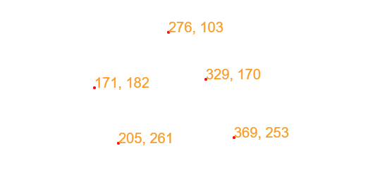

#### 空格

在字符串中，用`" "`来表示空格，如果我们需要在句子中加入空格，就不要漏掉这个看起来什么都没有的" "。

```javascript
var s = "Hello " + "World";
s.draw();
```

**试一试：**

如果我们要加入多个空格怎么办呢

### 布尔值

布尔值只有两个值，true和false。表示真和假。对算式来说，如果一个算式结果是对的，那么它的布尔值就是true，反过来，就是false。

试一试：

* 指出下面算式中为false的式子

布尔值一般和条件语句一起使用

### 变量的命名规则

在程序中，变量的命名要遵守一定的规则才能使用。

* 以字母开头，可以是大小写字母，但是不能以数字开头
* 后面接字母或者数字，或者下划线
* 变量名字中间不能有空格
* 变量不能使用编程语言的保留字

**试一试：**

* 定义几个合法的变量名称
* 指出下面变量名称中不合法的地方

除了以上这些基本规则外，为了程序的可读性更高，一般还有一些其他的规则。虽然编辑器不会提示这些错误，但是我们也应该遵守。

#### 驼峰法

当变量或者函数的名称是由多个单词连接在一起的时候，第一个单词以小写字母开始，后面每个单词的首字母大写。

因为大小写的区分使得复合词呈现出块状，看上去就想骆驼的驼峰，因此叫做驼峰法。

```javascript
var myName = 'Vic';
var myAge = 18;
var myFavouriteBook = 'Javascript';
```

如果第一个字母是小写，则称之为小驼峰法。如果第一个字母也写成大写，则可以称之为大驼峰法。一般情况下，我们只使用驼峰法就可以了。

试一试：

* 下面的变量名称是否满足驼峰法的要求。
* 如果不是，将下面的变量名称改成驼峰法。

```javascript
var orange = 1;
var 
```


#### 变量的名称

我们在给变量取名的时候，一定要取一个有意义的变量名字，这样我们在看到这个变量名字的时候，能够很快的了解这个变量是做什么的，下面两段代码用的不用的变量名称，阅读下面的代码，预测下运行的结果。在编辑器中运行，看看结果和你设想的是否一致。

在这个例子中，由于变量没有一个很好的名字，我们阅读起来就非常费劲。

**试一试：**

* ​

## 二维码

二维码项目地址：https://code.leaplearner.com/show.html?v=3657

在生活中，我们经常看到很多的二维码。有各种各样不同的功能，只要用手机扫一扫，就用很简便的使用它们。

其实，每个二维码对应的都是一组字符串，如果这个字符串是一个网址，那么手机会自动打开这个网址，进入到这个应用。下面，我们就来看看怎么制作自己的二维码，利用二维码来传递我们的信息。

### 制作二维码

实例：二维码的Hello World程序

打开项目，在文本框中输入一个字符串，点击运行后，就可以在画布上成功显示出制作完成的二维码。

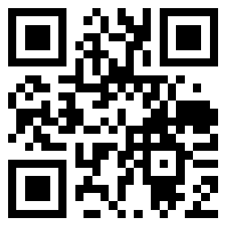

这就是我们成功制作的第一个二维码啦，但是从这张图上我们无法直接读取出来里面的信息。这时，就需要我们学会去读取二维码。

说一说：

* 观察二维码，它们有什么相同点
* 二维码的方向是什么样的

### 外部库的引用

在这个项目中，我们引用了一个外部的函数来帮助我们将字符串转为二维码。

### 识别二维码

我们有很多的软件可以来识别二维码，最简单的，现代的手机上有很多可以扫描二维码的软件，使用扫一扫功能，就可以看到这个二维码上带的内容。

```html
Hello, World!
```

动手试一试

* 写下一段话，将这段话转为二维码
* 将二维码发送给其他人，告诉他们怎么识别二维码

如果我们输入了很多的文字，那么这个二维码就会变得越来越复杂，越来越大。

### 二维码分享

将二维码发送给其他人，只要其他人获取到这个二维码，就能够获取到二维码携带的信息。

二维码有一定的容错性，因为二维码的这个特性，那怕二维码上面

二维码是没有加密的，只要拿到了二维码，就能用软件读取出其中的内容，所以如果你想要用二维码来传达秘密，你可要小心不要被其他人看到这个二维码。

#### 实例：分享自己的项目

同样，我们可以通过二维码分享自己的项目，在屏幕右上角，我们有一个分享按钮。点击后可以看到有2个内容，一个是二维码，一个是网址。在这里，这个二维码内容就是我们的网址。如果你要把自己的作品分享给其他人，那么只要将这个二维码发送给他，对方使用手机软件进行扫描后就可以看到了。

**动手试一试：**

* 把自己最喜欢的一个项目的二维码保存下来
* 发送给爸妈还有同学们，让他们观看你的项目

## 文本

在上一节中，我们知道如何将字符串显示出来。也知道了如何

### 颜色

文字，和其他图形一样，可以设置颜色。

fillStyle

制作艺术字


### 大小

不同字号的文本大小

### 字体

自己观察下面的2行字，发现他们有什么不一样的地方。

A字体，B字体

同样的字，在计算机中可以用不一样的字体来显示出来。

几种常见的字体

### 文字设计

如何合理的搭配出一张好看的贺卡

* 不要使用太多不同的字体
* 使用2-3种不同大小的字

## 图形的属性

图形一般包含边和填充，图形的样式也是由这两块共同组成。

### 填充样式

```javascript
rect.fillStyle = "red";
rect.draw();
```

填充样式

### 线条样式

```javascript
rect.strokeStyle = "green";
rect.stroke(); 
```

实例：

stroke和

## 代码规范

好的代码规范可以帮助我们减少很多错误。

### 缩进

每新增一个模块内容，整个代码区域往右缩进4个空格

看看下面的代码，哪个是符合要求的。

```javascript
var rect = new Rectangle(100, 100, 100, 50);

function draw (x, y) {
  	rect.x = x;
  	rect.y = y;
    rect.draw(); 
}

rect.draw(200, 200);
```

```javascript
var rect = new Rectangle(100, 100, 100, 50);

function draw (x, y) {
rect.x = x;
rect.y = y;
rect.draw();
}

rect.draw(200, 200);
```

这两段代码实现的效果完全一致，但是第二段代码没有按照要求进行缩进。在阅读上就没有第一个直观。

使用4个空格符号缩进

### 空格

运算符前后需要添加空格

函数名称后无空格

函数参数与括号间无空格

对象的冒号后加空格，冒号前不加

条件语句关键字后加空格

### 分号

一条语句通常以分号作为结束符。

```javascript
var a = 1;
var funk = {
    name: 'funk',
  	age: 18
};
```

### 换行

每行代码的字符数要少于80个。如果一个JavaScrip的语句超过了80个字符，建议在运算符或者逗号后换行。


在实际编程中，会有很多各种各样的编程规范，有了良好的编程规范，我们在编写代码时可以减少很多错误。

当然，良好的编程规范并不是一蹴而就的，需要我们在平时编程过程中，要注意多多积累，养成良好的习惯。

## 事件

计算机在运行的时候，能够同时。当鼠标被点击的时候，当键盘上的按键被按下的时候，会产生一个事件，通知计算机

### 事件原理


### 鼠标事件


按下来

Mouse.down

松开

Mouse.up

点击事件

Mouse.click

移动

Mouse.move

如果整个过程完成

手机上的点击事件

和电脑上不同的是，

### 图形触碰

当鼠标移动时，鼠标可能会停留在图形的上方，这个时候，如果我们使用图形的`touched`方法，就可以知道鼠标是不是在图形内。

如果鼠标在图形内，那么方法就会返回一个`true`值，反之则是`false`值

**例子：变化的圆**

```javascript
var c = new Circle(200, 200, 150);

function loop(){
  nextFrame(loop);
  if(c.touched())
    c.fillStyle = 'red';
  else
    c.fillStyle = 'green';
    
  c.draw();
}

loop();
```

当我们把鼠标移到图形上时，图形的颜色就变为红色，移开时，图形又变为绿色。

**练习题**

* 绘制一个图形，当鼠标移上去的时候，让图形的颜色变化
* 绘制一个图形，当鼠标移上去的时候，让图形的大小发生改变
* 绘制一个图形，当鼠标移上去的时候，让图形的大小持续发生改变

**例子：点不到的确认键**

我们在卸载一些软件的时候，卸载按钮总是隐藏的很深，今天我们就来模拟这些软件做一个永远点不到的卸载按钮。

```javascript
var btn = new Rectangle(100, 200, 100, 40);
var txt = new Text("Uninstall", 110, 205);

function loop(){
  nextFrame(loop);
  canvas.clear();
   
  new Text("Do you want to uninstall LeapLearner", 100, 100).draw();
  
  if(btn.touched()){
    btn.x = Math.random() * canvas.width;
    btn.y = Math.random() * canvas.height;
    txt.x = btn.x + 10;
    txt.y = btn.y + 5;
  }

  btn.draw();
  txt.draw();
}

loop();
```

**练习题**

* 在上面的代码中，按钮为什么不会被点到

  ​

### 键盘事件

当键盘上的一个按键被按下的时候，就会触发一个按键事件。如果我们为按键事件绑定了函数，那么这个函数就会被执行。

先让我们试一个简单的例子，用WASD来移动方块。

**实例：移动方块**

首先，我们在画布上画出一个方块。为了能够实时显示方块的位置，我们使用了动画，但是方块并没有在运动，所以我们无法看到任何动作。

```javascript
var rect = new Rectangle(100, 100, 100, 100);

function main(){
  	canvas.clear();
    rect.draw();
}

setInterval(main, 100);
```

接下来，我们在按键D上面绑定一个事件，只要按下D，就会触发这个函数。

```javascript
Key.d.press = function(){ rect.x += 10;}
```

再次运行，点击D，方块就随之往右移动了！

我们再把ASW的按键事件加上去，这样我们就可以用WASD来控制方块的位置了。

```javascript
Key.a.press = function(){ rect.x -= 10; }
Key.w.press = function(){ rect.y -= 10; }
Key.s.press = function(){ rect.y += 10; }
```

有了键盘事件，我们就可以用键盘来操作画布里的角色了。

**实例：把键盘变为钢琴**

我们还可以利用事件来控制声音的播放，当一个键被按下来的时候播放一个音符，如果每个按键绑定一个音符，那么键盘是不是就可以变成一台钢琴的琴键了？让我们来试一试吧。

我们决定，用1到7来分别代表钢琴的哆雷咪发梭拉西七个音阶。先从1开始：

```javascript
var do1 = new Audio();
do1.src = 
// re,mi,fa,sol,la,si
Key[1].press = function(){ duo.play(); }
```

完成的代码

```javascript
var url = "http://llcs-1252287760.cossh.myqcloud.com/Piano/";

var do1 = new Audio();
var re = new Audio();
var mi = new Audio();
var fa = new Audio();
var sol = new Audio();
var la = new Audio();
var xi = new Audio();

do1.src = url + "40-C.mp3";
re.src = url + "42-D.mp3";
mi.src = url + "44-E.mp3";
fa.src = url + "45-F.mp3";
sol.src = url + "47-G.mp3";
la.src = url + "49-A.mp3";
xi.src = url + "51-B.mp3";

Key[1].press = function(){ do1.play(); }
Key[2].press = function(){ re.play(); }
Key[3].press = function(){ mi.play(); }
Key[4].press = function(){ fa.play(); }
Key[5].press = function(){ sol.play(); }
Key[6].press = function(){ la.play(); }
Key[7].press = function(){ xi.play(); }

```

来一首《小星星》吧

1155665，4433221，5544332，5544332，1155665，4433221


再试试这个

333，333，35123，444，433，322125，333，333，35123，444，433，55421

看能不能听出来是什么音乐呢。

## 音效

属性

| 属性或方法       | 功能          |
| ----------- | ----------- |
| src         | 获取或者设置音效地址  |
| currentTime | 获取或者设置播放的时间 |
| loop        | 获取或者设置循环播放  |
| play()      | 播放音效        |
| pause()     | 暂停播放        |

**实例：做个音乐播放器**

作为音乐播放器，我们要添加各种控制按钮来控制音乐播放的进度。一个最简单的播放器要有以下功能：

* 播放
* 暂停
* 重新播放

我们先创建一个音效对象music，我们为这个音效取名为music。

```javascript
var music = new Audio();
```

选取一首你喜欢的音乐，设置music的地址。

```javascript
music.src = 'http://static.leaplearner.com/sounds/m_happy.mp3'; 
```

我们先用play方法来测试下这首音乐能够正常播放。

```javascript
music.play();
```

**开始播放**

接下来，我们开始添加一个开始按钮。一般来说，播放按钮的图标应该是这样一个图形

我们用三角形来模拟这个图形。并给这个按钮取名为start。

```javascript
var start = new Triangle(100, 100, 200, 200, 100, 200);
```

接下来，在开始按钮上我们为它绑定一个事件，点击后开始音乐的播放。

```javascript
start.click = function() {
    music.play();
}
```

最后记的把测试用的music.play()删除，完成的代码应该是这个的。

```javascript
var music = new Audio(); 
music.src = 'http://static.leaplearner.com/sounds/m_happy.mp3'; 

var start = new Triangle(100, 100, 100,200, 200,150);
start.draw();

start.click = function(){
    music.play();
}
```

运行一下，音乐没有播放，需要我们点击下播放按钮，音乐就按照我们的要求开始播放了。

再次点击播放，音乐并没有停止或者重新开始播放，我们需要添加其他方法来控制这两个功能。

**暂停播放**

播放器很重要的一个功能就是暂停，暂停的图标是2个矩形，为了简单起见，我们用一个大矩形来代表暂停按钮，并将这个按钮取名为`pause`。注意，暂停按钮不要覆盖了播放按钮，否则我们就点击不到开始按钮了。

同样，我们在暂停按钮上添加一个事件，让音乐暂停播放。我们在列表中找到暂停的方法名是pause，在事件中使用pause方法来暂停音乐的播放。

```javascript
var pause = new Rectangle(200, 100, 50, 50);
pause.click = function() {
    music.pause();
}
```

同样运行，点击播放，音乐开始播放，点击暂停，音乐就暂定播放。如果我们需要继续播放音乐，点击播放按钮就可以了。

**重新播放**

我们的播放器应该随时都可以重新播放音乐。重新播放音乐，需要把音乐的播放时间改成0，也就是：

```javascript
music.currentTime = 0;
```

如果在播放阶段，点击重新播放，音乐便从头开始播放。如果在暂停阶段，点击重新播放，虽然播放的时间回到了初始状态，但是音乐仍然处于暂停播放状态，为此，我们在事件里面添加一个play方法，即使在暂停状态下，也可以重新开始播放。

因为多次使用play方法不会影响到正常播放，我们可以大胆的使用。

```javascript
var restart = new Circle(450, 150, 50);
restart.draw();

restart.click = function(){
    music.currentTime = 0;
    music.play();
}
```

这样，我们就完成了我们的音乐播放器啦。附上完整的代码，快动手试一试吧。

```javascript
var music = new Audio(); 
music.src = 'http://static.leaplearner.com/sounds/m_happy.mp3'; 

var start = new Triangle(100, 100, 100,200, 200,150);
start.draw();

start.click = function(){
    music.play();
}

var pause = new Rectangle(250, 100, 100, 100);
pause.draw();

pause.click = function(){
    music.pause()
}

var restart = new Circle(450, 150, 50);
restart.draw();

restart.click = function(){
    music.currentTime = 0;
    music.play();
}
```

试一试：

* 把按钮改成你喜欢的图形或者图片
* 为播放器添加下一首功能

### 循环播放

```javascript
var music = new Audio();
music.loop = true;
music.play();
```


### 音效的加载

音效资源是需要从资源库中下载，需要的时间依据资源的大小而定，随着资源的增大，下载的时间也会增长。如果我们可以在音效资源加载完成后进行播放，那就可以解决这个问题。

我们只要为音效对象onload事件定义一个函数，当音效加载完成后，这个事件所对应的函数就会执行，也就起到了加载结束后播放的效果。

```javascript
var music = new Audio();
music.loop = true;

music.onload = function(){
    music.play();
}
```

#### 缓存

如果你多次点击运行，会发现后面几次的运行时，音效并没有延迟播放，这是因为浏览器将音效缓存起来了。我们下次再需要这个资源的时候，浏览器会直接使用已经下载好的资源，而不会重新去下载。

如果我们在一个新的环境下打开，比如在手机中打开，那么第一次甚至每次打开的时候就要重新下载，因此，为了保证体验的一致性，我们需要使用onload事件来保证一切都正常进行。


