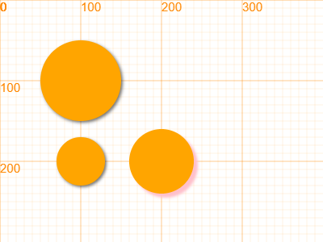

## 圆 circle

### 绘制方法 `circle`

```javascript
circle(x, y, r, *color)
/**************************
  x - x坐标
  y - y坐标
  r - 半径
  color - 颜色，默认为orange
**************************/
```

示例代码

```javascript
canvas.showAxis();
circle(100, 100, 30);
circle(200, 100, 40, 'green');
circle(300, 100, 50, 'red');

// 如果想要画圆框，在使用circle之前，使用fill方法

fill(false);
circle(100, 200, 50);
circle(200, 200, 40, 'green');
circle(300, 200, 30, 'red');
```

运行效果：


### 圆形对象 `Circle`

```javascript
class Circle(x, y, radius)

/***************************************************************
圆类
x, y:       圆的圆心位置
radius:     圆的半径
***************************************************************/
```

#### 属性值

##### 坐标值 `x`,`y`

圆心的坐标值

##### 半径 `r` / `radius`

等价属性，可以任意使用其中一个

例子

```javascript
canvas.showAxis();
var c = new Circle(100, 100, 50); // x, y, rX, rY
c.lineWidth = 3;
c.strokeStyle = "red";
c.fillStyle = "orange";

c.draw();

c.y += 100;
c.r = 30;
c.fill();

c.x += 100;
c.radius = 40; // both radius or r works
c.shadowColor = 'pink';
c.shadowBlur = 4;
c.shadowOffsetX = 5;
c.shadowOffsetY = 5;
c.fill();
```

运行效果

