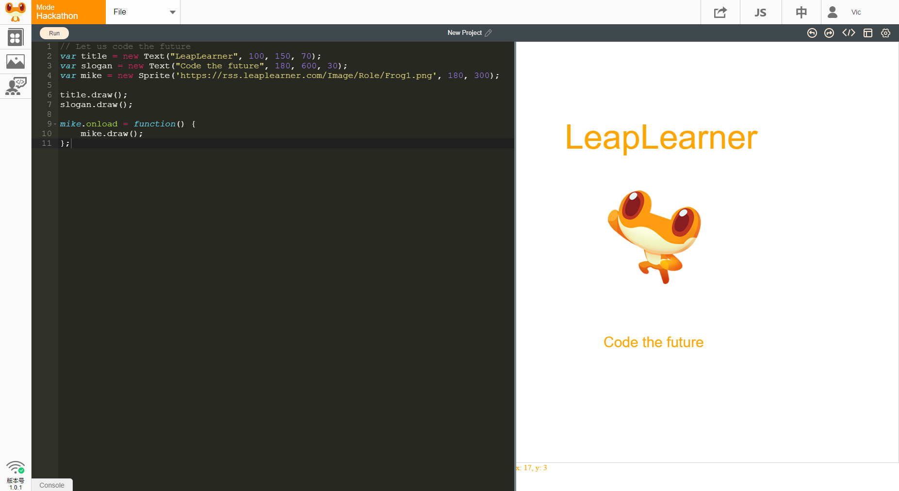
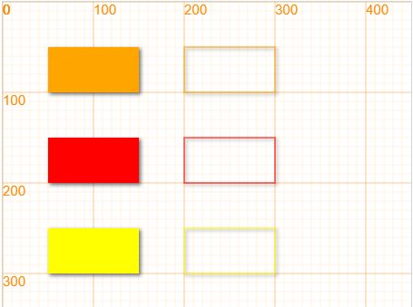
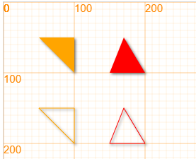
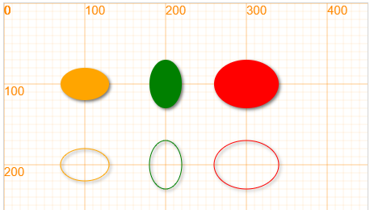
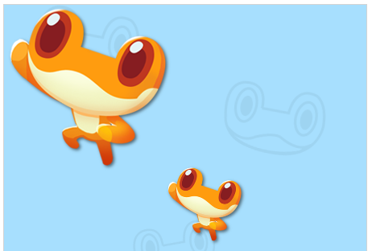
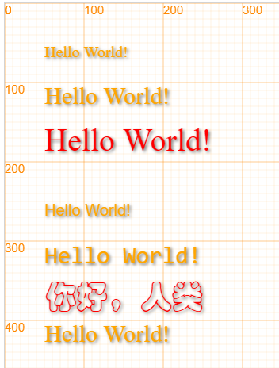

# LeapJS 说明文档

## 简介

LeapJS是由LeapLeaner开发的基于浏览器的一个插件，有了LeapJS，我们就可以在浏览器上使用简单的一些命令进行动画的创作，开发各种小游戏等。利用LeapJS学习JS，可以让你在学习JS的过程中充满乐趣。

要尝试LeapJS，只要打开运行环境：http://code.leaplearner.com，在左侧输入代码，点击运行，就可以看到效果了！在第一次打开这个页面时，我们已经为你创建了默认的代码，你可以尝试着去修改代码中的数字，来看看每个数字代表什么含义。



在这个运行环境中，我们还准备了许多隐藏的功能，我们将在后面的章节中一一介绍。


## 基本绘图函数

以下函数会在画布上绘制出相应的图形。通过使用基本绘图函数，我们可以组合出任意我们想要的图形。

### 基本形状

说明：前面加*的参数表示可选参数，除color是字符串参数外，其他参数均为数值参数。

#### 长方形 rectangle

长方形是由顶点位置和宽和高组成，并且我们可以画出不同颜色的长方形。长方形的定义如下：

```javascript
rectangle(x, y, w, h, *color)
/***************************
x - x坐标
y - y坐标
w - 宽度
h - 高度
color - 颜色，默认为orange
***************************/
```

通过设定rectangle的属性，我们可以绘制不同的一些长方形。

```javascript
canvas.showAxis();
rectangle(50, 50, 100, 50);
rectangle(50, 150, 100, 50, 'red');
rectangle(50, 250, 100, 50, '#ffff00');

// 如果想要画一个边框的长方形边框，在使用rectangle之前，使用fill方法
fill(false); // 无填充
rectangle(200, 50, 100, 50);
rectangle(200, 150, 100, 50, 'red');
rectangle(200, 250, 100, 50, '#ffff00');
```

运行后就可以得到下述结果，在这里`canvas.showAxis();`让我们能够在画布上显示出坐标。




#### 圆 circle

```javascript
circle(x, y, r, *color)
/**************************
  x - x坐标
  y - y坐标
  r - 半径
  color - 颜色，默认为orange
**************************/
```

示例代码

```javascript
canvas.showAxis();
circle(100, 100, 30);
circle(200, 100, 40, 'green');
circle(300, 100, 50, 'red');

// 如果想要画圆框，在使用circle之前，使用fill方法

fill(false);
circle(100, 200, 50);
circle(200, 200, 40, 'green');
circle(300, 200, 30, 'red');
```

运行效果：


#### 线段 line

```javascript
line(x1, y1, x2, y2, *lineWidth, *color)
/**************************
  x1 - 起点x坐标
  y1 - 起点y坐标
  x2 - 终点x坐标
  y2 - 终点y坐标
  lineWidth - 线宽，默认为1
  color - 颜色，默认为orange
**************************/
```

#### 点 point

```javascript
point(x, y, *color)
/**************************
  x - 点x坐标
  y - 点y坐标
  color - 颜色，默认为orange
**************************/
```

#### 三角形 triangle

```javascript
triangle(x1, y1, x2, y2, x3, y3, *color)
```

代码举例：
```javascript
canvas.showAxis();
triangle(50, 50, 100, 50, 100, 100);
triangle(150, 100, 170, 50, 200, 100, 'red');

fill(false);
triangle(50, 150, 100, 150, 100, 200);
triangle(150, 200, 170, 150, 200, 200, 'red');
```




#### 多边形 polygon

```javascript
polygon(x1, y1, x2, y2, x3, y3, ..., *color)
/**************************
  x1, y1 - 第一个点的坐标
  x2, y2 - 第二个点的坐标
  ...
  至少需要3个点，按照点的顺序连接起来
**************************/
```

#### 椭圆 ellipse

椭圆看起来就像是一个被压扁的圆，因此它有2个半径，一个数水平方向的半径radiuX，一个是垂直方向的半径radiuY。

```javascript
ellipse(x, y, xRadius, yRadius, *color)
/***************************************************************
在画布上画出一个椭圆：

* 椭圆的圆心位置为（x,y）
* 椭圆水平方向的半径为xRadius
* 椭圆垂直方向的半径为yRadius
* 颜色为为color，可选参数，默认为 "orange"
***************************************************************/
```

同样的，我们可以用ellipse来在画布上画出椭圆

```javascript
canvas.showAxis();
ellipse(100, 100, 30, 20);
ellipse(200, 100, 20, 30, 'green');
ellipse(300, 100, 40, 30, 'red');

fill(false);
ellipse(100, 200, 30, 20);
ellipse(200, 200, 20, 30, 'green');
ellipse(300, 200, 40, 30, 'red');
```

你能不能在图中找对每行代码对应的椭圆呢？



### 图片 image

```javascript
image(src, x, y, w, h)
/**************************
  src - 图片地址，图片需要从同一个网站地址，或者支持跨域访问
  x, y - 图片左上角顶点的位置

  ...
  图片第一次绘制时需要从服务器下载，因此可能需要一段时间后才能绘制出来
  如果覆盖了后面的图像，重新运行代码即可
**************************/
```
由于浏览器安全的限制，部分网络上的图片不支持跨域的条件，就不可以在画布中使用。

```javascript
var url1 = "https://rss.leaplearner.com/Image/Bgs/Alarm_bg_01.png";
var url2 = "https://rss.leaplearner.com/Image/Bgs/bluebg.jpg";

// 使用图片铺满整个屏幕，利用canvas的属性，可以用来设置背景
image(url1, 0, 0, canvas.width, canvas.heigh);

// 不带任何参数，默认显示图片原始大小
image("https://rss.leaplearner.com/Image/Role/Frog1.png");
image("https://rss.leaplearner.com/Image/Role/Frog1.png", 200, 200, 100, 100);
```

运行效果如下，如果改变图片的位置和大小，我们可以重复利用同一张图片。



图片的加载需要时间，如果图片未缓存，画图片时会有一定的延迟，可能会导致图片的绘制顺序与预期不同。一般等图片缓存后重新执行就可以解决这个问题，否则需要定义一个函数，使用loadRssAndRun()来加载资源。使用loadRssAndRun()方法


### 样式填充 fill

`fill(bool)`:设置是否填充图形，默认为填充，设置后对所有之后的图形生效
```javascript
/******************************************
fill(bool)

设置图形是否填充，对后续所有图形生效
* fill(true): 填充图形
* fill(false): 不填充图形

/******************************************/
```

举例：

```javascript
canvas.showAxis();
circle(100, 50, 20);
rectangle(50, 150, 100, 50, 'red');
ellipse(100, 250, 30, 20, 'green');

fill(false); // 无填充
circle(200, 50, 20);
rectangle(200, 150, 100, 50, 'red');
ellipse(200, 250, 30, 20, 'green');

fill(true);
circle(300, 50, 20);
rectangle(200, 150, 100, 50, 'red');
ellipse(300, 250, 30, 20, 'green');
```

运行效果：


### 文字

#### 字体 font

```javascript
/***************************************************************
font(fontName)

设置字体
* 字体名称：fontName
/***************************************************************/
```

能够使用的字体是和系统相关的，在不同系统下常见字体如下：

Windows

- ​    黑体：SimHei
- ​    宋体：SimSun
- ​    新宋体：NSimSun
- ​    仿宋：FangSong
- ​    楷体：KaiTi
- ​    仿宋GB2312：FangSongGB2312
- ​    楷体GB2312：KaiTiGB2312
- ​    微软雅黑：Microsoft YaHei

Mac Os

- ​    冬青黑体: Hiragino Sans GB （SNOW LEOPARD开始提供）
- ​    华文细黑：STHeiti Light （又名STXihei）
- ​    华文黑体：STHeiti
- ​    华文楷体：STKaiti
- ​    华文宋体：STSong
- ​    华文仿宋：STFangsong

如果安装了Microsoft Office软件，那么还可以使用以下字体

- ​    隶书：LiSu
- ​    幼圆：YouYuan
- ​    华文细黑：STXihei
- ​    华文楷体：STKaiti
- ​    华文宋体：STSong
- ​    华文中宋：STZhongsong
- ​    华文仿宋：STFangsong
- ​    方正舒体：FZShuTi
- ​    方正姚体：FZYaoti
- ​    华文彩云：STCaiyun
- ​    华文琥珀：STHupo
- ​    华文隶书：STLiti
- ​    华文行楷：STXingkai
- ​    华文新魏：STXinwei

等宽字体：
* Consolas

#### 写字 text

`text(src, x, y, *size, *color, *font)` : 绘制文本，同样，我们需要x、y来绘制文字的位置

```javascript
/***************************************************************
 * text(string, x, y, *size, *color)
 * 
 * 在画布上写字：
 * 
 * 文字内容：string
 * 文字左上角顶点位置为（x,y）
 * 文字大小为size，可选参数，默认为20
 * 文字颜色为为color，可选参数，默认为 "orange"
 ***************************************************************/
```

我们来继续看一些写字例子：

```javascript
canvas.showAxis();
text("Hello World!", 50, 50);
text("Hello World!", 50, 100, 30);
text("Hello World!", 50, 150, 40, 'red');

// 使用不同的字体
text("Hello World!", 50, 250, 20, null, "Arial");
text("Hello World!", 50, 300, 30, undefined, font="Consolas");
text("你好，人类", 50, 350, 40, 'red', 'STCaiyun');
text("Hello World!", 50, 400, 30);
```

在这里，我们也能看到不同的字体表现出来的效果差异很大。



### 音乐

在编辑环境中，我们同样提供了一系列的音乐音效

#### 播放 play

```javascript
play(src)
// src: 音乐链接地址
```

#### 暂停播放pause

```javascript
pause(src)
// src: 音乐链接地址
```


## 基本图形对象

在基本绘图函数中，我们在画布上绘制除了许多图形，但是，如果我们想要对已经画出来的图形进行操作，那么上诉方法就无能为力了。我们需要创建图形对象来控制这些图形。

### 基本图形对象 Shape

Shape 是所有图形对象的基础，也就是说，其他继承自Shape的图形都有Shape的属性和方法。

```javascript
class Shape {
    constructor ()
}
```

#### 属性

------

##### 形变 transform

记录图形的位移、斜切、旋转属性，详见Transform一节

##### 点击事件 click 

绑定点击事件后，当图形被鼠标点到，就会触发该事件

#### 方法

------

##### 描边 stroke

将图形对象的边框画出来

```javascript
var rect = Rectangle(100, 100, 100, 50);
rect.stroke()
```
##### 填充 fill

将图形填充

##### 画 draw

将图形画在画布上，默认情况下，draw等于fill

##### 旋转rotate(degree)

图形旋转一定的角度，以角度作为单位，360度为一圈

##### 平移 translate(x, y)

将原始图形平移x、y个像素

##### 缩放 scale(x, y)

将图形水平方向放大至原始大小的x倍，将垂直方向放大至原始大小的y倍。

##### 斜切 skew(x, y)

将图形往x、y轴方向倾斜x、y比例，当x=1时，往x方向倾斜45度

设置形变中心点 `setAnchor(x, y)`

设置形变的中心点，x、y为比率，当x=0.5， y=0.5时，中心点在图形中心点。

##### 获取真实坐标点 `getRealPoint(p) `

p：原始图形上的某个点，如 `{x: 100, y:100}`

返回值：在画布上真实的坐标值 ，如 `{x: 200, y:120}`

##### 碰到鼠标 `touched()`

判断是否碰到鼠标

返回值：`true` / `false`

##### 碰撞` collide(shape)`

判断图形是否碰到另一个图形

返回值：`true` / `false`

##### 克隆 `clone()`

返回一个完全相同的克隆体，深度复制所有的属性和方法。

返回值：`shape`

### 圆形 `Circle`

```javascript
class Circle extends Shape {
  constructor (x = 50, y = 50, r = 20, color="orange")
```

#### 属性值

##### 坐标值 `x,y`

圆形的坐标值

##### 半径 `r` / `radius`

等价属性，可以任意使用其中一个

### 点 Point

```javascript
class Point extends Circle {
  constructor (x, y, color="red")
```

### 线段 Line

属性值

坐标点 `x1, y1, x2, y2`

各个点的坐标值

坐标` x, y`

获取或者设置线段的中心点

### 多边形 `Polygon`

```javascript
class Polygon extends Shape
```

坐标 `x, y`

获取或者设置多边形的中心点

### 三角形 `Triangle`

```javascript
const Triangle = Polygon;
```

### 矩形 `Rectangle`

```javascript
class Rectangle extends Shape
  constructor (x = 100, y = 100, w = 100, h = 50, color="orange") 
```

属性值

坐标点 `x,y`

矩形左上角顶点的坐标值

宽度` w` / `width`

矩形的宽度

高度 `h` / `width`

矩形的高度

**方法**

设置碰撞的区域 `setCollisionScale(w, h)`

设置碰撞区域大小，默认为1，即正常大小

当`w`设置为0.5时，表示可碰撞区域的宽度为原始宽度的一半

### 椭圆 `Ellipse`

```javascript
class Ellipse extends Shape {
  constructor (x, y, rX, rY, color="orange")
```

### 属性

圆心位置 `x, y`

水平轴半径 `rX`, `radiusX`

垂直轴半径` rY`, `raduisY`

### 文本 `Text`

```javascript
class Text extends Rectangle
  constructor (src = 'LeapLearner', x = 0, y = 0, size = 20, color="orange", font = 'Arial')
```

#### 属性

##### 文本内容 `src`

获取或者设置文本的内容

##### 字体大小 ` size`

获取或者设置文本字体大小

##### 字体 `font`

获取或者设置文本字体

### 图像 `Sprite`

```javascript
class Sprite extends Rectangle
  constructor (src, x = 0, y = 0, w = null, h = null)
```

#### 属性

------

##### 图片链接 `src`

获取或者设置图片的链接

##### 加载完成事件 `onload`

如果定义了`onload`事件，那么当图片加载完成时就会触发

#### 方法

------

##### 裁剪图片 `clip(sx, sy, sw, sh)`

`sx`,` sy`: 图片裁剪开始的位置

`sw`, `sh`: 裁剪的图片大小

### 序列帧动画 Animation


```javascript
class Animation extends Sprite 
  constructor (src, x, y, w, h)
```

**方法**

##### 设置序列帧 `setFrame(c, r)`

`c`: 序列帧的列数，如上述实例的图片中，列数为8

`r`: 序列帧的行数

默认参数为4x1

##### 设置播放速度 setSpeed(speed)

设置序列帧的播放速度，多少个draw更新一次序列帧，默认为10

## 图形样式

图形一般包含边和填充，图形的样式也是由这两块共同组成。

### 线条和填充

图形的线条和填充分别由`strokeStyle`和`fillStyle`这两个属性来决定

### 颜色常量

`fillStyle`与`stokeStyle`可以设置为表示颜色的字符串常量，从而可以直接设置图形的颜色。

一些常见的颜色的常量有aqua、black、blue、fuchsia、gray、green、lime、maroon、navy、olive、purple、red、silver、teal、white、yellow。

##### 实例：设置矩形的颜色

```javascript
var rect = new Rectangle(10, 10, 200, 100);
rect.fillStyle = "red";
rect.fill()
```


### RGB值

如果用放大镜看显示器的屏幕，会发现屏幕的每个点都是由3个颜色组成，分别是

* Red, 红色
* Green，绿色
* Blue，蓝色

而这3个颜色的首字母组合，即RGB，这也是RGB值的由来。在RGB值的组成中，每一个数字分布代表了每个颜色的强弱，0代表关闭，255代表最高。

有了这3个基本的颜色，按照亮度的不同，就以组成各种个样的颜色。

### 透明度

透明度的数值从0到1，0代表完全透明，即什么都看不见，1代表全不透，是图像透明度的默认值。

在Canvas中，图像的透明度用globalApha来表示，设置图形的globalAlpha值即可获得不同的透明度。

```javascript
var rect = new Rectangle(10, 10, 200, 100);
rect.globalAlpha = 0.1;
rect.draw();
```

### RGBA值

RGBA值是RGB的扩充，在使用颜色时可以直接制定该颜色的Alpha值。

```javascript
rect.fillStyle = "rgba(255, 255, 0, 0,5)";
```

前三位对应的是RGB值，第四位即透明度值

### HSL

```javascript
HSL(360, 1.00, 1.00)
```


### HSLA

即HSL添加透明度Alpha

### 虚线

图形的`setLineDash`方法可以用来设置虚线条，它接受一个数组对象，按照数组的顺序，轮流绘制线条的实部、虚部。

```javascript
var line = new Line(100, 100, 300, 100);
line.setLineDash([5, 10]);
line.stroke();
```

### 透明度

设置图形的`globalAlpha`可以改变图形的透明度，默认为1，设置区间：0~1。

### 渐变色

在上面的例子中，我们图形的颜色是单一的。而在实际生活中，颜色往往都不是均匀的。我们可以创建一个变化的颜色来实现这个效果。

##### 实例：渐变色

```javascript
var grd = ctx.createLinearGradient(0,0,175,50);
grd.addColorStop(0,"#FF0000");
grd.addColorStop(1,"#00FF00");

var rect = new Rectangle(10, 10, 175, 50);
rect.fillStyle = grd;
rect.draw();
```

渐变色效果


addColorStop是在图像的特定位置创建出制定的颜色，中间的变化则由计算机自动完成。

通过添加更多的颜色，我们可以创建出更多特殊的渐变色。

彩虹是难得一见的奇观，一般只有雨过天晴的时候才会出现，现在，我们就来创建一个彩虹出来。

## 音乐与音效

好的项目离不开音效，合适的音效可以让一个项目发挥出200%的效果。

```javascript
var music = new Audio();
music.src = "ddd.mp3"
music.play();
```

属性和方法

src
获取或者设置音乐链接地址

oncanplaythrough
在音效加载结束后使用该方法

### 音乐

背景音乐一般是长度较长的音乐，且需要循环播放。我们可以将音效的`loop`属性设置为`true`，这样只要播放一次就可以了。

```javascript
var music = new Audio();
music.src = "ddd.mp3"
music.loop = true;
music.play();
```

### 音效

无论是音乐还是音效，浏览器在加载时都需要耗费一定的时间，因此一般都是通过异步加载的。因此只有在加载结束后才能进行播放。一般通过`oncanplaythrough`函数来调用播放音效。

如果是音效，我们可以在项目执行之前进行加载。本书不涉及到资源的管理和加载，如果有兴趣，可以去网上了解更多预加载的知识。

##### 实例：色阶钢琴

```javascript
var url = "http://llcs-1252287760.cossh.myqcloud.com/Piano/";

var urls = [ "40-C.mp3", "42-D.mp3", "44-E.mp3", "45-F.mp3", "47-G.mp3", "49-A.mp3", "51-B.mp3"];

var Key = Rectangle;
Key.prototype.click = function(){
    //this.audio.currentTime = 0;
    this.audio.play();
};

for(var i=0; i<urls.length; i++){
    var key = new Key(0, 550/7*i, 350, 550/7);
    key.fillStyle = RGB(0, 200-20*i, 200-20*i);
    key.audio = new Audio();
    key.audio.src = url + urls[i];
    key.fill();
}
```


## 事件

### 鼠标事件

事件驱动在JavaScript中是非常常见的一种程序设计模式，通过监测事件的发生，调用预定的函数，从而实现异步执行的效果。

比如说，当鼠标在画布上移动时，鼠标的坐标值会随之而变，这就是一个简单的事件在驱动着坐标值不断的发生变化。

`Mouse`的属性

属性
x    鼠标当前的x值，可以在画布左下角看到
y    鼠标当前的y值，可以在画布左下角看到

**点击事件**

当鼠标在画布上点击时，就会触发`click`事件，如果配置了`Mouse.click`函数，那么该函数就会执行。

##### 实例：点击成图

这个项目的目标是创建一个空白的画布，当鼠标在画布上面点击时，就会在鼠标的位置绘制一个圆圈。

第一步，我们需要创建一个圆，这里我们可以创建一个默认的圆图形。

```javascript
var circle = new Circle();
```

第二步，定义一个绘制圆的函数`drawEvent`，因为我们要将圆绘制在鼠标的位置，因此我们要将圆中心设置为鼠标的位置。

`Mouse`对象，即鼠标，有两个属性`x`和`y`，他们会随着鼠标的移动而发生变化，因此我们只要直接使用这两个属性就可以了。

```javascript
function drawEvent(){
    circle.x = Mouse.x;
    circle.y = Mouse.y;
    circle.draw();
}
```

第三步，将函数绑定给click事件

```javascript
Mouse.click = drawEvent;
```

完整代码如下，我们用简单的9行代码，就完成了这个例子。

```javascript
var circle = new Circle();

function drawEvent(){
    circle.x = Mouse.x;
    circle.y = Mouse.y;
    circle.draw();
}

Mouse.click = drawEvent;
```

一般情况下，我们可以省略函数名，直接定义一个匿名函数，可以简单写成。

```javascript
var circle = new Circle();

Mouse.click = function(){
    circle.x = Mouse.x;
    circle.y = Mouse.y;
    circle.draw();
}
```

点击画布，就会在画布上留下一个圆圈。


#### 移动事件

当鼠标移动时，就会触发`move`事件。只要我们定义了`move`函数，那么该函数就会执行。

##### 实例：写字板

`Mouse`的事件

手机上的事件

如果应用需要在手机上运行，需要特别注意事件的区别。在手机上，没有鼠标的存在，只有点击屏幕后才有移动事件的触发。

电脑：`Move` -> `Down` -> `Move` -> `Up/Click` -> `Down`

手机：`Down` -> `Move` -> `Up/Click`

所以为手机开发应用时，我们应该小心的使用这些事件的顺序

##### 实例：点击英雄

**插入图片**

第一步，我们定义两个图片，使用图片对象的`draw`方法将图片绘制在画布上。

```javascript
var bg = new Sprite("http://orjajlo36.bkt.clouddn.com/backgroundimage2.jpg", 0, 0, 350, 550);
var item = new Sprite("http://ou1htxdl4.bkt.clouddn.com/coin.png", 150, 100, 50, 50);
bg.draw();
item.draw();
```

点击执行，就可以将这两张图片绘制在画布上了。

**行动起来**

接下来，就是让物体开始运动起来了。画布上，我们每隔一段时间`(16.7ms)`将图形重新绘制一次，因为频率非常块，看起来就像是动起来一样。

这里我们需要先定义一个`GameLoop`函数，它的作用是在每一帧里绘制图形，同时在下一帧中调用自己。

```javascript
function GameLoop(){
    item.y += 1;
  
    bg.draw();
    item.draw();
    nextFrame(GameLoop);
}

loadRssAndRun(GameLoop);
```

在`GameLoop`中，我们让物体的y值每次都增加一，以达到每次往下移动的效果。最后，我们用一个函数`loadRssAndRun(GameLoop);`来加载图片并且开始执行这个循环。

完整代码如下：

```javascript
var bg = new Sprite("http://orjajlo36.bkt.clouddn.com/backgroundimage2.jpg", 0, 0, 350, 550);
var item = new Sprite("http://ou1htxdl4.bkt.clouddn.com/coin.png", 150, 100, 50, 50);

function GameLoop(){
    item.y += 1;
  
    bg.draw();
    item.draw();
    nextFrame(GameLoop);
}

loadRssAndRun(GameLoop);
```

**点击事件**

在点中物体时，我们需要让物体消失，然后刷新出一个新的物体。事实上，我们不用这么麻烦，把物体的坐标修改为0就可以了。

```javascript
item.click = function(){
    item.y = 0;
};
```

**随机位置**

每次都是固定的位置显然不好玩，让我们同时修改下物体的水平位置，使用一个随机的概念。`Math.random()`会产生一个0到1的随机数，乘以300，即随机生成一个0到300的随机数。

```javascript
item.click = function(){
    item.y = 0;
    item.x = Math.random() * 300;
};
```

**显示分数**

接下来就是记录游戏的分数了。让我们新增一个变量`score`，初始值为0。

```javascript
var score = 0;
```

数字是没法直接显示出来的，我们需要将数字转为字符串，利用JavaScript中字符串＋数字，自动将数字转为字符串的特性，我们可以实现数字的转换。

```javascript
var scoreMsg;

function GameLoop(){
    item.y += 1;
    scoreMsg = "score:" + score;
  
    bg.draw();
    item.draw();
    scoreMsg.draw();
    nextFrame(GameLoop);
}
```

当然，别忘了在成功点击物体时增加分数，否则分数就不会增加啦。

```javascript
item.click = function(){
    item.y = 0;
    item.x = Math.random() * 300;
    score++;
};
```

完整代码如下

```javascript
var bg = new Sprite("http://orjajlo36.bkt.clouddn.com/backgroundimage2.jpg", 0, 0, 350, 550);
var item = new Sprite("http://ou1htxdl4.bkt.clouddn.com/coin.png", 150, 100, 50, 50);

var score = 0;
var scoreMsg;

function GameLoop(){
    item.y += 1;
    scoreMsg = "score:" + score;
  
    bg.draw();
    item.draw();
    scoreMsg.draw();
    nextFrame(GameLoop);
}

loadRssAndRun(GameLoop);

item.click = function(){
    item.y = 0;
    item.x = Math.random() * 300;
    score++;
};
```

**播放声音**

没有声音，再好的戏也出不来。让我们来增加两个声音，背景音乐和点击音效，这里增加了两个新的声音对象

```javascript
var bgm = new Audio();
bgm.src = "http://oq2qlcey8.bkt.clouddn.com/bgm.mp3";

var clickSound = new Audio();
clickSound.src = "http://llcs-1252287760.cossh.myqcloud.com/audio/gold.mp3";
```

背景音乐我们需要让它循环播放，因此设置`loop`属性为`true`

```javascript
var bgm = new Audio();
bgm.src = "http://oq2qlcey8.bkt.clouddn.com/bgm.mp3";
bgm.loop = true;
bgm.play();
```

而物体点击音效则是在点击的时候播放，因此我们把它加在点击时

```javascript
item.click = function(){
    item.y = 0;
    item.x = Math.random() * 300;
    score++;
    clickSound.play();
};
```

最终代码

```javascript
var bg = new Sprite("http://orjajlo36.bkt.clouddn.com/backgroundimage2.jpg", 0, 0, 350, 550);
var item = new Sprite("http://ou1htxdl4.bkt.clouddn.com/coin.png", 150, 100, 50, 50);

var bgm = new Audio();
bgm.src = "http://oq2qlcey8.bkt.clouddn.com/bgm.mp3";
bgm.loop = true;
bgm.play();

var clickSound = new Audio();
clickSound.src = "http://llcs-1252287760.cossh.myqcloud.com/audio/gold.mp3";

var score = 0;
var scoreMsg;

function GameLoop(){
    item.y += 1;
    scoreMsg = "score:" + score;
  
    bg.draw();
    item.draw();
    scoreMsg.draw();
    nextFrame(GameLoop);
}

loadRssAndRun(GameLoop);

item.click = function(){
    item.y = 0;
    item.x = Math.random() * 300;
    score++;
    clickSound.play();
};
```

**代码重构**

在进入下一章节前，我们先对我们的程序进行一个小小的重构。在改变速度这里，我们使用了这么一行代码

```javascript
item.y += 1;
```

 这里1代表的是速度，但是并不直观。所以我们定义一个变量`speed`来表达它。

```javascript
var scoreMsg;
var speed = 1;
...
    item.y += speed;
```

**难度提升**

接下来，就是我们对游戏的难度进行修改。我们在每一次分数增加的时候去提高物体掉落的速度，这样就能提高游戏难度了！

```javascript
item.click = function(){
    item.y = 0;
    item.x = Math.random() * 300;
    score++;
    speed += 1;
    clickSound.play();
};
```

如果你觉得难度变化太大，你可以降低这个数值，让速度的增长变的慢一点。

**游戏结束**

游戏结束时，我们在屏幕上写上Game Over。

```javascript
function GameOver(){
    'Game Over'.draw(120, 300, "white");
}
```

怎么判断游戏结束呢，先用一段伪代码来表示

```javascript
如果物体超出了画布:
    游戏结束
其他情况下：
    继续游戏循环
```

在JavaScript中，就可以写成

```javascript
function GameLoop(){
    ...
    if(item.y > canvas.height)
        GameOver();
    else
        nextFrame(GameLoop);
}
```

**重新开始**

重新开始游戏循环前，我们要做这几件事情

- 把分数清零
- 把物体放回到最上方
- 把速度变为最初的速度

最后执行游戏循环。

```javascript
function GameStart(){
    score = 0;
    item.y = 0;
    speed = 1;
    GameLoop();
}
```

那什么时候触发游戏重新开始呢，当然是游戏结束的时候了。我们需要在游戏结束时添加一个按钮来激活它。

```javascript
var retry = new Sprite( "http://osykyzwcn.bkt.clouddn.com/SHAYUx0001.png", 120, 300, 100, 50);
retry.click = GameStart;

function GameOver(){
    "Game Over".draw(120, 160, "white");
    retry.draw();    
}
```

当游戏结束的时候，这个按钮就会被绘制到画布上，点击就可以重新开始游戏啦。

**最终代码**

```javascript
var bg = new Sprite("http://orjajlo36.bkt.clouddn.com/backgroundimage2.jpg", 0, 0, 350, 550);
var item = new Sprite("http://ou1htxdl4.bkt.clouddn.com/coin.png", 100, 0, 60, 60);

var bgm = new Audio();
bgm.src = "http://oq2qlcey8.bkt.clouddn.com/bgm.mp3";
bgm.loop = true;
bgm.play();

var sound = new Audio();
sound.src = "http://llcs-1252287760.cossh.myqcloud.com/audio/gold.mp3";

var speed = 1;
var score = 0;
var hiscore = 0;

item.click = function(){
    score += 1;
    speed += 1;

    sound.currentTime = 0;
    sound.play();

    item.y = 0;
    item.x = Math.random() * 300;
};

function GameStart(){
    item.y = 0;
    score = 0;
    speed = 1;
    GameLoop();
}

function GameLoop(){
    item.y += speed;
    
    bg.draw();
    item.draw();
    
    var scoreMsg = "Score: " + score;
    scoreMsg.draw();

    if(item.y > canvas.height)
      GameOver();
    else
      nextFrame(GameLoop);
}

var retry = new Sprite( "http://osykyzwcn.bkt.clouddn.com/SHAYUx0001.png", 120, 300, 100, 50);
retry.click = GameStart;

function GameOver(){
    "Game Over".draw(120, 160, "white");
    retry.draw();    
}

loadRssAndRun(GameStart);
```

### 键盘事件

和鼠标类似，键盘也会触发事件。

* `down`：当按键被按下时触发
* `up`：当按键松开时触发
* `press：当按键被按下并且松开时触发`

方法一：

```javascript
Key.a.press = function(console.log('a'));
```

```javascript
Key['a']press = function(console.log('a'));
```

Key是一个对象，因此以上两种方式都可以实现对按键a的监听。

一些特别的键名称

| 按键    | 名称         | 备注       |
| ----- | ---------- | -------- |
| `↑`   | ArrowUp    | 无press事件 |
| `↓`   | ArrowDown  | 无press事件 |
| `←`   | ArrowLeft  | 无press事件 |
| `→`   | ArrowRight | 无press事件 |
| `Esc` | Escape     |          |
| `空格`  | Space      |          |
| `回车键` | Enter      |          |

#### **数字键**

因为数字无法作为属性的名称，所有数字键只能使用以下方式进行调用。

```javascript
Key['1'].press = function(){};
```


### 手势事件

另外，手机上的键盘需要触发输入才能够显示，因此我们也要避免使用键盘输入。

`leapjs`包含了对手势的基本支持功能，在手机上，支持4个简单的滑动手势，上下左右，分别对应键盘的上下左右键。使用了这些按键的程序，在手机上可以使用滑动手势来控制。

```javascript
var rect = new Rectangle(30, 30, 100, 100);

Key.ArrowLeft.down = function(){  rect.x -= 10;};
Key.ArrowRight.down = function(){  rect.x += 10;};
Key.ArrowUp.down = function(){  rect.y -= 10;};
Key.ArrowDown.down = function(){  rect.y += 10;};

function main(){
  canvas.clear();
  rect.draw();
}

run(main)
```

在这个例子中，我们可以使用键盘的方向键来移动矩形的位置，也可以在手机上用移动手势来控制。

## 图形变换

所有的图形都可以在画布上按照一定的规律进行变换

### 平移

```javascript
var circle = new Circle(0, 0, 100);
circle.translate(100, 100);
circle.draw();
```

图形调用translate即可在画布上进行偏移。

如果需要对线条、多变形进行移动时，就可以使用该方式，而不用

```javascript
var polygon = new Polygon(0, 100, 0, 150, 50, 100, 100, 100, 200, 50);
polygon.translate(100, 100);
polygon.draw();
```


### 放大与缩小

我们可以改变矩形的宽高来改变矩形的大小，改变圆的半径来改变圆的大小。但是如果我们要改变其他图形的大小，就有点麻烦了。

不过，我们可以通过修改图像的比例来达到这个效果。

```javascript
rect.scale(2, 2);
```

同样的，放大缩小时是以坐标原点作为参考系的，我们可以通过设定锚点来修改。

### 斜切

图像的变换都是通过矩形计算进行的，如果读者想要了解更多图形变换的知识，可以在专门的网站上学习更多知识。

**平行多边形**

利用斜切来定义一个平行多边形

##物理效果

### 碰撞

所有图形类都有一个方法collide，接受一个参数，必须是另外一个图形类实例，如果两个图形相互碰撞，那么返回碰撞点坐标。否则返回`false`

```javascript
rect.collide(circle);
```

坐标点是一个对象，因此可以直接使用if来判断是否发生碰撞。

在图形进行旋转、翻转、平移后，碰撞仍可以进行判断。

### 图像的碰撞

为了提高执行的效率，不提供像素级别的碰撞判断，图片的碰撞体积默认为图像宽高的0.8（80%），可以通过`setCollisionScale`来设定碰撞宽高的比例。
