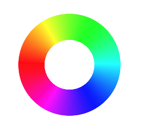

## 颜色

### 颜色常量

`fillStyle`与`stokeStyle`可以设置为表示颜色的字符串常量，从而可以直接设置图形的颜色。

一些常见的颜色的常量有aqua、black、blue、fuchsia、gray、green、lime、maroon、navy、olive、purple、red、silver、teal、white、yellow。

**实例：设置矩形的颜色**

```javascript
var rect = new Rectangle(10, 10, 200, 100);
rect.fillStyle = "red";
rect.fill()
```


### RGB值

如果用放大镜看显示器的屏幕，会发现屏幕的每个点都是由3个颜色组成，分别是

* Red, 红色
* Green，绿色
* Blue，蓝色

而这3个颜色的首字母组合，即RGB，这也是RGB值的由来。在RGB值的组成中，每一个数字分布代表了每个颜色的强弱，0代表关闭，255代表最高。

有了这3个基本的颜色，按照亮度的不同，就以组成各种个样的颜色。

### RGBA值

RGBA值是RGB的扩充，在使用颜色时可以直接制定该颜色的Alpha值。

```javascript
rect.fillStyle = "rgba(255, 255, 0, 0,5)";
```

前三位对应的是RGB值，第四位即透明度值

### HSL

```javascript
HSL(360, 1.00, 1.00)
```




### HSLA

即HSL添加透明度Alpha
