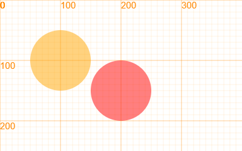

## 图形变换

所有的图形都可以在画布上按照一定的规律进行变换。形变包括平移、缩放、旋转，通过这几种变换，可以从简单的图形变化出各种图形。

### 平移

除了使用x，y对图形对象进行移动外，还可以使用平移的方式进行。

```javascript
var circle = new Circle(100, 100, 50);
circle.draw();

circle.translate(100, 50);
circle.fillStyle = "red";
circle.draw();
```

在没有改变circle的坐标前提下，我们把circle的位置改变了。



**实例：走路**

我们可以用平移来模拟角色在移动时候的晃动，比我们直接去计算坐标要方便的多。

```javascript
var role = new Sprite("https://r.leaplearner.com/i/robot1.png", 0, 200, 50, 60);
role.translate(0, new Swing(-5, 5, 1));

function draw(){
    canvas.clear();
    role.x += 1;
    role.draw();
}

run(draw);
```

这里，new Swing(-5, 5, 1)是创建了一个随时间变化的数值，这个数值从-5到5之间变化，间隔1秒，详细见常用数值方法一章。

图形调用translate即可在画布上进行偏移，同时不会影响到图形的移动。

**实例：多边形的移动**

如果需要对线条、多变形进行移动时，就可以使用该方式，而不用去改变每个点的位置。

```javascript
var polygon = new Polygon(0, 100, 0, 150, 50, 100, 100, 100, 200, 50);
polygon.draw();

polygon.translate(100, 100);
polygon.draw();
```

### 缩放

缩放包括缩小和放大，都是对图形在某个方向上的形变。最形象的说法就是：拉长或者压扁。

我们可以改变矩形的宽高来改变矩形的大小，改变圆的半径来改变圆的大小。但是如果我们要改变其他图形的大小，就有点麻烦了。

不过，我们可以通过修改图像的比例来达到这个效果。

```javascript
rect.scale(2, 2);
```

同样的，放大缩小时是以坐标原点作为参考系的，我们可以通过设定锚点来修改。

### 旋转

### 斜切

图像的变换都是通过矩形计算进行的，如果读者想要了解更多图形变换的知识，可以在专门的网站上学习更多知识。

**平行多边形**

利用斜切来定义一个平行多边形